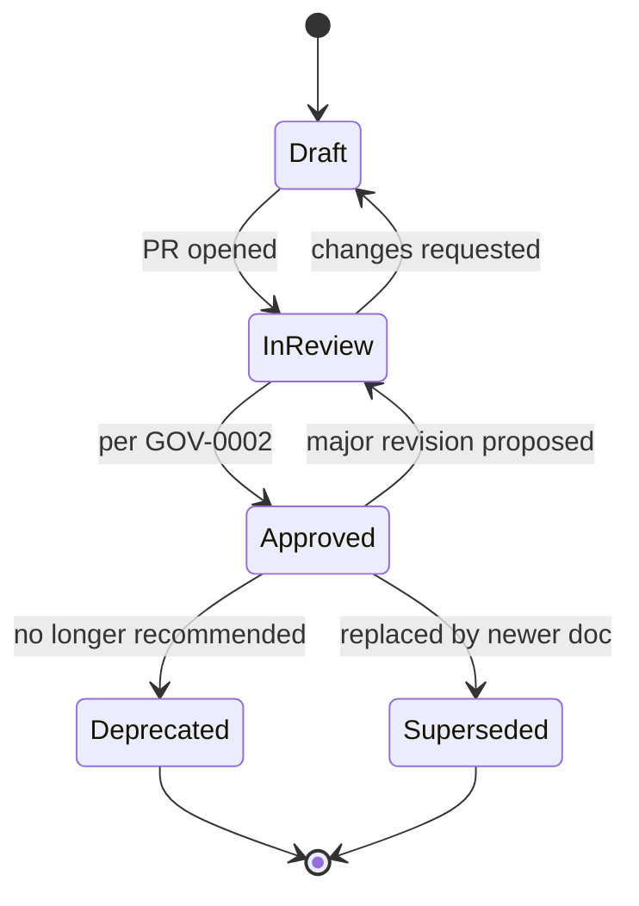

# STD-0004 — Versioning Strategy

## 1. Purpose

Defines how documents, the repository, and (as they arrive) APIs, events, and schemas are versioned, and how a document moves through its lifecycle.

## 2. Document Versions

Documents use two-part versions: `MAJOR.MINOR`, stored in front matter as a string (`version: "1.2"`).

- **MAJOR** increments when the *meaning* changes: decisions altered, requirements added/removed/changed, contracts modified. Consumers of the document must re-read it.
- **MINOR** increments for clarifications, corrections, formatting, and editorial changes that do not change meaning.
- Drafts before first approval are `0.x`. First approval publishes `1.0`.

Every version bump adds a row to the document's `## Change Log` table.

## 3. Document Lifecycle

| Status | Meaning | Editable? |
| --- | --- | --- |
| `Draft` | Being written; not authoritative | Freely |
| `In Review` | In an open PR under GOV-0001 | Via review cycle |
| `Approved` | Authoritative; the source of truth | Only via new review cycle |
| `Deprecated` | Still true historically, but discouraged | Front matter/notice only |
| `Superseded` | Replaced; `superseded-by` MUST point to the successor | Front matter/notice only |

Special case — **ADRs are immutable once approved**: they are never revised, only superseded by a new ADR (`supersedes` / `superseded-by` links both ways).

## 4. Repository Versioning

The repository as a whole carries a semantic version tracked in [`CHANGELOG.md`](../../CHANGELOG.md), tagged at meaningful milestones (`v0.1.0` = foundation complete). This versions the *structure and standards*, not individual documents.

## 5. Contract Versioning (APIs, Events, Schemas)

These rules bind the documents in `docs/06-api/`, `docs/07-data/`, and `docs/09-events/`:

- **APIs:** URI-versioned major versions only (`/v1/`). Breaking changes require a new major version and a deprecation period for the old one; additive changes (new optional fields, new endpoints) do not bump the version.
- **Events:** version suffix in the event name (`collection.milk-collected.v1`). Any breaking payload change mints `v2`; both versions run in parallel during migration.
- **Database schemas:** forward-only numbered migrations; the DBD document version tracks the design, with a `## Migration History` section mapping design versions to migration ranges.
- **AI models:** model artifacts use `MAJOR.MINOR.PATCH` (architecture / retraining / hotfix); the AIM document records which model versions it covers.

## 6. What "Breaking" Means

A change is breaking if an existing, conforming consumer could stop working: removing/renaming a field, tightening validation, changing semantics of an existing value, changing defaults, changing error codes. When in doubt, treat it as breaking.

## Change Log

| Version | Date | Author | Change |
| --- | --- | --- | --- |
| 1.0 | 2026-08-02 | Documentation Engineering | Initial approved version. |
