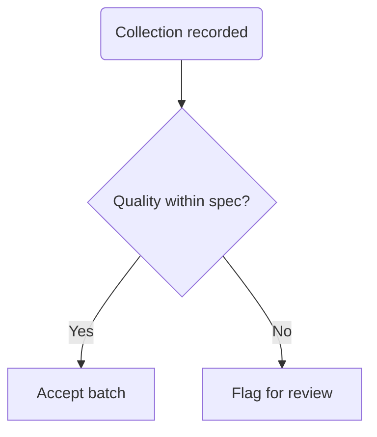

# STD-0005 — Mermaid Standards

## 1. Purpose

Mermaid is the **default diagramming tool** in this repository: diagrams live as text next to the prose, render in the repository UI, and produce reviewable diffs. This standard defines when to use Mermaid and how to keep diagrams consistent.

## 2. When to Use Mermaid (vs PlantUML)

| Need | Use |
| --- | --- |
| Flowcharts, sequence diagrams, state machines, ER sketches, user journeys, simple class diagrams | **Mermaid** (this standard) |
| C4 architecture diagrams, detailed component diagrams, complex class models, deployment diagrams | **PlantUML** per [STD-0006](STD-0006-plantuml-standards.md) |
| Anything requiring pixel-perfect layout | Neither — reconsider; diagrams here communicate structure, not art |

## 3. General Rules

- Diagrams are **inline** in the owning document as fenced ```` ```mermaid ```` blocks.
- One idea per diagram. If a diagram needs more than ~15 nodes, split it or raise the abstraction level.
- Every diagram is introduced by one sentence of prose stating what it shows. A diagram never appears without context.
- Node labels use glossary terminology, not internal codenames.
- No styling directives (`style`, `classDef`, theme overrides) except the semantic classes defined below — rendering themes differ between tools, and content must not depend on color.

### 3.1 Permitted semantic classes

When state must be distinguished, use only these class names (renderers may style them):

```text
external   — systems outside Lacteva's control
deprecated — components being retired
planned    — components not yet built
```

## 4. Per-Type Conventions

### 4.1 Flowcharts

- Direction: `flowchart TD` for processes, `LR` for pipelines. State the direction explicitly.
- Decisions are diamonds (`{ }`) phrased as questions with labeled edges (`-- Yes -->`).
- Start/end as rounded (`( )`); a flowchart has exactly one entry point.



### 4.2 Sequence Diagrams

- Participants declared explicitly, ordered left-to-right by call direction.
- Use `->>` for calls, `-->>` for responses, `-)` for async/fire-and-forget.
- Show error paths with `alt`/`else` when they matter to the design.

### 4.3 State Diagrams

- `stateDiagram-v2` only. Every transition is labeled with its trigger.
- Model the lifecycle of one entity per diagram.

### 4.4 ER Diagrams

- Mermaid `erDiagram` is for **conceptual sketches** in domain models and early design; the authoritative schema lives in the DBD document's DDL, not the diagram.
- Entity and attribute names in `snake_case` matching STD-0002 database conventions.

## 5. Review Checklist for Diagrams

- [ ] Renders without errors (paste into a Mermaid live editor if unsure)
- [ ] ≤ ~15 nodes; one idea
- [ ] Introduced by prose; labels match glossary terms
- [ ] No decorative styling
- [ ] Direction and diagram type appropriate for the content

## Change Log

| Version | Date | Author | Change |
| --- | --- | --- | --- |
| 1.0 | 2026-08-02 | Documentation Engineering | Initial approved version. |
