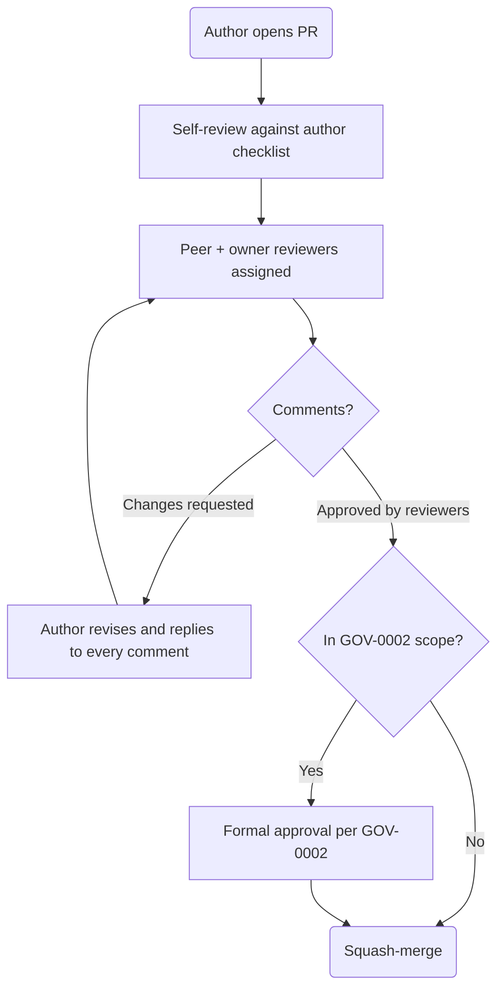

# GOV-0001 — Review Workflow

## 1. Purpose

Defines the mandatory peer-review process for every change to this repository. Review ensures correctness, consistency with standards, and shared understanding — it is how hundreds of contributors stay one team.

## 2. Scope

All pull requests: documentation, templates, standards, and code. Formal **approval** (sign-off authority) is layered on top of review and defined in [GOV-0002](GOV-0002-approval-workflow.md).

## 3. Roles

| Role | Responsibility |
| --- | --- |
| **Author** | Prepares the change, self-reviews, responds to every comment, keeps the PR mergeable |
| **Peer reviewer** | Any team member; checks content quality and standards compliance |
| **Owner reviewer** | Required reviewer from CODEOWNERS for the touched paths; accountable for domain correctness |
| **Approver** | Sign-off authority for documents in GOV-0002 scope |

## 4. Review Flow

### 4.1 Reviewer count

- Documentation and code: minimum **2** reviews — one peer, one CODEOWNERS owner (one person may satisfy both if they qualify as both).
- Standards, governance, templates: minimum **2 Architecture Board** reviews.
- Typo-level fixes (no meaning change, MINOR version bump only): **1** owner review.

### 4.2 Timing expectations

- First review response within **2 business days**; re-reviews within **1 business day**.
- PRs inactive for 10 business days are closed by the maintainers-on-duty; work is not lost, the branch remains.

## 5. Author Checklist

Before requesting review, the author confirms (also embedded in the PR template):

- [ ] Correct template used; every section filled or marked `Not applicable — <reason>`
- [ ] Front matter valid; ID assigned per STD-0003; filename per STD-0002
- [ ] Version bumped correctly per STD-0004 and document change log updated
- [ ] Domain index `README.md` updated
- [ ] Diagrams follow STD-0005 / STD-0006
- [ ] Glossary consistency: terms match, new terms added
- [ ] All links resolve

## 6. Reviewer Checklist

Reviewers check, in priority order:

1. **Correctness** — is the content true, complete, and internally consistent?
2. **Consequences** — does it contradict any `Approved` document? If it changes a contract (API, event, schema), is the versioning treatment per STD-0004 correct?
3. **Clarity** — could a new engineer act on this document without asking its author?
4. **Standards compliance** — the author checklist, verified.

## 7. Review Conduct

- Comments critique the document, never the author. Be specific: quote the line, state the problem, suggest a fix.
- Authors respond to **every** comment: fix, or explain why not. "Done" with no change is not a response.
- Disagreements unresolved after one round of discussion escalate per [GOV-0002 §6](GOV-0002-approval-workflow.md#6-escalation).
- Blocking a PR requires a stated, standards- or correctness-based reason. "I would have written it differently" is not blocking grounds.

## Change Log

| Version | Date | Author | Change |
| --- | --- | --- | --- |
| 1.0 | 2026-08-02 | Documentation Engineering | Initial approved version. |
