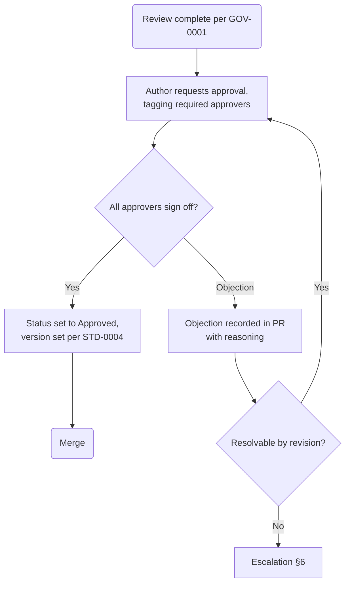

# GOV-0002 — Approval Workflow

## 1. Purpose

Some documents are **commitments**: decisions, requirements, and contracts that other teams build against. Those documents require formal sign-off beyond peer review. This workflow defines who approves what, and how approval is recorded so it is auditable years later.

## 2. Approval Matrix

| Document Type | Approver(s) Required |
| --- | --- |
| Standard (`STD`), Governance (`GOV`), Template (`TPL`) | Architecture Board (2 members) |
| ADR — single-team scope | Owning team lead + 1 Architecture Board member |
| ADR — cross-team / platform scope | Architecture Board (2 members) + affected team leads |
| BRD | Business sponsor + Head of Product |
| PRD | Product manager's lead + owning engineering lead |
| SRS | Owning engineering lead + product manager |
| API specification (`API`) | API platform owner + each consuming team lead identified in the spec |
| Database design (`DBD`) | Data platform owner + owning service team lead |
| AI documentation (`AIM`) | AI platform owner + owning team lead; + Legal/Compliance when the model affects pricing, credit, or regulatory reporting |
| Event specification (`EVT`) | Event platform owner + producing team lead |
| Business capability (`CAP`), Domain model (`DOM`) | Architecture Board (1 member) + domain owner |
| Runbook (`OPS`) | Owning team lead + on-call lead |

Roles map to named individuals in the CODEOWNERS-backed team registry; approval authority follows the **role**, not the person.

## 3. How Approval Is Recorded

Approval is recorded in **two places**, both mandatory:

1. **PR approval** by each required approver on the merging pull request.
2. **In-document record**: the document's front matter gains an `approvers` list, and its `## Change Log` row for the approved version names the approvers and date.

```yaml
approvers:
  - role: Architecture Board
    name: <name>
    date: 2026-08-02
```

A document whose status says `Approved` but lacks an approval record is defective; revert it to `In Review`.

## 4. Approval Flow



## 5. What Approvers Are Accountable For

Approval is not a rubber stamp. By approving, the approver asserts:

- The decision/requirement/contract is **sound for its stated scope** and consistent with strategy and prior `Approved` documents.
- Affected stakeholders were identified and heard.
- The consequences section honestly states costs and risks.

Approvers who cannot make those assertions must object with reasons, not abstain silently.

## 6. Escalation

1. Author and objector attempt resolution in the PR (time-boxed: 3 business days).
2. Unresolved → the Architecture Board hears both positions and decides; the decision and rationale are recorded in the PR and, for architectural matters, as an ADR.
3. Business-priority conflicts escalate to the Head of Product / Head of Engineering pair instead.

An escalated decision is final until new information appears; re-litigating without new information is out of order.

## 7. Emergency Changes

Production incidents may require changing a contract document faster than the matrix allows. In that case: one owner approval suffices to merge, the document is flagged `status: In Review` (not `Approved`), and full approval MUST complete within 5 business days or the change is reverted.

## Change Log

| Version | Date | Author | Change |
| --- | --- | --- | --- |
| 1.0 | 2026-08-02 | Documentation Engineering | Initial approved version. |
