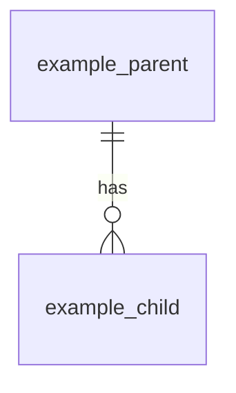

# TPL-0006 — Database Design (DBD) Template

> Template guidance: Copy everything below the rule into `docs/07-data/DBD-NNNN-<short-title>.md`. One DBD per service datastore (services own their data; shared databases require an ADR). The DDL in migrations is authoritative for structure; this document is authoritative for **intent** — why the schema is shaped this way, and the rules the data must obey. Naming per [STD-0002 §6](../00-standards/STD-0002-naming-conventions.md): `snake_case`, singular table names.

---

```yaml
---
id: DBD-NNNN
title: <Datastore title>
type: dbd
status: Draft
version: "0.1"
owner: <owning team>
created: <YYYY-MM-DD>
last-updated: <YYYY-MM-DD>
related: [<SRS-ID>, <DOM-ID>, <ADR-IDs>]
---
```

# DBD-NNNN — \<Title\>

## 1. Overview

- **Owning service:** \<service; only this service accesses the store directly\>
- **Engine and version:** \<e.g. PostgreSQL 17\>
- **Domain model:** \<DOM-ID this schema realizes\>
- **Workload profile:** \<OLTP/OLAP/mixed; read/write ratio; expected volumes at target scale\>

## 2. Multi-Tenancy Model

> Template guidance: Mandatory. State the isolation mechanism (row-level with `tenant_id` + RLS, schema-per-tenant, database-per-tenant), why it fits this store per the platform tenancy ADR, and how cross-tenant leakage is made impossible.

\<tenancy design\>

## 3. Entity-Relationship Overview

> Template guidance: Conceptual Mermaid `erDiagram` per STD-0005 §4.4 — keys and relationships, not every column.



## 4. Table Specifications

> Template guidance: Repeat per table. Every column: type, nullability, meaning. "Meaning" uses glossary terms — a data dictionary entry, not a restatement of the name.

### 4.1 `<table_name>`

\<what one row represents; lifecycle (insert-only? mutable? soft-delete?)\>

| Column | Type | Null | Default | Meaning |
| --- | --- | --- | --- | --- |
| `id` | \<type\> | No | \<gen\> | Surrogate key. |
| `tenant_id` | \<type\> | No | — | Owning tenant; enforced by \<mechanism\>. |
| \<col\> | \<type\> | \<Y/N\> | \<default\> | \<meaning, unit, valid range\> |

- **Primary key:** …
- **Foreign keys:** …
- **Indexes:** \<index → the query it serves; unexplained indexes are review-blocking\>
- **Constraints:** \<checks, uniques, and the business rule each enforces\>

## 5. Data Integrity Rules

> Template guidance: Rules spanning tables or not expressible as constraints, and where each is enforced (DB, service layer, both).

| Rule | Enforced By |
| --- | --- |
| \<invariant\> | \<mechanism\> |

## 6. Data Lifecycle

- **Retention:** \<how long, per data class and regulation\>
- **Archival:** \<what moves where, when\>
- **Deletion:** \<hard/soft; tenant offboarding; right-to-erasure handling\>

## 7. Volumetrics and Scaling

| Table | Rows at Target Scale | Growth Rate | Scaling Approach |
| --- | --- | --- | --- |
| \<table\> | \<estimate\> | \<per period\> | \<partitioning/sharding strategy and key\> |

## 8. Migration Strategy

- **Tooling:** \<migration tool; forward-only per STD-0004 §5\>
- **Zero-downtime rules:** \<expand–contract pattern; backfill approach\>

## 9. Migration History

| Design Version | Migration Range | Summary |
| --- | --- | --- |
| 1.0 | \<0001–NNNN\> | Initial schema. |

## Change Log

| Version | Date | Author | Change |
| --- | --- | --- | --- |
| 0.1 | \<date\> | \<author\> | Initial draft. |
