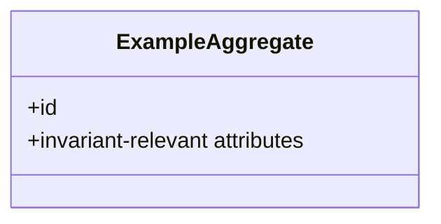

# TPL-0010 — Domain Model Template

> Template guidance: Copy everything below the rule into `docs/03-architecture/domain-models/DOM-NNNN-<short-title>.md`. One document per **bounded context** (DDD sense). The domain model defines the concepts, relationships, and invariants of a context in ubiquitous language — every term MUST exist in the glossary with the same meaning. Database schemas (DBD) and APIs (API) realize this model; where they diverge, the divergence is documented there, justified here-or-there, never silent.

---

```yaml
---
id: DOM-NNNN
title: <Bounded context name>
type: dom
status: Draft
version: "0.1"
owner: <domain owner team>
created: <YYYY-MM-DD>
last-updated: <YYYY-MM-DD>
related: [<CAP-IDs>, <DBD-IDs>, <EVT-IDs>]
---
```

# DOM-NNNN — \<Bounded Context Name\>

## 1. Context Purpose

\<what this bounded context is responsible for, and — as important — what it is NOT responsible for\>

## 2. Ubiquitous Language

> Template guidance: The context's terms with their meaning **inside this context**. The same word may mean different things in different contexts (e.g. "Batch" in Collection vs Processing) — that's the point of bounded contexts. Sync every term with the glossary, noting context qualifiers there.

| Term | Meaning in This Context |
| --- | --- |
| \<term\> | \<definition\> |

## 3. Model Overview

> Template guidance: Mermaid `classDiagram` or `erDiagram` per STD-0005; PlantUML class diagram per STD-0006 for complex models. Show aggregates, entities, value objects, and relationships with multiplicities.



## 4. Aggregates

> Template guidance: Repeat per aggregate. The aggregate is the consistency boundary — its invariants hold transactionally.

### 4.1 \<Aggregate name\>

- **Root entity:** \<entity\>
- **Contains:** \<entities and value objects inside the boundary\>
- **Identity:** \<how instances are identified\>
- **Invariants:** \<rules that MUST hold at all times within the aggregate, numbered\>
- **Lifecycle:** \<created when / changes how / archived-deleted when; a Mermaid stateDiagram-v2 if non-trivial\>

## 5. Value Objects

| Value Object | Attributes | Validity Rules |
| --- | --- | --- |
| \<name\> | \<attributes\> | \<e.g. fat content: 0–15%, two decimals\> |

## 6. Domain Events

| Event (EVT-ID) | Emitted By | When |
| --- | --- | --- |
| \<EVT-ID / planned name\> | \<aggregate\> | \<condition\> |

## 7. Context Relationships

> Template guidance: DDD context-mapping terms: Customer–Supplier, Conformist, Anti-Corruption Layer, Shared Kernel, Open Host Service, Published Language.

| Related Context (DOM-ID) | Relationship | Translation Notes |
| --- | --- | --- |
| \<context\> | \<pattern\> | \<which concepts translate, and how\> |

## 8. Design Rationale

\<why the boundaries are drawn here — the alternatives considered and rejected; link ADRs for significant boundary decisions\>

## Change Log

| Version | Date | Author | Change |
| --- | --- | --- | --- |
| 0.1 | \<date\> | \<author\> | Initial draft. |
