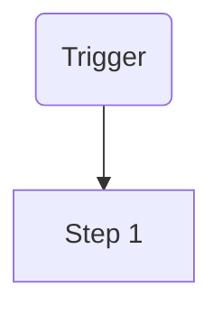

# TPL-0014 — Business Process (BPR) Template

> Template guidance: Copy below the rule into `docs/03-architecture/01-business-layer/BPR-NNNN-<process-name>.md`. A process is an ordered flow through capabilities toward a business outcome. Every step MUST cite the capability ID it exercises; market variants are sections within this one document, never separate documents.

---

```yaml
---
id: BPR-NNNN
title: <Process name — verb phrase, e.g. "Settle a Collection Period">
type: bpr
layer: business
status: Draft
version: "0.1"
owner: <process owner team>
created: <YYYY-MM-DD>
last-updated: <YYYY-MM-DD>
related: [<CAP docs>, <CON-IDs>]
---
```

# BPR-NNNN — \<Process Name\>

## 1. Overview

- **Outcome:** \<the business result when the process completes successfully\>
- **Trigger(s):** \<what starts an instance — event, schedule, request\>
- **Frequency / volume:** \<how often, at what scale\>
- **End states:** \<success + every terminal failure state\>

## 2. Actors

| Actor | Role in Process |
| --- | --- |
| \<actor\> | \<responsibility\> |

## 3. Process Flow

> Template guidance: one Mermaid flowchart per STD-0005; ≤ 15 nodes — decompose bigger processes into sub-processes (own BPRs) referenced here.



## 4. Steps

| # | Step | Actor | Capability Exercised | Business Events |
| --- | --- | --- | --- | --- |
| 1 | \<what happens\> | \<actor\> | \<e.g. MCL.PCK.01\> | \<events from the capability catalog\> |

## 5. Business Rules Applied

| Rule | Source |
| --- | --- |
| \<rule the process must honor\> | \<POL-ID once policies exist, else capability/regulatory reference\> |

## 6. Market Variants

> Template guidance: how the flow differs per market archetype (e.g. tanker-pickup vs can-delivery). Same steps table structure, deltas only.

\<variants, or "None — the flow is globally uniform"\>

## 7. Exceptions and Compensation

| Exception | At Step | Handling |
| --- | --- | --- |
| \<what can go wrong\> | \<#\> | \<the business response, incl. how completed steps are compensated\> |

## 8. Measures

| KPI | Definition | Target |
| --- | --- | --- |
| \<process KPI, e.g. cycle time\> | \<definition\> | \<target\> |

## Change Log

| Version | Date | Author | Change |
| --- | --- | --- | --- |
| 0.1 | \<date\> | \<author\> | Initial draft. |
