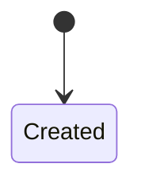

# TPL-0017 — Aggregate (AGG) Template

> Template guidance: Copy below the rule into `docs/03-architecture/02-domain-layer/<context-folder>/AGG-NNNN-<aggregate-name>.md`. The aggregate is the consistency boundary: everything inside changes together or not at all. Requires an approved `DOM` (front matter `context:`). Keep implementation out — no persistence, no framework.

---

```yaml
---
id: AGG-NNNN
title: <Aggregate name — the root entity's name>
type: agg
layer: domain
context: <DOM-NNNN>
status: Draft
version: "0.1"
owner: <context owner team>
created: <YYYY-MM-DD>
last-updated: <YYYY-MM-DD>
related: [<ENT/VAL/REP/POL/SPC IDs>, <EVT-IDs>]
---
```

# AGG-NNNN — \<Aggregate Name\>

## 1. Purpose

\<what business fact-cluster this aggregate protects, and why these things must be consistent together\>

## 2. Identity

- **Root entity:** \<name; ENT-ID if standalone-documented\>
- **Identified by:** \<the identity, in business terms\>

## 3. Contents

| Member | Kind | Documented | Notes |
| --- | --- | --- | --- |
| \<root entity\> | Entity (root) | inline / ENT-NNNN | |
| \<member\> | Entity / Value Object | inline / ENT-NNNN / VAL-NNNN | \<inline members get their rules here\> |

## 4. Invariants

> Template guidance: numbered, testable, each stating WHY. These are the aggregate's reason to exist — an aggregate with no invariants spanning its members is drawn too large.

| # | Invariant | Why |
| --- | --- | --- |
| I1 | \<rule that must always hold within the boundary\> | \<business consequence of violation\> |

## 5. Lifecycle



\<state descriptions and what transitions each state permits/forbids\>

## 6. Operations and Events

| Operation (business command) | Allowed In States | Emits (business event / EVT-ID) |
| --- | --- | --- |
| \<e.g. Record quality result\> | \<states\> | \<e.g. Quantity Graded\> |

## 7. Boundary Rationale

- **Why this big:** \<what would break if split\>
- **Why not bigger:** \<what stays out and why (referenced by identity instead)\>
- **Concurrent change expectation:** \<who changes instances, how often — the contention reality the boundary must survive\>

## 8. References to Other Aggregates

| Aggregate | Referenced By | Consistency Expectation |
| --- | --- | --- |
| \<AGG-ID\> | Identity only | Eventual, via \<event\> |

## Change Log

| Version | Date | Author | Change |
| --- | --- | --- | --- |
| 0.1 | \<date\> | \<author\> | Initial draft. |
