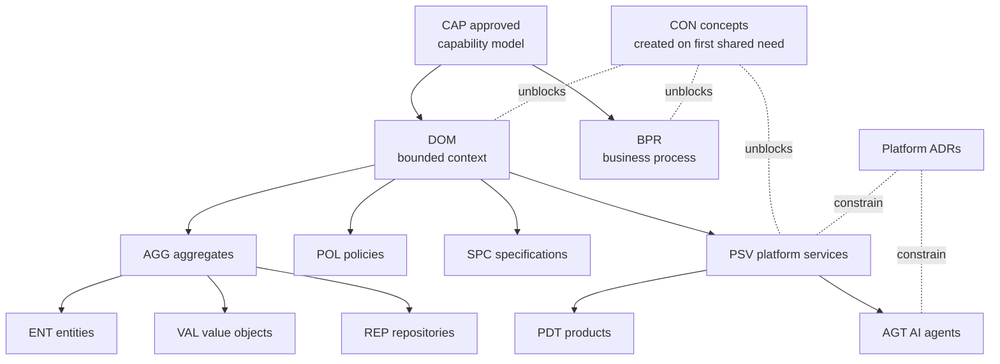

# Architecture Document Dependency Maps

What must be **approved** before what may be **started**, within the EA workspace. Complements the repository-wide pipeline graph in [QR-0004 §1](../12-quality/QR-0004-documentation-roadmap.md); this map zooms into the architecture layers.

## Authoring-Order Dependencies

## Dependency Rules

| Before Starting… | These Must Be Approved | Because |
| --- | --- | --- |
| Any BPR | The CAP documents its steps cite | Steps cite capability IDs |
| Any DOM | CAP model for its capabilities | Contexts model capabilities |
| Any tactical artifact (AGG/ENT/VAL/REP/POL/SPC) | Its `DOM` | Tactical artifacts have no meaning outside a context |
| ENT / VAL / REP standalone docs | Their `AGG` | Aggregate defines the boundary they live in |
| Any PSV | Its `DOM` + the tenancy/event platform ADRs | A service without a context or platform rules is speculation |
| Any PDT | BRD selecting its scope + composing PSVs (at least drafted) | Products compose services toward a business case |
| Any AGT | Capabilities served + acting PSV + relevant `POL` guardrail policies | An agent charter without guardrails is unapprovable |
| Any CON | Two consuming artifacts identified (may be drafts) | Concepts exist to serve consumers, not speculatively |

**Draft-parallelism rule:** "approved before started" binds *approval* order, not thinking — drafting in parallel is encouraged, but a downstream artifact cannot enter GOV-0002 approval while its upstream is unapproved.

## Current Critical Path

With zero architecture artifacts existing, the critical path to the first complete vertical slice (per [QR-0004](../12-quality/QR-0004-documentation-roadmap.md) Phase 1) is:

1. CAP suite approval (Phase 0.3) →
2. `DOM` Collection + `DOM` Quality + `DOM` Settlement (the trust loop) →
3. Their aggregates and policies + the collection-to-settlement `BPR` →
4. First `PSV` set + platform ADRs →
5. First `PDT` (from BRD-0001) and first `AGT` (advisory, from DIA model).

## Change Log

| Version | Date | Author | Change |
| --- | --- | --- | --- |
| 1.0 | 2026-08-02 | Architecture Board | Initial dependency maps and authoring-order rules. |
