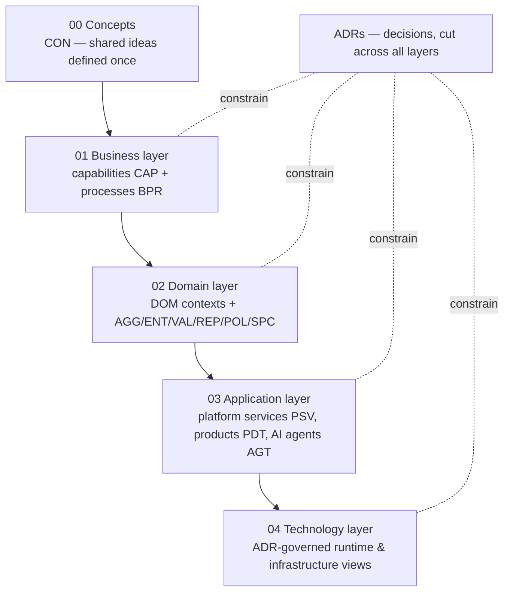

# 03 — Enterprise Architecture Workspace

The architecture operating system of Lacteva: five layers of architecture artifacts, the decisions that shape them (ADRs), and the indexes that keep every artifact discoverable and traceable. Everything here is technology-independent until the technology layer; everything carries a stable ID and traces upward to business capabilities ([CAP-0001](../05-capabilities/CAP-0001-business-capability-master-map.md)).

## The Layer Model

| Layer | Folder | Artifacts | Answers |
| --- | --- | --- | --- |
| Concepts | [`00-concepts/`](00-concepts/README.md) | `CON` | What do our shared ideas mean, exactly, once? |
| Business | [`01-business-layer/`](01-business-layer/README.md) | `BPR` (+ `CAP` in [`05-capabilities/`](../05-capabilities/README.md)) | What does the business do, and how does work flow? |
| Domain | [`02-domain-layer/`](02-domain-layer/README.md) | `AGG`, `ENT`, `VAL`, `REP`, `POL`, `SPC` (+ `DOM` in [`domain-models/`](domain-models/README.md)) | What are the models, rules, and invariants? |
| Application | [`03-application-layer/`](03-application-layer/README.md) | `PSV`, `PDT`, `AGT` | What logical services, products, and agents realize the domains? |
| Technology | [`04-technology-layer/`](04-technology-layer/README.md) | ADR-driven views | On what does it all run? |

Cross-layer: [`adr/`](adr/README.md) (decisions) · [`diagrams/`](diagrams/README.md) (cross-cutting views).

## Navigation and Bookkeeping

| Index | Purpose |
| --- | --- |
| [`INDEX.md`](INDEX.md) | Inventory of every architecture artifact, by layer |
| [`TRACEABILITY.md`](TRACEABILITY.md) | Vertical traces: capability → process → domain → application → technology |
| [`CROSS-REFERENCE.md`](CROSS-REFERENCE.md) | Horizontal references: which artifacts cite which, and the citation rules |
| [`DEPENDENCY-MAP.md`](DEPENDENCY-MAP.md) | Authoring-order dependency maps for architecture artifacts |

## Binding Rules

1. **Every artifact starts from its template** ([`02-templates/`](../02-templates/README.md), TPL-0001…0023) and carries front matter with `id`, `layer`, and — for domain-layer artifacts — `context` (the owning `DOM`).
2. **Every artifact traces up.** A domain artifact names its context; a context names its capabilities; an application artifact names the capabilities/domains it realizes. Untraceable artifacts are review-blocking.
3. **Lower layers never constrain upper layers.** Technology choices never appear in business/domain artifacts; an ADR is the only place a technology constraint is decided.
4. **Indexes update in the same PR** as the artifact they list (GOV-0001 reviewer duty; validated by `tools/validate/`).
5. **Decisions are ADRs.** Any architecturally significant choice made while authoring an artifact is extracted into an ADR and cited, never buried in the artifact.
