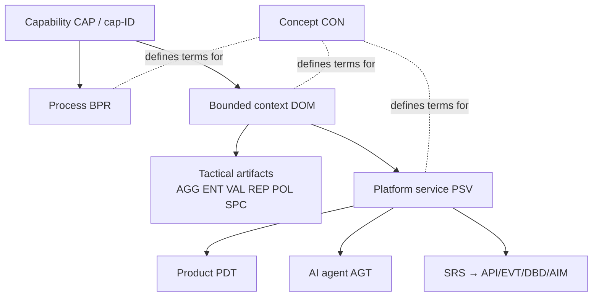

# Architecture Traceability Index

**Vertical** traceability through the layers: every artifact must be reachable from a business capability, and every capability must eventually be reachable down to running technology. This index complements the repository-wide [QR-0003 traceability matrix](../12-quality/QR-0003-traceability-matrix.md) — QR-0003 traces *document pipelines* (BRD→PRD→SRS); this index traces *architecture layers*.

## The Trace Chain

## Trace Rules (enforced in review; validated by `tools/validate/` as artifacts appear)

| Artifact | MUST Trace To | Via |
| --- | --- | --- |
| `BPR` | Capability IDs, one per step | Steps table |
| `DOM` | Capability IDs of the abilities it models | Front matter `related:` + §1 |
| `AGG`/`ENT`/`VAL`/`REP`/`POL`/`SPC` | Its context | Front matter `context: DOM-NNNN` |
| `PSV` | Its context + capability IDs realized | Front matter `context:` + §2 |
| `PDT` | Composing PSVs + BRD/PRD lineage | §Composition + `related:` |
| `AGT` | Capabilities served + acting PSV + AIM (when models exist) | §Mission + `related:` |
| Technology views | Backing ADRs | Index column |

**Orphan rule:** an artifact with an empty trace is review-blocking. **Reverse-orphan rule:** a capability that no artifact traces to is not an error — it is unstarted scope, visible in the coverage table below.

## Capability → Architecture Coverage

One row per capability domain; counts updated as artifacts land. This table is the heartbeat of architecture progress.

| Capability Domain | BPRs | DOM | Tactical | PSVs | PDTs | AGTs |
| --- | --- | --- | --- | --- | --- | --- |
| FPR Farm Production | 0 | — | 0 | 0 | 0 | 0 |
| MCL Collection & Logistics | 0 | — | 0 | 0 | 1 (PDT-0001) | 0 |
| QFS Quality & Food Safety | 0 | — | 0 | 0 | 1 (PDT-0001) | 0 |
| PRO Processing & Manufacturing | 0 | — | 0 | 0 | 0 | 0 |
| CMA Commerce & Market Access | 0 | — | 0 | 0 | 0 | 0 |
| PEF Producer Economics | 0 | — | 0 | 0 | 0 | 0 |
| CPR Cooperative Relations | 0 | — | 0 | 0 | 0 | 0 |
| SWC Sustainability & Compliance | 0 | — | 0 | 0 | 0 | 0 |
| DIA Intelligence & Advisory | 0 | — | 0 | 0 | 0 | 0 |
| ETE Ecosystem Enablement | 0 | — | 0 | 0 | 0 | 0 |

## Concept Trace Register

Concepts (`CON`) trace horizontally — one concept, many consumers. Register one row per concept as created:

| CON | Consuming Artifacts |
| --- | --- |
| — | *None yet* |

## Change Log

| Version | Date | Author | Change |
| --- | --- | --- | --- |
| 1.1 | 2026-08-02 | Lacteva Collect Product Team | PDT-0001 counted for MCL/QFS coverage; package-level trace in `13-products/lacteva-collect/TRACEABILITY.md`. |
| 1.0 | 2026-08-02 | Architecture Board | Trace rules and coverage skeleton established; all counts zero by design. |
