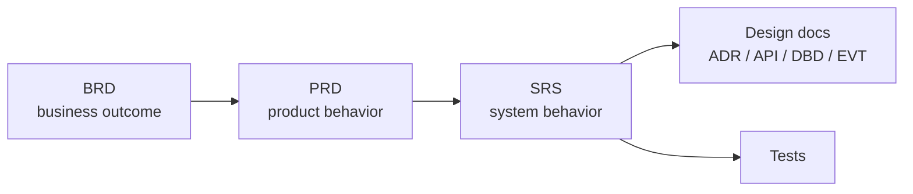

# 04 — Requirements

Requirements live in three layers with **explicit traceability** between them. Each layer answers a different question and has a different owner:

| Folder | Document | Question Answered | Owner |
| --- | --- | --- | --- |
| [`business/`](business/README.md) | BRD — Business Requirements Document | *Why* does the business need this? What outcome? | Business sponsor / Product leadership |
| [`product/`](product/README.md) | PRD — Product Requirements Document | *What* should the product do for users? | Product management |
| [`software/`](software/README.md) | SRS — Software Requirements Specification | *How* must the software behave, precisely? | Engineering |

## The Traceability Chain

- Every PRD names the BRD (and goal IDs) it serves; every SRS names the PRD requirements it realizes; every SRS carries a traceability matrix.
- A requirement with no upstream trace is a question for review: why are we building it?
- Requirement-level IDs (`BRD-0002-G01`, `SRS-0012-F04`) follow [STD-0003 §5](../00-standards/STD-0003-document-numbering.md) and are never renumbered.

## Rules

- Templates are mandatory: [TPL-0002](../02-templates/TPL-0002-business-requirements-template.md) (BRD), [TPL-0003](../02-templates/TPL-0003-product-requirements-template.md) (PRD), [TPL-0004](../02-templates/TPL-0004-software-requirements-template.md) (SRS).
- Approval per the [GOV-0002 matrix](../01-governance/GOV-0002-approval-workflow.md) — requirements are commitments.
- Changing an `Approved` requirement is a MAJOR version bump and re-approval; downstream documents must be checked and updated in tracked follow-up PRs.
