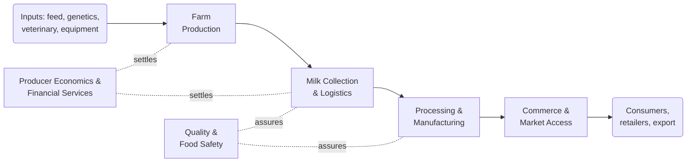
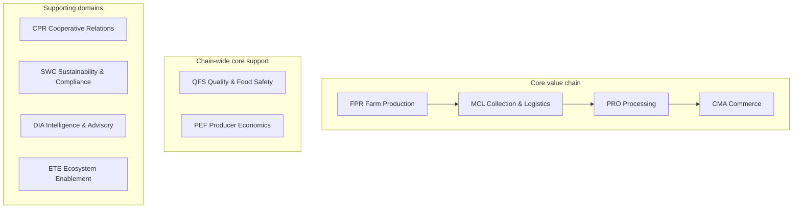
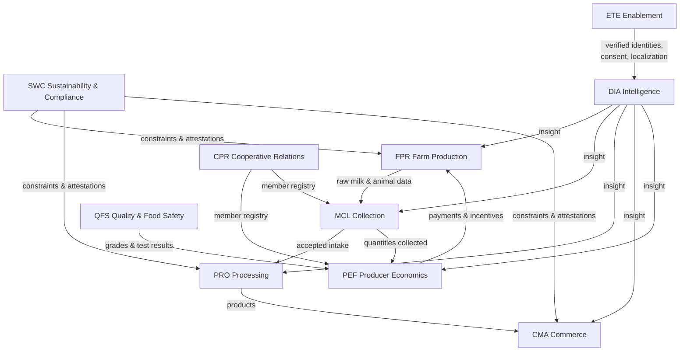

# CAP-0001 — Business Capability Master Map: Dairy Ecosystem

## 1. Purpose

This document is the **enterprise foundation** of the Lacteva platform: a complete, technology-independent model of **what the dairy industry does**, worldwide. Every future engineering artifact — domain model, requirement, contract — traces to a capability defined in this model. Nothing in this model names software, systems, screens, or data structures; it names business abilities, the actors who exercise them, and the value they produce.

## 2. Scope and Method

**Scope:** the entire dairy ecosystem, farm to consumer, across 50+ countries — smallholder and industrial farms, cooperatives, collectors, chilling centers, laboratories, processors, traders, distributors, financiers, insurers, certifiers, and regulators.

**Method:**

- **Level 1 — Domains (10):** partitions of the ecosystem, stable for decades. Core domains follow the physical/commercial value chain of milk; supporting domains cut across it.
- **Level 2 — Subdomains (~40):** coherent groupings of capabilities within a domain.
- **Level 3 — Capabilities (86):** discrete business abilities, each with purpose, actors, value, dependencies, business events, AI opportunities, reports, and KPIs.

**Global validity rule:** a capability enters this model only if it exists — in some form — across markets. Market variation (e.g. milking by hand vs robot, pricing by volume vs components, formal vs informal channels) is variation *within* a capability, recorded in the domain documents, never a separate capability per country.

### 2.1 Capability Identification Scheme

Capabilities carry hierarchical business IDs, independent of document numbering:

```
<DOMAIN>.<SUBDOMAIN>.<NN>     e.g.  FPR.HLT.02
```

- `DOMAIN` — three-letter domain code (registry in §4).
- `SUBDOMAIN` — three-letter subdomain code (registered in each domain document).
- `NN` — two-digit sequence within the subdomain, never reused.

*Amendment to [TPL-0009](../02-templates/TPL-0009-business-capability-template.md) usage:* at industry-model scale, capabilities are cataloged inside their **domain document** (CAP-0002 … CAP-0011) using a compact attribute block. TPL-0009 remains the template for future single-capability deep-dives, which will reference their catalog ID.

## 3. The Dairy Value Chain

The core domains follow milk through the economy; supporting domains apply at every stage.



Supporting domains not shown above — Cooperative & Producer Relations, Sustainability & Compliance, Dairy Intelligence & Advisory, Ecosystem Enablement — span the whole chain; their reach is shown in the dependency model (§6).

## 4. Level 1 Domain Map

| Code | Domain | Document | Kind | One-Line Definition |
| --- | --- | --- | --- | --- |
| `FPR` | Farm Production | [CAP-0002](CAP-0002-farm-production.md) | Core | Managing animals, feeding, breeding, health, and milking to produce raw milk |
| `MCL` | Milk Collection & Logistics | [CAP-0003](CAP-0003-milk-collection-logistics.md) | Core | Moving raw milk from farms to processing, preserving quantity and cold chain |
| `QFS` | Quality & Food Safety | [CAP-0004](CAP-0004-quality-food-safety.md) | Core-supporting | Testing, grading, tracing, and protecting milk and dairy products |
| `PRO` | Processing & Manufacturing | [CAP-0005](CAP-0005-processing-manufacturing.md) | Core | Transforming raw milk into dairy products |
| `CMA` | Commerce & Market Access | [CAP-0006](CAP-0006-commerce-market-access.md) | Core | Selling, trading, distributing, and exporting milk and dairy products |
| `PEF` | Producer Economics & Financial Services | [CAP-0007](CAP-0007-producer-economics-financial-services.md) | Core-supporting | Pricing schemes, settlement, payments, credit, insurance, subsidies |
| `CPR` | Cooperative & Producer Relations | [CAP-0008](CAP-0008-cooperative-producer-relations.md) | Supporting | Membership, governance, extension services, and input supply for producer organizations |
| `SWC` | Sustainability, Welfare & Compliance | [CAP-0009](CAP-0009-sustainability-welfare-compliance.md) | Supporting | Environmental stewardship, animal welfare, regulation, and certification |
| `DIA` | Dairy Intelligence & Advisory | [CAP-0010](CAP-0010-dairy-intelligence-advisory.md) | Supporting | Analytics, forecasting, advisory, and early warning across the ecosystem |
| `ETE` | Ecosystem & Tenant Enablement | [CAP-0011](CAP-0011-ecosystem-tenant-enablement.md) | Supporting | Onboarding businesses, managing partners, data stewardship, market localization |



## 5. Capability Inventory

Full detail (purpose, actors, value, dependencies, events, AI opportunities, reports, KPIs) lives in each domain document; this inventory is the master index.

### 5.1 FPR — Farm Production ([CAP-0002](CAP-0002-farm-production.md))

| ID | Capability | Subdomain |
| --- | --- | --- |
| FPR.HRD.01 | Animal Identification & Registration | Herd & Animal Registry |
| FPR.HRD.02 | Herd Structure & Lifecycle Management | Herd & Animal Registry |
| FPR.HRD.03 | Animal Movement & Custody Tracking | Herd & Animal Registry |
| FPR.HLT.01 | Health Monitoring & Case Management | Animal Health |
| FPR.HLT.02 | Preventive Care & Vaccination Programs | Animal Health |
| FPR.HLT.03 | Veterinary Service Coordination | Animal Health |
| FPR.HLT.04 | Treatment & Withdrawal Management | Animal Health |
| FPR.BRE.01 | Reproductive Cycle Management | Breeding & Genetics |
| FPR.BRE.02 | Genetic Evaluation & Mating Planning | Breeding & Genetics |
| FPR.BRE.03 | Calving & Young-Stock Rearing | Breeding & Genetics |
| FPR.NUT.01 | Ration Planning & Feeding Management | Feeding & Nutrition |
| FPR.NUT.02 | Feed Inventory & Procurement | Feeding & Nutrition |
| FPR.NUT.03 | Pasture & Forage Management | Feeding & Nutrition |
| FPR.MLK.01 | Milking Operations Management | Milking & On-Farm Handling |
| FPR.MLK.02 | Individual Yield Recording | Milking & On-Farm Handling |
| FPR.MLK.03 | On-Farm Storage & Cooling | Milking & On-Farm Handling |
| FPR.MLK.04 | Milking Hygiene Management | Milking & On-Farm Handling |

### 5.2 MCL — Milk Collection & Logistics ([CAP-0003](CAP-0003-milk-collection-logistics.md))

| ID | Capability | Subdomain |
| --- | --- | --- |
| MCL.RTE.01 | Collection Scheduling & Route Planning | Collection Planning |
| MCL.RTE.02 | Collection Capacity & Demand Balancing | Collection Planning |
| MCL.PCK.01 | Farm Pickup & Quantity Recording | Pickup & Reception |
| MCL.PCK.02 | Plant & Center Reception and Acceptance | Pickup & Reception |
| MCL.PCK.03 | Collection Dispute Resolution | Pickup & Reception |
| MCL.CCH.01 | Chilling Center Operations | Cold Chain |
| MCL.CCH.02 | Cold Chain Monitoring & Assurance | Cold Chain |
| MCL.LGX.01 | Transport & Carrier Management | Transport |
| MCL.LGX.02 | Fleet & Equipment Utilization | Transport |

### 5.3 QFS — Quality & Food Safety ([CAP-0004](CAP-0004-quality-food-safety.md))

| ID | Capability | Subdomain |
| --- | --- | --- |
| QFS.TST.01 | Sampling & Test Orchestration | Testing & Analysis |
| QFS.TST.02 | Laboratory Analysis Management | Testing & Analysis |
| QFS.TST.03 | Rapid & Field Testing | Testing & Analysis |
| QFS.GRD.01 | Quality Grading & Classification | Grading & Standards |
| QFS.GRD.02 | Quality Scheme Management | Grading & Standards |
| QFS.TRC.01 | Batch Traceability & Provenance | Traceability |
| QFS.TRC.02 | Chain-of-Custody Documentation | Traceability |
| QFS.INC.01 | Food Safety Incident Management | Incidents & Recall |
| QFS.INC.02 | Recall & Withdrawal Execution | Incidents & Recall |

### 5.4 PRO — Processing & Manufacturing ([CAP-0005](CAP-0005-processing-manufacturing.md))

| ID | Capability | Subdomain |
| --- | --- | --- |
| PRO.PLN.01 | Milk Intake Allocation & Production Planning | Production Planning |
| PRO.PLN.02 | Demand–Supply Balancing | Production Planning |
| PRO.MFG.01 | Production Execution & Yield Management | Manufacturing |
| PRO.MFG.02 | Product Recipe & Specification Management | Manufacturing |
| PRO.PKG.01 | Packaging & Labeling Management | Packaging |
| PRO.INV.01 | Raw & Finished Goods Inventory | Inventory |
| PRO.INV.02 | Maturation & Shelf-Life Management | Inventory |

### 5.5 CMA — Commerce & Market Access ([CAP-0006](CAP-0006-commerce-market-access.md))

| ID | Capability | Subdomain |
| --- | --- | --- |
| CMA.PRI.01 | B2B Contract Management | Pricing & Contracts |
| CMA.PRI.02 | Product Pricing Management | Pricing & Contracts |
| CMA.SLS.01 | Order Management | Sales |
| CMA.SLS.02 | Buyer Relationship Management | Sales |
| CMA.MKT.01 | Raw Milk & Surplus Trading | Marketplace |
| CMA.MKT.02 | Marketplace Participant Management | Marketplace |
| CMA.DST.01 | Distribution & Fulfillment | Distribution |
| CMA.EXP.01 | Export & Cross-Border Trade | Export |

### 5.6 PEF — Producer Economics & Financial Services ([CAP-0007](CAP-0007-producer-economics-financial-services.md))

| ID | Capability | Subdomain |
| --- | --- | --- |
| PEF.MPR.01 | Milk Pricing Scheme Management | Milk Pricing |
| PEF.MPR.02 | Quality Premium & Penalty Management | Milk Pricing |
| PEF.SET.01 | Producer Settlement Calculation | Settlement & Payments |
| PEF.SET.02 | Payment Execution & Reconciliation | Settlement & Payments |
| PEF.SET.03 | Deduction & Advance Management | Settlement & Payments |
| PEF.FIN.01 | Producer Credit & Financing Access | Financial Access |
| PEF.INS.01 | Livestock & Production Insurance | Risk & Insurance |
| PEF.SUB.01 | Subsidy & Program Administration | Public Programs |

### 5.7 CPR — Cooperative & Producer Relations ([CAP-0008](CAP-0008-cooperative-producer-relations.md))

| ID | Capability | Subdomain |
| --- | --- | --- |
| CPR.MEM.01 | Producer Registry & Membership Management | Membership |
| CPR.MEM.02 | Member Onboarding & Verification | Membership |
| CPR.GOV.01 | Cooperative Governance & Decision-Making | Governance |
| CPR.GOV.02 | Share Capital & Patronage Management | Governance |
| CPR.EXT.01 | Extension & Training Delivery | Extension Services |
| CPR.EXT.02 | Field Advisory Visit Management | Extension Services |
| CPR.INP.01 | Input Supply & Store Management | Input Supply |
| CPR.INP.02 | Shared Equipment & Services | Input Supply |

### 5.8 SWC — Sustainability, Welfare & Compliance ([CAP-0009](CAP-0009-sustainability-welfare-compliance.md))

| ID | Capability | Subdomain |
| --- | --- | --- |
| SWC.ENV.01 | Emissions & Environmental Footprint Management | Environmental Stewardship |
| SWC.ENV.02 | Manure & Nutrient Management | Environmental Stewardship |
| SWC.ENV.03 | Water & Energy Stewardship | Environmental Stewardship |
| SWC.AWF.01 | Animal Welfare Assurance | Animal Welfare |
| SWC.REG.01 | Regulatory Obligation Management | Regulatory Compliance |
| SWC.REG.02 | Inspection & Audit Management | Regulatory Compliance |
| SWC.CRT.01 | Certification Lifecycle Management | Certification |

### 5.9 DIA — Dairy Intelligence & Advisory ([CAP-0010](CAP-0010-dairy-intelligence-advisory.md))

| ID | Capability | Subdomain |
| --- | --- | --- |
| DIA.ANL.01 | Farm & Herd Performance Analytics | Analytics & Benchmarking |
| DIA.ANL.02 | Cross-Market Benchmarking | Analytics & Benchmarking |
| DIA.FOR.01 | Yield & Supply Forecasting | Forecasting |
| DIA.FOR.02 | Demand & Price Forecasting | Forecasting |
| DIA.ADV.01 | Personalized Advisory & Recommendations | Advisory |
| DIA.ADV.02 | Scenario Planning & What-If Analysis | Advisory |
| DIA.RSK.01 | Disease Outbreak Early Warning | Risk Intelligence |
| DIA.RSK.02 | Climate & Market Risk Intelligence | Risk Intelligence |

### 5.10 ETE — Ecosystem & Tenant Enablement ([CAP-0011](CAP-0011-ecosystem-tenant-enablement.md))

| ID | Capability | Subdomain |
| --- | --- | --- |
| ETE.ONB.01 | Business Onboarding & Identity Verification | Onboarding |
| ETE.PRT.01 | Ecosystem Partner Management | Partners |
| ETE.DGV.01 | Data Ownership & Consent Management | Data Stewardship |
| ETE.DGV.02 | Data Sharing & Interoperability Governance | Data Stewardship |
| ETE.LOC.01 | Country & Market Localization | Localization |

## 6. Cross-Domain Dependency Model

Detailed capability-level dependencies are stated in each capability's attribute block. At domain level, the load-bearing relationships are:



| Dependency | Why It Is Load-Bearing |
| --- | --- |
| QFS → PEF | Quality-based payment is the industry's central incentive loop: test results and grades directly determine producer income. |
| MCL → PEF | Collected quantities are the other half of every settlement; disputed quantities block payment. |
| PEF → FPR | Payment reliability and premiums drive on-farm behavior (hygiene, feeding, health investment). |
| CPR → MCL/PEF | In cooperative markets, membership defines who may deliver and who gets paid. |
| FPR → QFS | Treatment and withdrawal records determine whether milk may enter the food chain. |
| ETE → all | No capability operates for a business that is not verifiably onboarded, with consented data, in its market's terms. |
| DIA ← all / → all | Intelligence consumes events from every domain and returns insight to every domain; it owns no primary facts. |

## 7. Global Variability Considerations

The model holds across 50+ countries because variation is captured *inside* capabilities:

| Axis of Variation | Examples | Where Absorbed |
| --- | --- | --- |
| Farm scale | 2-cow smallholder → 10,000-head operation | Actor definitions and KPI baselines per capability; never separate capabilities |
| Collection model | Farm-gate tanker pickup vs producer delivery to village chilling center | MCL.PCK / MCL.CCH cover both flows |
| Pricing model | Volume-only, fat/SNF two-axis, multi-component with quality premiums | PEF.MPR treats the scheme as configurable business rules |
| Organization form | Cooperatives, private collectors, processor-owned supply chains, informal traders | CPR applies where producer organizations exist; MCL/PEF apply universally |
| Regulation & schemes | EU quality directives, Indian FSSAI, East African standards, halal/organic/kosher | SWC.REG / SWC.CRT and ETE.LOC parameterize per market |
| Financial inclusion | Bank transfers vs mobile money vs cash | PEF.SET.02 treats payment rails as market-specific realizations |

## 8. Index for Future Documents

This map is the anchor for all downstream artifacts. Reservation of the documentation pipeline:

| Future Artifact | Derives From | Target Home |
| --- | --- | --- |
| Bounded-context domain models (`DOM`) — first candidates: Herd & Animal, Collection, Quality, Settlement, Intelligence | FPR, MCL, QFS, PEF, DIA | `docs/03-architecture/domain-models/` |
| Market-entry BRDs (`BRD`) — which domains/capabilities the first release monetizes | §5 inventory + §7 variability | `docs/04-requirements/business/` |
| Product PRDs (`PRD`) — per capability cluster selected by BRDs | Capability IDs | `docs/04-requirements/product/` |
| Platform ADRs (`ADR`) — tenancy, event backbone, localization architecture | §6 dependencies, §7 variability | `docs/03-architecture/adr/` |
| Event catalog (`EVT`) | "Business events" rows of every capability | `docs/09-events/` |
| AI model cards (`AIM`) | "AI opportunities" rows of every capability | `docs/08-ai/` |

Traceability rule: every future BRD/PRD/DOM/EVT/AIM document MUST cite the capability IDs it serves.

## Change Log

| Version | Date | Author | Change |
| --- | --- | --- | --- |
| 0.1 | 2026-08-02 | Enterprise Architecture | Initial draft: 10 domains, 40 subdomains, 86 capabilities. |
