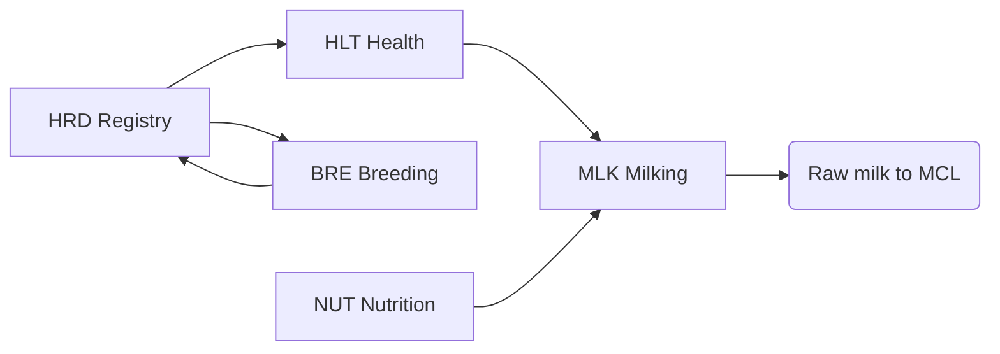

# CAP-0002 — Farm Production Domain (FPR)

## 1. Domain Definition

Everything a dairy business does **on the farm** to produce raw milk: keeping and knowing its animals, keeping them healthy, breeding the next generation, feeding the herd, and extracting and safeguarding milk until it leaves the farm. This is the origin of all value in the ecosystem; every other domain consumes what this domain produces.

**Global note:** the domain spans a hand-milking smallholder with two buffalo and a robotic 5,000-cow operation. Capabilities below are defined so both exercise the *same ability* at different levels of formality and automation.

## 2. Subdomain Overview

| Code | Subdomain | Ability |
| --- | --- | --- |
| `HRD` | Herd & Animal Registry | Knowing which animals exist, who owns them, where they are |
| `HLT` | Animal Health | Keeping animals healthy and milk safe from residues |
| `BRE` | Breeding & Genetics | Producing the next, better generation |
| `NUT` | Feeding & Nutrition | Converting feed into milk economically |
| `MLK` | Milking & On-Farm Handling | Extracting, measuring, and preserving raw milk |

## 3. HRD — Herd & Animal Registry

### FPR.HRD.01 — Animal Identification & Registration

**Purpose:** Establish and maintain a unique, lifelong identity for every animal, from birth or acquisition to disposal.

| Attribute | Detail |
| --- | --- |
| Actors | Farmer/herd manager; cooperative registrar; national ID authority; veterinarian |
| Business value | Foundation for all per-animal decisions, traceability, disease control, and proof of ownership |
| Dependencies | ETE.ONB.01 (owning business verified); national ID schemes via ETE.LOC.01 |
| Business events | Animal Registered; Animal Identity Updated; Animal Disposed/Deceased Recorded |
| AI opportunities | Vision-based identification (muzzle/coat patterns) where tagging is impractical; duplicate-identity detection |
| Reports | Herd register; birth/disposal register; regulatory identification returns |
| KPIs | % animals uniquely identified; registration lag (birth→registered); identity error rate |

### FPR.HRD.02 — Herd Structure & Lifecycle Management

**Purpose:** Organize animals into management groups (lactating, dry, young stock) and manage each animal's lifecycle stage transitions.

| Attribute | Detail |
| --- | --- |
| Actors | Herd manager; farm workers |
| Business value | Right animal in the right group → correct feeding, milking, and breeding decisions |
| Dependencies | FPR.HRD.01; FPR.BRE.01 (reproductive status drives stage) |
| Business events | Animal Group Changed; Lactation Started; Animal Dried Off; Animal Culled |
| AI opportunities | Optimal dry-off timing recommendation; cull-candidate ranking from productivity and health history |
| Reports | Herd composition; lactation distribution; culling analysis |
| KPIs | Herd structure ratio (lactating/dry/young); average lactation number; voluntary vs involuntary cull rate |

### FPR.HRD.03 — Animal Movement & Custody Tracking

**Purpose:** Record every change of an animal's location or custody — between farms, to markets, shows, or slaughter — including cross-border movements.

| Attribute | Detail |
| --- | --- |
| Actors | Farmer; buyer/seller; transporter; border/veterinary authority |
| Business value | Disease containment, theft protection, legal proof of custody; prerequisite for many market accesses |
| Dependencies | FPR.HRD.01; SWC.REG.01 (movement rules per market); QFS.TRC.01 (provenance chain) |
| Business events | Animal Movement Declared; Animal Custody Transferred; Movement Blocked (health restriction) |
| AI opportunities | Anomalous movement pattern detection (theft, disease-risk routing) |
| Reports | Movement history per animal; farm in/out register; regulatory movement declarations |
| KPIs | % movements declared before/at occurrence; movement documentation completeness |

## 4. HLT — Animal Health

### FPR.HLT.01 — Health Monitoring & Case Management

**Purpose:** Detect health problems early and manage each case from observation through recovery or escalation.

| Attribute | Detail |
| --- | --- |
| Actors | Farmer; farm workers; veterinarian; para-vet/community animal health worker |
| Business value | Mastitis and lameness are the largest preventable losses in dairying; early detection preserves yield and milk acceptability |
| Dependencies | FPR.HRD.01; FPR.MLK.02 (yield drops signal illness); DIA.RSK.01 (area outbreak context) |
| Business events | Health Observation Recorded; Health Case Opened; Health Case Resolved; Animal Quarantined |
| AI opportunities | Early illness prediction from yield, activity, and milking behavior; mastitis risk scoring per animal |
| Reports | Open case list; herd health summary; disease incidence trends |
| KPIs | Clinical mastitis incidence per 100 cows; case detection-to-treatment time; recovery rate |

### FPR.HLT.02 — Preventive Care & Vaccination Programs

**Purpose:** Plan and execute vaccination, deworming, hoof care, and other preventive protocols across the herd.

| Attribute | Detail |
| --- | --- |
| Actors | Farmer; veterinarian; cooperative/extension health program coordinator; government campaign teams |
| Business value | Prevention costs a fraction of outbreak losses; herd immunity protects neighboring farms |
| Dependencies | FPR.HRD.01; SWC.REG.01 (mandatory programs per market); CPR.EXT.01 (campaign delivery in cooperative settings) |
| Business events | Preventive Protocol Scheduled; Vaccination Administered; Protocol Compliance Lapsed |
| AI opportunities | Protocol prioritization by regional disease pressure; compliance-risk flagging |
| Reports | Vaccination coverage; due/overdue protocol list; campaign completion |
| KPIs | Vaccination coverage %; on-time protocol completion %; preventable-disease incidence |

### FPR.HLT.03 — Veterinary Service Coordination

**Purpose:** Connect farms with veterinary professionals — requesting, scheduling, and recording professional interventions.

| Attribute | Detail |
| --- | --- |
| Actors | Farmer; veterinarian; para-vet; cooperative vet service desk |
| Business value | In most markets vet access is the binding constraint on herd health; coordination shortens response time |
| Dependencies | ETE.PRT.01 (vets as ecosystem partners); FPR.HLT.01 (cases needing escalation) |
| Business events | Veterinary Visit Requested; Visit Completed; Prescription Issued |
| AI opportunities | Triage assistance (which cases need a vet now); vet routing across dispersed smallholders |
| Reports | Visit history; response-time analysis; vet service utilization |
| KPIs | Request-to-visit time; % cases resolved without escalation; vet visits per 100 animals |

### FPR.HLT.04 — Treatment & Withdrawal Management

**Purpose:** Record every treatment administered and enforce milk/meat withdrawal periods so that milk with drug residues never enters the food chain.

| Attribute | Detail |
| --- | --- |
| Actors | Farmer; veterinarian; milk collector (must know exclusions) |
| Business value | A single residue violation can reject a whole tanker and cost a farm its market access; this is the industry's highest-stakes on-farm discipline |
| Dependencies | FPR.HLT.01; QFS.TST.01 (residue testing verifies compliance); MCL.PCK.01 (excluded animals' milk withheld) |
| Business events | Treatment Recorded; Withdrawal Period Started; Withdrawal Period Ended; Withdrawal Violation Flagged |
| AI opportunities | Withdrawal conflict prevention (alerting before milk from a treated animal reaches the tank) |
| Reports | Treatment register (regulatory); animals-in-withdrawal list; antimicrobial usage report |
| KPIs | Withdrawal violations per year (target: zero); antimicrobial use per animal; treatment record completeness |

## 5. BRE — Breeding & Genetics

### FPR.BRE.01 — Reproductive Cycle Management

**Purpose:** Track each female's reproductive status — heat, insemination, pregnancy, calving — and act at the right time.

| Attribute | Detail |
| --- | --- |
| Actors | Farmer; artificial-insemination technician; veterinarian |
| Business value | Every extra day of calving interval is a day of lost production; reproduction timing is the core economic lever of a dairy herd |
| Dependencies | FPR.HRD.01; FPR.HLT.01 (health affects fertility) |
| Business events | Heat Detected; Insemination Recorded; Pregnancy Confirmed; Calving Recorded |
| AI opportunities | Heat prediction from activity/yield patterns; conception-probability scoring; optimal insemination timing |
| Reports | Reproduction calendar; herd fertility summary; technician performance |
| KPIs | Calving interval; conception rate; services per conception; heat detection rate |

### FPR.BRE.02 — Genetic Evaluation & Mating Planning

**Purpose:** Evaluate animals' genetic merit and choose sires to improve the herd across generations.

| Attribute | Detail |
| --- | --- |
| Actors | Farmer; breeding advisor; artificial-insemination provider; breed association |
| Business value | Genetics compound: each generation's gain in yield, health, and fertility is permanent |
| Dependencies | FPR.BRE.01; FPR.MLK.02 (performance data feeds evaluation); DIA.ANL.01 |
| Business events | Genetic Evaluation Updated; Mating Plan Created; Sire Selected |
| AI opportunities | Genomic-style merit estimation from performance data where genotyping is unavailable; inbreeding-avoidance mating optimization |
| Reports | Herd genetic trend; sire usage; predicted progeny performance |
| KPIs | Genetic gain per generation (yield, health traits); inbreeding coefficient trend |

### FPR.BRE.03 — Calving & Young-Stock Rearing

**Purpose:** Manage calving events and rear calves/heifers to productive age — the herd's replacement pipeline.

| Attribute | Detail |
| --- | --- |
| Actors | Farmer; farm workers; veterinarian |
| Business value | Replacement heifers are the farm's largest hidden investment; rearing losses silently destroy future capacity |
| Dependencies | FPR.BRE.01; FPR.HLT.02 (calf health protocols); FPR.NUT.01 |
| Business events | Calf Born; Colostrum Administered; Weaning Completed; Heifer Entered Milking Herd |
| AI opportunities | Growth-curve monitoring against breed targets; first-calving-age optimization |
| Reports | Calf register; mortality analysis; heifer pipeline projection |
| KPIs | Calf mortality %; age at first calving; heifer growth rate vs target |

## 6. NUT — Feeding & Nutrition

### FPR.NUT.01 — Ration Planning & Feeding Management

**Purpose:** Design and execute feeding regimes that meet each group's nutritional needs at the lowest viable cost.

| Attribute | Detail |
| --- | --- |
| Actors | Farmer; nutritionist/feed advisor; farm workers |
| Business value | Feed is 50–70% of production cost worldwide; ration efficiency is the biggest controllable cost lever |
| Dependencies | FPR.HRD.02 (groups); FPR.NUT.02 (available feeds); FPR.MLK.02 (yield response) |
| Business events | Ration Formulated; Feeding Regime Changed; Feed Response Evaluated |
| AI opportunities | Least-cost ration optimization with local feed availability; yield-response prediction per ration change |
| Reports | Ration composition; feed cost per liter; feed efficiency trends |
| KPIs | Feed cost per liter of milk; feed conversion efficiency; ration compliance % |

### FPR.NUT.02 — Feed Inventory & Procurement

**Purpose:** Plan, procure, and manage stocks of purchased and home-grown feed across seasons.

| Attribute | Detail |
| --- | --- |
| Actors | Farmer; feed suppliers; cooperative input store |
| Business value | Seasonal feed gaps are the top cause of yield collapse in smallholder systems; stock planning smooths production |
| Dependencies | CPR.INP.01 (cooperative supply channel); PEF.FIN.01 (input financing); DIA.FOR.01 (feed demand forecast) |
| Business events | Feed Purchased; Feed Stock Adjusted; Feed Shortage Projected |
| AI opportunities | Seasonal feed-gap forecasting; purchase timing against price cycles |
| Reports | Feed stock position; procurement history; cost trend by feed type |
| KPIs | Days of feed cover; feed price paid vs market benchmark; stock-out incidents |

### FPR.NUT.03 — Pasture & Forage Management

**Purpose:** Manage grazing land and forage production — rotation, cutting, conservation (silage/hay) — as the cheapest feed source.

| Attribute | Detail |
| --- | --- |
| Actors | Farmer; grazing/agronomy advisor |
| Business value | Grass converted directly is the lowest-cost milk in pasture systems; forage quality determines winter/dry-season survival |
| Dependencies | FPR.NUT.01; DIA.RSK.02 (weather intelligence); SWC.ENV.02 (nutrient application rules) |
| Business events | Grazing Rotation Planned; Forage Harvested; Forage Quality Assessed |
| AI opportunities | Satellite/weather-driven pasture growth prediction; rotation and harvest-window optimization |
| Reports | Pasture utilization; forage inventory; forage quality analysis |
| KPIs | Pasture utilization %; forage yield per hectare; % milk from forage |

## 7. MLK — Milking & On-Farm Handling

### FPR.MLK.01 — Milking Operations Management

**Purpose:** Organize the recurring milking process — sessions, order, equipment readiness, labor — whatever the technology level.

| Attribute | Detail |
| --- | --- |
| Actors | Farmer; milkers; equipment technicians |
| Business value | Milking consistency drives both yield and udder health; it is the farm's core daily operation |
| Dependencies | FPR.HRD.02 (who gets milked); FPR.MLK.04 (hygiene protocol); FPR.HLT.04 (excluded animals) |
| Business events | Milking Session Started; Milking Session Completed; Milking Exception Recorded |
| AI opportunities | Session anomaly detection (duration, incomplete milking); equipment failure prediction from session patterns |
| Reports | Session log; milking efficiency; exception summary |
| KPIs | Milking duration per session; sessions per day completed as planned; exception rate |

### FPR.MLK.02 — Individual Yield Recording

**Purpose:** Measure and record milk produced per animal per milking or per period — the farm's most decision-dense data.

| Attribute | Detail |
| --- | --- |
| Actors | Farmer; milkers; milk recording organization (where formal schemes exist) |
| Business value | Per-animal yield underpins feeding, breeding, health detection, and culling — every optimization starts here |
| Dependencies | FPR.HRD.01; FPR.MLK.01 |
| Business events | Yield Recorded; Yield Anomaly Detected |
| AI opportunities | Yield anomaly detection as health early-warning; lactation-curve modeling per animal; estimation methods for non-metered farms |
| Reports | Individual lactation curves; herd yield summary; recording scheme returns |
| KPIs | Milk per cow per day; lactation yield (305-day or local standard); % animals with recorded yields |

### FPR.MLK.03 — On-Farm Storage & Cooling

**Purpose:** Hold milk between milking and collection while preserving quantity and quality — bulk tank, cans, or immediate delivery.

| Attribute | Detail |
| --- | --- |
| Actors | Farmer; equipment suppliers; milk collector |
| Business value | Every degree and hour between udder and chilling costs bacterial quality and therefore price; storage is where farm value is preserved or lost |
| Dependencies | FPR.MLK.01; MCL.CCH.02 (cold chain continues off-farm); FPR.MLK.04 |
| Business events | Milk Stored; Tank Temperature Exception; Milk Handed Over to Collection |
| AI opportunities | Cooling failure prediction; spoilage risk scoring by time-temperature history |
| Reports | Storage temperature log; volume on hand; handover reconciliation |
| KPIs | Time from milking to cooling; temperature excursions per month; on-farm milk losses % |

### FPR.MLK.04 — Milking Hygiene Management

**Purpose:** Define and verify hygiene practices — udder preparation, equipment cleaning, milker health — that determine bacterial quality.

| Attribute | Detail |
| --- | --- |
| Actors | Farmer; milkers; quality advisors; buyer field staff |
| Business value | Hygiene is the cheapest quality intervention in dairying: practice changes alone can move a farm across grade (and price) boundaries |
| Dependencies | FPR.MLK.01; QFS.GRD.01 (grades reflect hygiene outcomes); CPR.EXT.01 (training) |
| Business events | Hygiene Protocol Defined; Hygiene Check Performed; Hygiene Non-Conformance Recorded |
| AI opportunities | Linking hygiene practices to test outcomes to recommend the highest-impact practice change per farm |
| Reports | Hygiene audit results; practice-adoption tracking; quality correlation analysis |
| KPIs | Bacterial count trend; hygiene audit score; % protocols followed |

## 8. Cross-Domain Dependencies

| This Domain Needs | From | For |
| --- | --- | --- |
| Collection schedules and acceptance feedback | MCL | Storage planning, quality feedback loop |
| Test results and grades | QFS | Hygiene and health steering |
| Payment signals and premiums | PEF | Investment decisions on farm |
| Advisory, forecasts, early warnings | DIA | All husbandry decisions |
| Training and inputs | CPR | Capability execution in cooperative markets |
| Verified identity, market rules | ETE | Operating legally per market |

## Change Log

| Version | Date | Author | Change |
| --- | --- | --- | --- |
| 0.1 | 2026-08-02 | Enterprise Architecture | Initial draft: 5 subdomains, 17 capabilities. |
