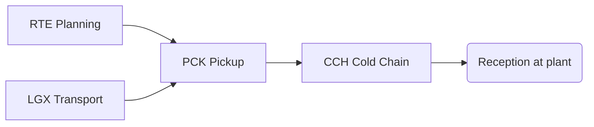

# CAP-0003 — Milk Collection & Logistics Domain (MCL)

## 1. Domain Definition

Moving raw milk from thousands of dispersed farms to processing — planning who collects what and when, physically collecting and measuring it, keeping it cold, and getting it accepted at its destination. This domain is where quantity is fixed for payment and where quality is most easily destroyed; its records are the backbone of producer trust.

**Global note:** two archetypes coexist worldwide — **tanker pickup** at farm bulk tanks (industrialized markets) and **producer delivery** of cans to village collection points/chilling centers (smallholder markets). Every capability covers both.

## 2. Subdomain Overview

| Code | Subdomain | Ability |
| --- | --- | --- |
| `RTE` | Collection Planning | Deciding routes, schedules, and capacity |
| `PCK` | Pickup & Reception | Recording quantity and custody at each handover |
| `CCH` | Cold Chain | Preserving milk quality between farm and plant |
| `LGX` | Transport | Managing carriers, vehicles, and equipment |

## 3. RTE — Collection Planning

### MCL.RTE.01 — Collection Scheduling & Route Planning

**Purpose:** Plan which farms/collection points are visited, in what order, at what times, by which capacity.

| Attribute | Detail |
| --- | --- |
| Actors | Collection planner (cooperative/processor/private collector); drivers; farmers (informed of schedule) |
| Business value | Route efficiency is the domain's main cost lever; schedule reliability determines how long milk waits warm |
| Dependencies | CPR.MEM.01 (who is entitled to collection); DIA.FOR.01 (expected volumes); MCL.LGX.01 (available capacity) |
| Business events | Collection Route Planned; Schedule Published; Route Changed |
| AI opportunities | Route optimization over volumes, road conditions, and tank capacities; dynamic re-planning on disruption |
| Reports | Route plans; schedule adherence; cost per liter collected by route |
| KPIs | Collection cost per liter; on-time pickup %; route utilization % |

### MCL.RTE.02 — Collection Capacity & Demand Balancing

**Purpose:** Match collection capacity to seasonal and daily supply swings — flush seasons, festivals, weather disruptions.

| Attribute | Detail |
| --- | --- |
| Actors | Collection planner; processing intake planner; carrier partners |
| Business value | Under-capacity in flush season means milk poured away at farms; over-capacity is standing cost all year |
| Dependencies | DIA.FOR.01 (supply forecast); PRO.PLN.01 (intake capacity); MCL.LGX.01 |
| Business events | Capacity Plan Updated; Capacity Shortfall Projected; Overflow Arrangement Activated |
| AI opportunities | Seasonal supply forecasting per route/region; capacity scenario optimization |
| Reports | Capacity vs supply projection; shortfall/overflow incidents; seasonal planning pack |
| KPIs | Milk lost to capacity shortfall %; capacity utilization across season; forecast accuracy |

## 4. PCK — Pickup & Reception

### MCL.PCK.01 — Farm Pickup & Quantity Recording

**Purpose:** Execute the collection event at farm or collection point: verify eligibility, measure quantity, take samples, record the transaction.

| Attribute | Detail |
| --- | --- |
| Actors | Collector/driver/collection-point operator; farmer; weigher/sampler |
| Business value | This measurement **is** the producer's income statement; its perceived fairness underpins the entire supply relationship |
| Dependencies | FPR.MLK.03 (milk handed over); FPR.HLT.04 (withdrawal exclusions honored); QFS.TST.01 (sampling); CPR.MEM.01 |
| Business events | Milk Collected; Sample Taken; Collection Rejected at Farm; Collection Missed |
| AI opportunities | Measurement anomaly detection (fraud, equipment drift); missed-collection prediction |
| Reports | Collection register per producer; daily collection summary; rejection log |
| KPIs | Collected volume vs expected; farm-level rejection rate; measurement dispute rate |

### MCL.PCK.02 — Plant & Center Reception and Acceptance

**Purpose:** Receive milk at chilling center or plant: verify quantity against collections, test, and formally accept or reject the load.

| Attribute | Detail |
| --- | --- |
| Actors | Reception operator; quality tester; transporter; intake planner |
| Business value | Acceptance is the legal/commercial transfer point; reconciliations here surface losses and fraud in transit |
| Dependencies | MCL.PCK.01 (what was collected); QFS.TST.03 (acceptance tests); PRO.PLN.01 (intake allocation) |
| Business events | Load Received; Load Accepted; Load Rejected; Quantity Variance Recorded |
| AI opportunities | Transit-loss pattern analysis; adulteration risk screening before full testing |
| Reports | Reception log; collected-vs-received reconciliation; rejection analysis |
| KPIs | Transit loss %; load rejection rate; reception turnaround time |

### MCL.PCK.03 — Collection Dispute Resolution

**Purpose:** Manage disagreements over quantities, quality results, or missed collections between producers and collectors to a recorded resolution.

| Attribute | Detail |
| --- | --- |
| Actors | Farmer; collector; cooperative/buyer field officer; arbiter per market practice |
| Business value | Unresolved measurement disputes are the top driver of producer side-selling and channel leakage |
| Dependencies | MCL.PCK.01/02 (the disputed records); QFS.TST.02 (retest evidence); PEF.SET.01 (settlement impact) |
| Business events | Dispute Raised; Evidence Attached; Dispute Resolved; Settlement Adjusted |
| AI opportunities | Dispute-risk prediction per route/operator; evidence summarization for arbiters |
| Reports | Dispute register; resolution time analysis; dispute causes by route/operator |
| KPIs | Disputes per 1,000 collections; median resolution time; % resolved without escalation |

## 5. CCH — Cold Chain

### MCL.CCH.01 — Chilling Center Operations

**Purpose:** Operate intermediate chilling/bulking facilities where smallholder deliveries are aggregated, cooled, and stored pending transport.

| Attribute | Detail |
| --- | --- |
| Actors | Chilling center operator; delivering farmers; transporters; maintenance providers |
| Business value | Chilling centers are what make smallholder milk marketable at distance — the single most important infrastructure in developing dairy markets |
| Dependencies | MCL.PCK.01 (deliveries in); MCL.CCH.02 (temperature discipline); PEF.SET.01 (center-level accounting) |
| Business events | Center Intake Recorded; Bulk Dispatched; Center Capacity Exceeded; Equipment Fault Recorded |
| AI opportunities | Intake volume prediction per center; chilling equipment failure prediction; energy optimization |
| Reports | Center throughput; center mass balance (in vs out); equipment uptime |
| KPIs | Center utilization %; milk loss at center %; cooling time to target temperature |

### MCL.CCH.02 — Cold Chain Monitoring & Assurance

**Purpose:** Ensure milk temperature stays within safe bounds from farm handover to plant reception, and make excursions visible and actionable.

| Attribute | Detail |
| --- | --- |
| Actors | Collectors; chilling center operators; transporters; quality managers |
| Business value | Temperature history is quality destiny: minutes warm cost grades, hours cost the load |
| Dependencies | FPR.MLK.03 (chain starts on farm); MCL.LGX.01 (transport conditions); QFS.GRD.01 (grade consequences) |
| Business events | Temperature Excursion Detected; Cold Chain Breach Declared; Load Quarantined Pending Test |
| AI opportunities | Spoilage risk scoring from time-temperature profiles; excursion root-cause classification |
| Reports | Cold chain compliance per route/center; excursion log; loss attribution |
| KPIs | % volume within temperature spec end-to-end; excursions per 100 loads; spoilage loss % |

## 6. LGX — Transport

### MCL.LGX.01 — Transport & Carrier Management

**Purpose:** Manage the transport relationships — own fleet, contracted carriers, or informal transporters — that move milk and dairy goods.

| Attribute | Detail |
| --- | --- |
| Actors | Logistics manager; carriers/drivers; procurement |
| Business value | Reliable transport at predictable cost; carrier accountability for what happens between handovers |
| Dependencies | ETE.PRT.01 (carriers as partners); MCL.RTE.01 (demand for transport); SWC.REG.01 (food transport rules) |
| Business events | Carrier Engaged; Trip Assigned; Trip Completed; Carrier Performance Issue Recorded |
| AI opportunities | Carrier reliability scoring; trip-level cost anomaly detection |
| Reports | Carrier performance scorecards; trip log; transport cost analysis |
| KPIs | Trip completion rate; transport cost per liter-km; carrier incident rate |

### MCL.LGX.02 — Fleet & Equipment Utilization

**Purpose:** Manage the physical assets of collection — tankers, cans, coolers, testing kits — their assignment, condition, and renewal.

| Attribute | Detail |
| --- | --- |
| Actors | Fleet manager; drivers; maintenance providers; equipment financiers |
| Business value | Equipment downtime cascades directly into missed collections and lost milk |
| Dependencies | MCL.LGX.01; PEF.FIN.01 (equipment financing); MCL.CCH.02 (equipment fitness for cold chain) |
| Business events | Asset Assigned; Maintenance Performed; Asset Out of Service; Asset Replaced |
| AI opportunities | Predictive maintenance from usage patterns; fleet right-sizing analysis |
| Reports | Asset register; utilization per asset; maintenance cost trends |
| KPIs | Fleet availability %; maintenance cost per liter collected; asset downtime hours |

## 7. Cross-Domain Dependencies

| This Domain Needs | From | For |
| --- | --- | --- |
| Milk ready for handover, withdrawal exclusions | FPR | Pickup execution |
| Acceptance tests, grading, sampling protocols | QFS | Reception decisions |
| Member/supplier entitlement registry | CPR | Who may deliver |
| Settlement of collected quantities | PEF | The commercial meaning of every record made here |
| Supply forecasts and disruption warnings | DIA | Planning and capacity |
| Intake plans and capacity | PRO | Where milk can go |

## Change Log

| Version | Date | Author | Change |
| --- | --- | --- | --- |
| 0.1 | 2026-08-02 | Enterprise Architecture | Initial draft: 4 subdomains, 9 capabilities. |
