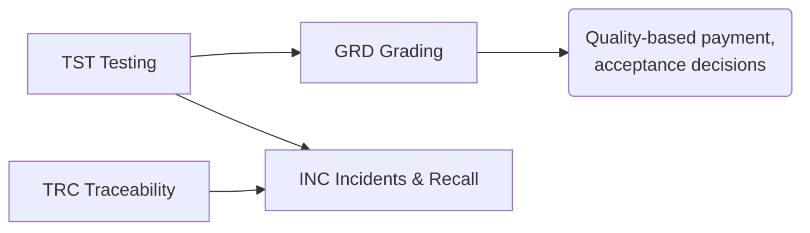

# CAP-0004 — Quality & Food Safety Domain (QFS)

## 1. Domain Definition

Knowing what the milk **is** (testing), what it is **worth** (grading), where it has **been** (traceability), and protecting consumers when something goes **wrong** (incidents and recall). This domain produces the facts that the economic domains act on: quality-based payment, acceptance decisions, and market access all consume its outputs.

**Global note:** the same abilities run on very different instruments — accredited laboratories with infrared analyzers in one market, lactometers and alcohol tests at a village collection point in another. Capability definitions are instrument-independent.

## 2. Subdomain Overview

| Code | Subdomain | Ability |
| --- | --- | --- |
| `TST` | Testing & Analysis | Measuring milk composition, hygiene, and safety |
| `GRD` | Grading & Standards | Converting measurements into commercial classifications |
| `TRC` | Traceability | Following milk and products through the chain |
| `INC` | Incidents & Recall | Containing and correcting food safety failures |

## 3. TST — Testing & Analysis

### QFS.TST.01 — Sampling & Test Orchestration

**Purpose:** Define what gets sampled and tested, when, by whom, against which test plan — from routine per-collection sampling to targeted investigations.

| Attribute | Detail |
| --- | --- |
| Actors | Quality manager; samplers (collectors, reception staff); laboratories; regulators (mandated plans) |
| Business value | Right-sized testing: enough to price fairly and catch risk, not so much that testing costs exceed its value |
| Dependencies | MCL.PCK.01 (sampling occasions); SWC.REG.01 (mandatory test regimes); FPR.HLT.04 (residue risk triggers) |
| Business events | Test Plan Defined; Sample Registered; Test Ordered; Chain-of-Custody Recorded for Sample |
| AI opportunities | Risk-based sampling optimization (test more where risk is higher); sample-tampering pattern detection |
| Reports | Sampling coverage; test plan compliance; cost of quality testing |
| KPIs | Sampling coverage %; sample integrity rate; tests per 1,000 liters |

### QFS.TST.02 — Laboratory Analysis Management

**Purpose:** Manage formal laboratory testing: receiving samples, performing analyses, assuring result validity, and releasing results to entitled parties.

| Attribute | Detail |
| --- | --- |
| Actors | Laboratory (internal or partner); lab technicians; quality manager; accreditation bodies |
| Business value | Results that everyone — farmer, buyer, regulator — accepts as true; the trust anchor of quality-based payment |
| Dependencies | QFS.TST.01 (orders and samples); ETE.PRT.01 (partner labs); ETE.DGV.01 (result access rights) |
| Business events | Sample Received at Lab; Result Released; Result Amended; Retest Performed |
| AI opportunities | Instrument drift detection; result plausibility checking against farm history |
| Reports | Result registers; turnaround analysis; inter-lab comparison |
| KPIs | Result turnaround time; retest rate; proficiency test performance |

### QFS.TST.03 — Rapid & Field Testing

**Purpose:** Perform immediate tests at collection or reception — alcohol, lactometer, adulteration screens — that gate acceptance on the spot.

| Attribute | Detail |
| --- | --- |
| Actors | Collectors; collection point/reception operators; farmers (witnessing) |
| Business value | Catches unacceptable milk **before** it contaminates a bulk volume; the first and cheapest line of defense |
| Dependencies | MCL.PCK.01/02 (the gating moments); QFS.GRD.01 (thresholds applied) |
| Business events | Field Test Performed; Milk Failed Field Test; Adulteration Suspected |
| AI opportunities | Adulteration pattern recognition across producers/routes; test-skipping detection |
| Reports | Field test logs; failure analysis by cause; adulterant incidence |
| KPIs | Field test failure rate; bulk contamination incidents (target: zero); % collections field-tested |

## 4. GRD — Grading & Standards

### QFS.GRD.01 — Quality Grading & Classification

**Purpose:** Convert test results into the grade/class of a milk quantity under the applicable scheme — the commercial verdict on quality.

| Attribute | Detail |
| --- | --- |
| Actors | Quality manager; buyers; producers (recipients of grades); scheme owners |
| Business value | The grade is the bridge from chemistry to money; consistent grading is what makes quality premiums credible |
| Dependencies | QFS.TST.02/03 (results); QFS.GRD.02 (the scheme in force); PEF.MPR.02 (premium consequences) |
| Business events | Quantity Graded; Grade Disputed; Grade Confirmed After Retest |
| AI opportunities | Grade-drift monitoring per producer with early coaching triggers; misgrading anomaly detection |
| Reports | Grade distribution per producer/route/season; grade migration analysis |
| KPIs | % volume in top grade; grade dispute rate; producer grade improvement rate |

### QFS.GRD.02 — Quality Scheme Management

**Purpose:** Define and maintain the grading schemes themselves — parameters, thresholds, test methods, and their evolution per market and buyer.

| Attribute | Detail |
| --- | --- |
| Actors | Quality leadership; buyers; producer representatives; regulators/standards bodies |
| Business value | Schemes aligned with market requirements and achievable by producers; scheme changes managed without breaking trust |
| Dependencies | SWC.REG.01 (regulatory floors); ETE.LOC.01 (market-specific schemes); CPR.GOV.01 (producer consent in cooperatives) |
| Business events | Scheme Defined; Scheme Revised; Scheme Transition Announced |
| AI opportunities | Scheme impact simulation (who gains/loses under a proposed change) before adoption |
| Reports | Scheme definitions in force; scheme change impact analysis |
| KPIs | Scheme stability (changes per year); % producers meeting scheme minimums |

## 5. TRC — Traceability

### QFS.TRC.01 — Batch Traceability & Provenance

**Purpose:** Maintain the ability to trace any milk quantity or product batch backward to its contributing farms and forward to its destinations.

| Attribute | Detail |
| --- | --- |
| Actors | All custodians in the chain; quality manager; regulators; buyers requiring provenance |
| Business value | One-step-back/one-step-forward tracing is a legal requirement in most markets and the precondition for surgical (vs catastrophic) recalls; provenance is increasingly a premium product attribute |
| Dependencies | MCL.PCK.01/02 (custody records); PRO.MFG.01 (batch composition); FPR.HRD.03 (animal-level provenance where required) |
| Business events | Batch Composed; Trace Requested; Trace Completed |
| AI opportunities | Trace-gap detection (where the chain would break before it must be used) |
| Reports | Trace exercise results; chain completeness audits; provenance statements |
| KPIs | Trace completion time (regulatory target, e.g. < 4 hours); trace completeness %; mock-trace success rate |

### QFS.TRC.02 — Chain-of-Custody Documentation

**Purpose:** Produce and preserve the formal documentation of each custody transfer — delivery notes, acceptance records, transport documents — as legally valid evidence.

| Attribute | Detail |
| --- | --- |
| Actors | Every transferring/receiving party; auditors; customs (export); courts (disputes) |
| Business value | When quantity, quality, or safety is contested, documentation is what decides; exports die without it |
| Dependencies | MCL.PCK.01/02; CMA.EXP.01 (export documentation demands); SWC.REG.02 (audit demands) |
| Business events | Custody Document Issued; Document Countersigned; Document Corrected |
| AI opportunities | Document completeness/consistency checking; fraud-pattern detection across documents |
| Reports | Custody document archive; documentation exception log |
| KPIs | Documentation completeness %; document correction rate; audit findings on documentation |

## 6. INC — Incidents & Recall

### QFS.INC.01 — Food Safety Incident Management

**Purpose:** Detect, assess, and manage food safety events — contamination, residue findings, pathogen detections — from first signal to closure.

| Attribute | Detail |
| --- | --- |
| Actors | Quality manager; food safety team; affected custodians; regulators; laboratories |
| Business value | Hours of delay in containment multiply exposure; disciplined incident management is the difference between a contained event and a brand catastrophe |
| Dependencies | QFS.TST.02/03 (detection signals); QFS.TRC.01 (scoping the exposure); SWC.REG.01 (notification duties) |
| Business events | Incident Declared; Affected Scope Determined; Authority Notified; Incident Closed |
| AI opportunities | Early signal correlation (linking scattered test anomalies into one emerging incident); scope estimation |
| Reports | Incident register; root cause analyses; regulator notifications |
| KPIs | Signal-to-containment time; incidents closed with verified root cause %; repeat-cause incidents |

### QFS.INC.02 — Recall & Withdrawal Execution

**Purpose:** Execute the removal of affected product from the chain and market — notifications, retrieval, disposition, and verification of effectiveness.

| Attribute | Detail |
| --- | --- |
| Actors | Recall coordinator; distributors and retailers; regulators; consumers (public recalls); disposal services |
| Business value | Recall speed and completeness directly bound consumer harm and legal liability |
| Dependencies | QFS.INC.01 (the triggering incident); QFS.TRC.01 (where product went); CMA.DST.01 (distribution reach-back) |
| Business events | Recall Initiated; Recall Notice Distributed; Product Retrieved; Recall Effectiveness Verified; Recall Closed |
| AI opportunities | Retrieval-rate prediction and prioritization of retrieval effort |
| Reports | Recall status; retrieval reconciliation; effectiveness verification; post-recall review |
| KPIs | Time to first notification; retrieval rate %; recall cost; regulator acceptance of closure |

## 7. Cross-Domain Dependencies

| This Domain Needs | From | For |
| --- | --- | --- |
| Sampling occasions and custody records | MCL | Testing and tracing |
| Treatment/withdrawal records | FPR | Residue risk management |
| Batch composition records | PRO | Forward/backward tracing |
| Distribution destinations | CMA | Recall reach |
| Regulatory obligations per market | SWC | Test regimes, notification duties |
| Its grades consumed by | PEF | Quality-based payment |

## Change Log

| Version | Date | Author | Change |
| --- | --- | --- | --- |
| 0.1 | 2026-08-02 | Enterprise Architecture | Initial draft: 4 subdomains, 9 capabilities. |
