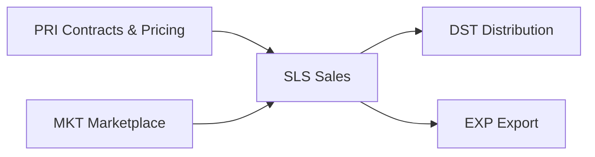

# CAP-0006 — Commerce & Market Access Domain (CMA)

## 1. Domain Definition

Converting milk and dairy products into revenue: agreeing terms with buyers, taking and fulfilling orders, trading raw milk and surpluses between ecosystem participants, distributing product, and reaching markets across borders. The domain serves every seller in the ecosystem — a cooperative selling raw milk to a processor, a processor selling cheese to retail, a farmer selling surplus to a neighbor dairy.

**Global note:** formal contracted supply chains, wet markets, and everything between. The capabilities describe the commercial abilities, not the channel's formality.

## 2. Subdomain Overview

| Code | Subdomain | Ability |
| --- | --- | --- |
| `PRI` | Pricing & Contracts | Agreeing who buys what at which terms |
| `SLS` | Sales | Taking and managing orders and buyer relationships |
| `MKT` | Marketplace | Matching supply and demand between ecosystem participants |
| `DST` | Distribution | Physically fulfilling sales |
| `EXP` | Export | Crossing borders with dairy products |

## 3. PRI — Pricing & Contracts

### CMA.PRI.01 — B2B Contract Management

**Purpose:** Establish and manage supply agreements between ecosystem businesses — volumes, duration, quality terms, price mechanisms, and their fulfillment tracking.

| Attribute | Detail |
| --- | --- |
| Actors | Commercial managers of seller and buyer; legal; quality (terms) |
| Business value | Contracts convert perishable daily production into predictable revenue; fulfillment discipline protects relationships and prices |
| Dependencies | PRO.PLN.02 (deliverable volumes); QFS.GRD.02 (quality terms reference schemes); PEF.MPR.01 (raw milk price mechanisms) |
| Business events | Contract Agreed; Contract Amended; Fulfillment Shortfall Recorded; Contract Renewed/Expired |
| AI opportunities | Contract risk scoring (fulfillment feasibility vs supply forecast); renewal-term recommendation |
| Reports | Contract register; fulfillment vs commitment; contract profitability |
| KPIs | Contracted volume fulfillment %; % production under contract; contract renewal rate |

### CMA.PRI.02 — Product Pricing Management

**Purpose:** Set and maintain selling prices for products across channels, markets, and customer segments — list prices, promotions, and price change governance.

| Attribute | Detail |
| --- | --- |
| Actors | Pricing/commercial management; sales; finance |
| Business value | Dairy margins are thin; disciplined pricing against volatile input costs is survival, not optimization |
| Dependencies | DIA.FOR.02 (market price outlook); PRO.PLN.01 (cost basis); CMA.SLS.02 (segment strategy) |
| Business events | Price List Published; Price Changed; Promotion Activated/Ended |
| AI opportunities | Price elasticity estimation per product/market; input-cost pass-through recommendation |
| Reports | Price lists in force; realized price vs list; margin bridge by product |
| KPIs | Realized margin per product; price realization % (actual vs list); pricing decision lead time |

## 4. SLS — Sales

### CMA.SLS.01 — Order Management

**Purpose:** Capture, confirm, and track buyer orders from placement through delivery and invoicing readiness.

| Attribute | Detail |
| --- | --- |
| Actors | Buyers; sales staff/agents; fulfillment; finance |
| Business value | The order is the commercial heartbeat; order reliability (right product, quantity, time) is what buyers actually purchase |
| Dependencies | PRO.INV.01 (availability); CMA.PRI.01/02 (applicable terms); CMA.DST.01 (fulfillment) |
| Business events | Order Placed; Order Confirmed; Order Fulfilled; Order Short-Shipped; Order Cancelled |
| AI opportunities | Order-fill risk prediction; suggested substitute/allocation under shortage |
| Reports | Order book; fill-rate analysis; order-to-delivery cycle times |
| KPIs | Order fill rate %; on-time-in-full (OTIF) %; order cycle time |

### CMA.SLS.02 — Buyer Relationship Management

**Purpose:** Know and develop the buyer base — segmentation, terms history, performance, credit exposure, and growth of each relationship.

| Attribute | Detail |
| --- | --- |
| Actors | Sales/account managers; finance (credit); buyers |
| Business value | Concentrated buyer bases are dairy's chronic risk; managed relationships and credit discipline protect both revenue and cash |
| Dependencies | CMA.SLS.01 (transaction history); PEF.SET.02 (receivables reality); ETE.ONB.01 (buyer verification) |
| Business events | Buyer Registered; Credit Terms Set; Buyer Review Completed; Buyer Status Changed |
| AI opportunities | Churn-risk and payment-risk scoring; share-of-wallet growth recommendations |
| Reports | Buyer performance scorecards; credit exposure; revenue concentration |
| KPIs | Buyer retention %; days sales outstanding; revenue concentration (top-5 share) |

## 5. MKT — Marketplace

### CMA.MKT.01 — Raw Milk & Surplus Trading

**Purpose:** Match sellers and buyers of raw milk and surpluses within the ecosystem — spot volumes, seasonal surpluses, inter-processor balancing.

| Attribute | Detail |
| --- | --- |
| Actors | Selling producers/cooperatives/processors; buying processors/traders; market facilitator |
| Business value | Gives surplus milk a price instead of a drain; gives deficit processors supply without long-term commitment — the ecosystem's shock absorber |
| Dependencies | QFS.GRD.01 (traded milk needs credible grades); MCL.LGX.01 (delivery feasibility); ETE.ONB.01 (verified counterparties); PEF.SET.02 (trade settlement) |
| Business events | Offer Listed; Bid Placed; Trade Matched; Trade Fulfilled; Trade Defaulted |
| AI opportunities | Price discovery support (fair-value estimation per grade/location); counterparty reliability scoring; match optimization with transport cost |
| Reports | Trade volumes and prices; market depth; default/dispute log |
| KPIs | Matched volume; time-to-match; trade completion rate %; price spread vs reference |

### CMA.MKT.02 — Marketplace Participant Management

**Purpose:** Govern who may trade — eligibility, standing rules, conduct, sanctions — so the market stays trusted.

| Attribute | Detail |
| --- | --- |
| Actors | Market operator; participants; dispute arbiters |
| Business value | Markets die from bad actors faster than from thin volume; participant governance is the market's immune system |
| Dependencies | ETE.ONB.01 (identity); CMA.MKT.01 (conduct evidence); MCL.PCK.03 / QFS pattern for dispute practice |
| Business events | Participant Admitted; Conduct Warning Issued; Participant Suspended; Participant Reinstated |
| AI opportunities | Market abuse pattern detection (collusion, phantom offers, grade misrepresentation) |
| Reports | Participant register; conduct case log; market integrity review |
| KPIs | Active participant count; conduct incidents per 1,000 trades; suspension recidivism |

## 6. DST — Distribution

### CMA.DST.01 — Distribution & Fulfillment

**Purpose:** Deliver sold product to buyers — own delivery, distributors, or buyer pickup — with condition, quantity, and documentation intact.

| Attribute | Detail |
| --- | --- |
| Actors | Distribution staff; distributors/carriers; buyers (receiving) |
| Business value | Fulfillment is where the sale becomes real; delivery condition failures for chilled product forfeit both the sale and the trust |
| Dependencies | CMA.SLS.01 (what to deliver); MCL.LGX.01 (transport capability, shared with collection); QFS.TRC.02 (delivery documentation); PRO.INV.01 (dispatch) |
| Business events | Shipment Dispatched; Delivery Confirmed; Delivery Rejected; Return Processed |
| AI opportunities | Delivery route/load optimization for mixed chilled cargo; rejection-risk prediction |
| Reports | Delivery performance; rejection/return analysis; distribution cost per unit |
| KPIs | OTIF %; delivery rejection rate; distribution cost as % of revenue |

## 7. EXP — Export

### CMA.EXP.01 — Export & Cross-Border Trade

**Purpose:** Sell into other countries: destination-market eligibility, health certificates, customs documentation, and cross-border logistics coordination.

| Attribute | Detail |
| --- | --- |
| Actors | Export manager; veterinary/competent authorities (certificates); customs brokers; international buyers |
| Business value | Export access diversifies demand and lifts domestic price floors; certification failures strand perishable shipments at borders |
| Dependencies | SWC.REG.01 (exporting- and destination-market rules); SWC.CRT.01 (required certifications); QFS.TRC.02 (documentation); PRO.PKG.01 (destination labeling) |
| Business events | Export Order Accepted; Health Certificate Issued; Shipment Cleared; Shipment Rejected at Border |
| AI opportunities | Destination-requirement compliance pre-checking; border-rejection risk scoring per shipment |
| Reports | Export volumes by destination; certificate register; border incident log |
| KPIs | Border rejection rate (target: zero); certificate issuance lead time; export share of revenue |

## 8. Cross-Domain Dependencies

| This Domain Needs | From | For |
| --- | --- | --- |
| Available product, batch identity | PRO | Selling and fulfilling |
| Grades and documentation | QFS | Trusted trading, export, recalls reach-back |
| Settlement and receivables execution | PEF | Getting paid |
| Demand/price forecasts | DIA | Pricing and contracting |
| Verified counterparties, market rules | ETE | Trading and export legality |

## Change Log

| Version | Date | Author | Change |
| --- | --- | --- | --- |
| 0.1 | 2026-08-02 | Enterprise Architecture | Initial draft: 5 subdomains, 8 capabilities. |
