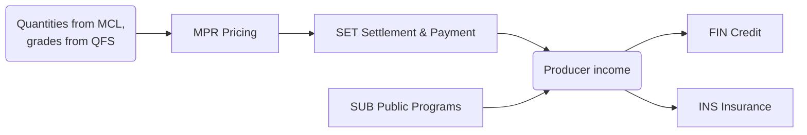

# CAP-0007 — Producer Economics & Financial Services Domain (PEF)

## 1. Domain Definition

The money side of milk: how a liter's price is determined, how producers get paid correctly and on time, and how they access the financial services — credit, insurance, subsidies — that dairying's cash-flow profile demands. This domain closes the ecosystem's central incentive loop: quality and quantity facts (QFS, MCL) become income (here), which drives on-farm behavior (FPR).

**Global note:** payment rails range from monthly bank settlement to daily mobile-money and cash; pricing from flat per-liter to multi-component formulas. The abilities are constant; their parameterization is per market and per buyer.

## 2. Subdomain Overview

| Code | Subdomain | Ability |
| --- | --- | --- |
| `MPR` | Milk Pricing | Defining what a liter is worth |
| `SET` | Settlement & Payments | Computing and paying what each producer is owed |
| `FIN` | Financial Access | Connecting producers to credit |
| `INS` | Risk & Insurance | Protecting against livestock and production shocks |
| `SUB` | Public Programs | Administering subsidies and government schemes |

## 3. MPR — Milk Pricing

### PEF.MPR.01 — Milk Pricing Scheme Management

**Purpose:** Define and maintain the formula that turns collected milk into money — per-liter, fat/SNF-based, multi-component, seasonal adjustments — per buyer and market.

| Attribute | Detail |
| --- | --- |
| Actors | Buyer commercial leadership; producer representatives; regulators (where prices are administered) |
| Business value | The pricing scheme is the ecosystem's steering wheel: it tells every producer what to optimize; transparent schemes build supply loyalty |
| Dependencies | QFS.GRD.02 (schemes reference quality parameters); CPR.GOV.01 (producer consent in cooperatives); ETE.LOC.01 (administered prices per market); DIA.FOR.02 (market alignment) |
| Business events | Pricing Scheme Published; Scheme Revised; Scheme Simulation Requested |
| AI opportunities | Scheme impact simulation across the actual supplier base before changes; competitive-scheme benchmarking |
| Reports | Scheme definitions in force; scheme change history; average price outcome by scheme |
| KPIs | Producer comprehension/dispute rate on pricing; scheme change frequency; price competitiveness vs region |

### PEF.MPR.02 — Quality Premium & Penalty Management

**Purpose:** Operate the quality-linked component of pricing — premiums for top grades, penalties for failures — as the incentive engine for quality improvement.

| Attribute | Detail |
| --- | --- |
| Actors | Quality and commercial management; producers (recipients); field advisory staff |
| Business value | Quality-based payment is the proven mechanism that lifts national milk quality; poorly designed penalties, though, push producers into informal channels |
| Dependencies | QFS.GRD.01 (grades per delivery); PEF.MPR.01 (scheme frame); CPR.EXT.01 (coaching so producers can respond) |
| Business events | Premium Applied; Penalty Applied; Incentive Outcome Reviewed |
| AI opportunities | Incentive-response modeling (which premium levels actually change behavior per segment) |
| Reports | Premium/penalty distribution; quality-income correlation; incentive effectiveness review |
| KPIs | % producers earning premiums; quality improvement rate among penalized producers; premium budget efficiency |

## 4. SET — Settlement & Payments

### PEF.SET.01 — Producer Settlement Calculation

**Purpose:** Compute, for each settlement period, exactly what each producer is owed: quantities × scheme prices ± premiums/penalties − deductions, with a statement the producer can verify.

| Attribute | Detail |
| --- | --- |
| Actors | Settlement officer; producers; cooperative/buyer finance |
| Business value | A verifiable, correct settlement statement is the single largest trust artifact in the producer relationship |
| Dependencies | MCL.PCK.01 (quantities); QFS.GRD.01 (grades); PEF.MPR.01/02 (prices); PEF.SET.03 (deductions); CPR.MEM.01 (who settles) |
| Business events | Settlement Period Closed; Settlement Computed; Statement Issued; Settlement Corrected |
| AI opportunities | Settlement anomaly detection before publication; plain-language statement explanation per producer |
| Reports | Settlement statements; settlement run summary; correction log |
| KPIs | Settlement accuracy (corrections per 1,000 statements); statement issuance timeliness; producer queries per settlement |

### PEF.SET.02 — Payment Execution & Reconciliation

**Purpose:** Move the money — via bank, mobile money, or cash — and reconcile every payment against its settlement, chasing failures to closure.

| Attribute | Detail |
| --- | --- |
| Actors | Finance/treasury; payment providers; producers; agents (cash markets) |
| Business value | Payment reliability is the currency of supply loyalty: producers stay with the buyer who pays on time, every time |
| Dependencies | PEF.SET.01 (amounts); ETE.PRT.01 (payment providers); ETE.ONB.01 (verified payees) |
| Business events | Payment Batch Executed; Payment Confirmed; Payment Failed; Payment Reconciled |
| AI opportunities | Payment failure prediction (invalid accounts, provider outages); fraud pattern detection in payout flows |
| Reports | Payment run results; failure/retry log; reconciliation status |
| KPIs | On-time payment %; payment failure rate; time from period close to funds received |

### PEF.SET.03 — Deduction & Advance Management

**Purpose:** Manage amounts withheld from settlements — input credit recovery, loan installments, insurance premiums, share contributions — and cash advances against future deliveries.

| Attribute | Detail |
| --- | --- |
| Actors | Cooperative/buyer finance; producers; lending and insurance partners |
| Business value | Settlement-linked recovery is what makes smallholder credit viable at all; transparent deductions keep it from feeling like confiscation |
| Dependencies | PEF.SET.01 (the settlement to deduct from); PEF.FIN.01, PEF.INS.01, CPR.INP.01, CPR.GOV.02 (deduction sources) |
| Business events | Deduction Authorized; Advance Granted; Deduction Applied; Deduction Disputed |
| AI opportunities | Sustainable-deduction ceiling estimation per producer (avoiding income shocks that drive exit) |
| Reports | Deduction registers by source; advance exposure; net-income impact analysis |
| KPIs | Deduction transparency (disputes per 1,000); advance repayment rate; net payout share of gross |

## 5. FIN — Financial Access

### PEF.FIN.01 — Producer Credit & Financing Access

**Purpose:** Connect producers with credit — input finance, equipment loans, working capital — using their production and settlement history as the basis for creditworthiness.

| Attribute | Detail |
| --- | --- |
| Actors | Producers; lenders (banks, microfinance, input suppliers); cooperative as facilitator/guarantor |
| Business value | Credit is the binding constraint on smallholder productivity growth; verified production history converts unbankable farmers into bankable ones |
| Dependencies | PEF.SET.01/02 (income history as credit evidence — with consent per ETE.DGV.01); PEF.SET.03 (repayment channel); ETE.PRT.01 (lender partners) |
| Business events | Financing Requested; Credit Assessment Completed; Loan Disbursed; Loan Repaid/Defaulted |
| AI opportunities | Production-history-based credit scoring; default early warning from delivery pattern changes |
| Reports | Loan portfolio by producer segment; repayment performance; credit access penetration |
| KPIs | % producers with credit access; repayment rate; time from request to disbursement |

## 6. INS — Risk & Insurance

### PEF.INS.01 — Livestock & Production Insurance

**Purpose:** Protect producers against animal loss, disease, and production shocks through insurance products, from enrollment through claims.

| Attribute | Detail |
| --- | --- |
| Actors | Producers; insurers; veterinarians (verification); cooperative as aggregator |
| Business value | One animal's death can erase a smallholder's year; insurance keeps shocks from becoming exits from dairying |
| Dependencies | FPR.HRD.01 (insured animal identity); FPR.HLT.01 (health records as claim evidence); PEF.SET.03 (premium collection); ETE.PRT.01 (insurer partners) |
| Business events | Policy Enrolled; Premium Collected; Claim Filed; Claim Assessed; Claim Paid |
| AI opportunities | Parametric trigger design (index-based payout); claim fraud detection; risk-based premium support |
| Reports | Enrollment coverage; claims experience; loss ratio by region/peril |
| KPIs | Insurance penetration %; claim settlement time; claim dispute rate |

## 7. SUB — Public Programs

### PEF.SUB.01 — Subsidy & Program Administration

**Purpose:** Administer government and donor programs targeting dairy producers — eligibility, enrollment, benefit delivery, and accountability reporting.

| Attribute | Detail |
| --- | --- |
| Actors | Producers; government agencies/donors; cooperative or buyer as delivery channel; auditors |
| Business value | Programs move real money and inputs; clean administration gets benefits to intended recipients and keeps the delivery channel trusted by funders |
| Dependencies | CPR.MEM.01 / ETE.ONB.01 (verified beneficiaries); ETE.LOC.01 (program rules per market); PEF.SET.02 (delivery rails); ETE.DGV.01 (data sharing with agencies) |
| Business events | Program Enrolled; Eligibility Verified; Benefit Delivered; Program Reported |
| AI opportunities | Eligibility verification support; leakage/ghost-beneficiary detection |
| Reports | Beneficiary registers; disbursement reports; program accountability packs |
| KPIs | Benefit delivery accuracy %; leakage rate; reporting acceptance by funder |

## 8. Cross-Domain Dependencies

| This Domain Needs | From | For |
| --- | --- | --- |
| Collected quantities, dispute outcomes | MCL | Settlement inputs |
| Grades and quality results | QFS | Quality-based payment |
| Member registry, governance consent | CPR | Who is settled, scheme legitimacy |
| Verified identities, partners, consent | ETE | Payments, credit, programs |
| Price forecasts, anomaly intelligence | DIA | Scheme design, fraud control |
| Its payments driving behavior in | FPR | The incentive loop this domain exists to close |

## Change Log

| Version | Date | Author | Change |
| --- | --- | --- | --- |
| 0.1 | 2026-08-02 | Enterprise Architecture | Initial draft: 5 subdomains, 8 capabilities. |
