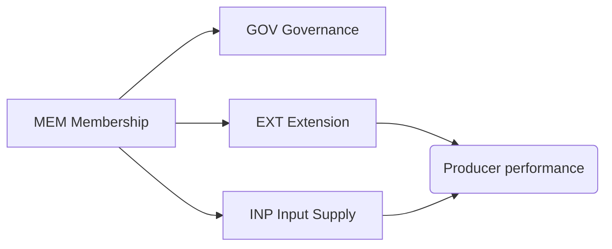

# CAP-0008 — Cooperative & Producer Relations Domain (CPR)

## 1. Domain Definition

How producer organizations — cooperatives, producer companies, farmer groups — and buyer supply-chain teams manage their relationship with producers: who belongs, how collective decisions are made, how knowledge reaches farms, and how inputs and shared services are provided. In much of the world, the cooperative **is** the dairy economy's operating unit; where cooperatives are absent, processors run equivalent supplier-relations capabilities.

**Global note:** applies to formal cooperatives (India's Anand pattern, European co-ops), producer companies, informal farmer groups, and processor-run supplier programs alike; "member" reads as "registered supplier" in investor-owned contexts.

## 2. Subdomain Overview

| Code | Subdomain | Ability |
| --- | --- | --- |
| `MEM` | Membership | Knowing and managing who belongs |
| `GOV` | Governance | Collective decisions, shares, and patronage |
| `EXT` | Extension Services | Moving knowledge to farms |
| `INP` | Input Supply | Providing inputs and shared services |

## 3. MEM — Membership

### CPR.MEM.01 — Producer Registry & Membership Management

**Purpose:** Maintain the authoritative register of producers in the organization — status, entitlements, delivery rights, and history.

| Attribute | Detail |
| --- | --- |
| Actors | Membership officer; producers; board (admission/termination decisions) |
| Business value | The registry defines who may deliver milk, who gets paid, who votes, and who receives services — it anchors four other domains |
| Dependencies | ETE.ONB.01 (identity verification); CPR.GOV.01 (admission rules) |
| Business events | Member Admitted; Member Status Changed; Member Withdrawn/Terminated |
| AI opportunities | Membership churn prediction (who is about to leave for a competitor or informal channel) |
| Reports | Member register; membership movement; active vs dormant analysis |
| KPIs | Active member %; member retention rate; registry accuracy audit results |

### CPR.MEM.02 — Member Onboarding & Verification

**Purpose:** Take a prospective member from application to productive participation — verification, orientation, initial farm assessment, and first delivery.

| Attribute | Detail |
| --- | --- |
| Actors | Prospective members; membership officer; field staff (farm assessment) |
| Business value | Onboarding quality predicts member lifetime value; a member who delivers within days stays for years |
| Dependencies | CPR.MEM.01 (registration); ETE.ONB.01 (business identity); MCL.RTE.01 (route assignment); FPR baseline capture |
| Business events | Application Received; Verification Completed; First Delivery Made; Onboarding Completed |
| AI opportunities | Onboarding drop-off prediction; farm potential assessment from baseline data |
| Reports | Onboarding pipeline; time-to-first-delivery; drop-off analysis |
| KPIs | Application-to-first-delivery time; onboarding completion rate; 90-day new-member retention |

## 4. GOV — Governance

### CPR.GOV.01 — Cooperative Governance & Decision-Making

**Purpose:** Run the organization's collective decision processes — general meetings, board elections, votes on schemes and rules — with recorded legitimacy.

| Attribute | Detail |
| --- | --- |
| Actors | Members; board; management; regulators of cooperative law |
| Business value | Legitimate governance is why members accept prices and deductions; contested governance destroys cooperatives faster than bad prices |
| Dependencies | CPR.MEM.01 (who may vote); ETE.LOC.01 (cooperative law per market) |
| Business events | Meeting Convened; Resolution Passed; Election Completed; Rule Amended |
| AI opportunities | Participation analysis and inclusive-engagement recommendations (reaching remote/female/young members) |
| Reports | Meeting minutes and resolutions; election records; participation statistics |
| KPIs | Voting participation %; resolution implementation rate; governance dispute incidence |

### CPR.GOV.02 — Share Capital & Patronage Management

**Purpose:** Manage members' financial stake — share capital, patronage-based allocations of surplus, and equity accounts over the membership lifecycle.

| Attribute | Detail |
| --- | --- |
| Actors | Members; finance; board; auditors |
| Business value | Patronage returns are the cooperative's differentiating promise: profit flows back in proportion to use, and members can verify it |
| Dependencies | CPR.MEM.01; PEF.SET.01 (patronage base = delivery history); PEF.SET.03 (share contributions via deduction) |
| Business events | Shares Issued; Patronage Allocated; Equity Redeemed |
| AI opportunities | Equity redemption liability forecasting across member age structure |
| Reports | Share register; patronage allocation statements; equity position |
| KPIs | Patronage payout timeliness; equity redemption backlog; member equity satisfaction (survey) |

## 5. EXT — Extension Services

### CPR.EXT.01 — Extension & Training Delivery

**Purpose:** Deliver structured knowledge programs to producers — hygiene, feeding, health, business skills — through trainings, campaigns, and media appropriate to each market.

| Attribute | Detail |
| --- | --- |
| Actors | Extension officers; trainers; producers; program funders |
| Business value | Knowledge is the cheapest input in dairying: hygiene and feeding training routinely outperform capital investment in yield-per-cost |
| Dependencies | CPR.MEM.01 (audience); DIA.ANL.01 (targeting by performance gaps); FPR.MLK.04 / FPR.NUT.01 (content domains) |
| Business events | Program Launched; Training Delivered; Attendance Recorded; Competency Assessed |
| AI opportunities | Training targeting by predicted impact; localized content generation in local languages; adoption tracking |
| Reports | Training coverage; adoption tracking; impact evaluation (before/after performance) |
| KPIs | Training reach %; practice adoption rate; performance delta of trained vs untrained cohorts |

### CPR.EXT.02 — Field Advisory Visit Management

**Purpose:** Plan and record one-to-one field visits to farms — diagnosis, advice, follow-up — the retail channel of extension.

| Attribute | Detail |
| --- | --- |
| Actors | Field/extension officers; producers; subject specialists (escalation) |
| Business value | The field visit is where generic training becomes farm-specific change; visit records build the farm's development history |
| Dependencies | CPR.EXT.01 (programs to reinforce); DIA.ADV.01 (advisory content); FPR.* (the practices advised on) |
| Business events | Visit Planned; Visit Completed; Recommendation Issued; Follow-Up Scheduled |
| AI opportunities | Visit prioritization (which farms need attention now); recommendation effectiveness learning |
| Reports | Visit logs; recommendation follow-through; officer coverage and productivity |
| KPIs | Farms visited per officer per month; recommendation adoption %; repeat-issue rate |

## 6. INP — Input Supply

### CPR.INP.01 — Input Supply & Store Management

**Purpose:** Procure and distribute production inputs — feed, minerals, veterinary supplies, hygiene materials — to producers, often on settlement-linked credit.

| Attribute | Detail |
| --- | --- |
| Actors | Input store staff; producers; suppliers; finance (credit link) |
| Business value | Aggregated procurement cuts input costs 10–30%; settlement-linked credit makes inputs accessible when cash is short |
| Dependencies | PEF.SET.03 (credit recovery); FPR.NUT.02 (demand); ETE.PRT.01 (suppliers); CPR.MEM.01 (eligible buyers) |
| Business events | Input Stock Received; Input Sold/Issued; Input Credit Extended |
| AI opportunities | Demand forecasting per store; quality-outcome linkage (which inputs actually improve member performance) |
| Reports | Store sales and stock; input credit exposure; price benchmark vs open market |
| KPIs | Member input purchase share; input price advantage vs market; store stock-out rate |

### CPR.INP.02 — Shared Equipment & Services

**Purpose:** Operate shared productive assets and services — chilling equipment, breeding services, machinery, testing kits — that individual producers cannot justify alone.

| Attribute | Detail |
| --- | --- |
| Actors | Service coordinators; operators; producers (users); maintenance providers |
| Business value | Shared assets bring smallholders technologies otherwise reserved for scale — the cooperative's classic economic function |
| Dependencies | CPR.MEM.01 (entitled users); PEF.SET.03 (usage fee recovery); MCL.CCH.01 (chilling as a shared service) |
| Business events | Service Requested; Service Delivered; Usage Charged; Asset Maintained |
| AI opportunities | Utilization optimization and fair scheduling; service pricing that sustains the asset |
| Reports | Service utilization; cost recovery per asset; member usage equity |
| KPIs | Asset utilization %; cost recovery ratio; service waiting time |

## 7. Cross-Domain Dependencies

| This Domain Needs | From | For |
| --- | --- | --- |
| Settlement engine and deduction channel | PEF | Patronage, input credit, service fees |
| Delivery and quality performance data | MCL, QFS | Targeting extension, patronage base |
| Verified identities and partner network | ETE | Membership integrity, suppliers |
| Analytics and advisory content | DIA | Extension targeting and content |
| Its registry consumed by | MCL, PEF | Delivery rights and settlement |

## Change Log

| Version | Date | Author | Change |
| --- | --- | --- | --- |
| 0.1 | 2026-08-02 | Enterprise Architecture | Initial draft: 4 subdomains, 8 capabilities. |
