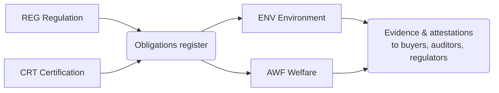

# CAP-0009 — Sustainability, Welfare & Compliance Domain (SWC)

## 1. Domain Definition

The license to operate: managing dairying's environmental footprint, assuring animal welfare, meeting every regulatory obligation in every operating market, and earning the certifications that markets increasingly demand. This domain converts external requirements — law, buyer standards, social expectations — into managed obligations and evidenced conformance across the whole chain.

**Global note:** the obligations differ enormously (EU emissions accounting vs basic effluent rules; codified welfare law vs custom), but the *abilities* — know your obligations, meet them, prove it — are universal. Rising buyer-driven standards travel across borders faster than law does.

## 2. Subdomain Overview

| Code | Subdomain | Ability |
| --- | --- | --- |
| `ENV` | Environmental Stewardship | Managing emissions, nutrients, water, and energy |
| `AWF` | Animal Welfare | Assuring and evidencing animal care standards |
| `REG` | Regulatory Compliance | Knowing and meeting legal obligations |
| `CRT` | Certification | Earning and keeping voluntary standards |

## 3. ENV — Environmental Stewardship

### SWC.ENV.01 — Emissions & Environmental Footprint Management

**Purpose:** Measure, report, and reduce the greenhouse-gas and broader environmental footprint of milk production and processing — per farm, per facility, per liter.

| Attribute | Detail |
| --- | --- |
| Actors | Farmers; processors; sustainability managers; buyers (footprint demands); regulators; carbon program operators |
| Business value | Footprint per liter is becoming a market-access requirement and a price factor in premium markets; credible measurement is also the gate to carbon-income opportunities |
| Dependencies | FPR.NUT.01 (feed drives enteric emissions); FPR.HRD.02 (herd structure); PRO.MFG.01 (processing energy); DIA.ANL.02 (benchmarking) |
| Business events | Footprint Assessed; Reduction Target Set; Reduction Action Recorded; Footprint Reported |
| AI opportunities | Footprint estimation from operational data where direct measurement is impractical; reduction-lever recommendation ranked by cost per tonne |
| Reports | Footprint statements per farm/product; reduction progress; buyer/regulator disclosures |
| KPIs | kg CO₂e per liter (farm and processing); year-on-year reduction %; % supply base with assessed footprint |

### SWC.ENV.02 — Manure & Nutrient Management

**Purpose:** Manage manure and nutrient flows — storage, application, exchange — within agronomic and legal limits, turning a liability into fertility.

| Attribute | Detail |
| --- | --- |
| Actors | Farmers; agronomy advisors; regulators (nitrate/effluent rules); neighboring crop farmers (nutrient offtake) |
| Business value | Nutrient compliance is the most common environmental legal exposure of dairy farms; managed well, manure displaces purchased fertilizer |
| Dependencies | FPR.NUT.03 (land application); SWC.REG.01 (limits per market); FPR.HRD.02 (production volume) |
| Business events | Nutrient Plan Approved; Application Recorded; Storage Limit Warning; Nutrient Transferred Off-Farm |
| AI opportunities | Application planning within regulatory and weather windows; storage-overflow risk warning |
| Reports | Nutrient balances per farm; application registers (regulatory); transfer documentation |
| KPIs | Farms within nutrient limits %; nutrient balance surplus per hectare; violations (target: zero) |

### SWC.ENV.03 — Water & Energy Stewardship

**Purpose:** Measure and improve water and energy use across farms, chilling, and processing — the operational face of sustainability.

| Attribute | Detail |
| --- | --- |
| Actors | Farm and plant operators; utilities; sustainability managers |
| Business value | Water and energy are both cost lines and scarcity risks; chilling and cleaning dominate the chain's energy and water intensity |
| Dependencies | MCL.CCH.01 (chilling energy); PRO.MFG.01 (process consumption); DIA.ANL.01 (efficiency benchmarking) |
| Business events | Consumption Recorded; Efficiency Target Set; Efficiency Measure Implemented |
| AI opportunities | Consumption anomaly detection (leaks, failing equipment); efficiency-measure ranking by payback |
| Reports | Water/energy intensity per liter; efficiency project tracking; utility cost analysis |
| KPIs | Liters water per liter milk; kWh per liter processed; efficiency improvement year-on-year |

## 4. AWF — Animal Welfare

### SWC.AWF.01 — Animal Welfare Assurance

**Purpose:** Define, assess, and evidence animal welfare standards across the supply base — housing, handling, health outcomes, and welfare-relevant practices.

| Attribute | Detail |
| --- | --- |
| Actors | Farmers; welfare assessors; veterinarians; buyers (welfare requirements); certification bodies; NGOs (scrutiny) |
| Business value | Welfare failures are existential brand events in consumer markets; welfare assurance is also increasingly priced into premium contracts |
| Dependencies | FPR.HLT.01 (health outcomes as welfare indicators); FPR.HRD.01 (assessed animals); SWC.CRT.01 (welfare certifications); CPR.EXT.01 (practice improvement) |
| Business events | Welfare Assessment Completed; Non-Conformance Raised; Corrective Action Closed; Welfare Attestation Issued |
| AI opportunities | Outcome-based welfare indicators from routine data (lameness, mastitis, longevity trends) reducing inspection burden |
| Reports | Welfare assessment results; corrective action tracking; supply-base welfare profile |
| KPIs | Supply base assessed %; non-conformance closure time; welfare outcome indicators trend |

## 5. REG — Regulatory Compliance

### SWC.REG.01 — Regulatory Obligation Management

**Purpose:** Maintain, per operating market, the complete register of applicable legal obligations — food law, animal law, environmental law, dairy-specific rules — mapped to the parties and capabilities they bind.

| Attribute | Detail |
| --- | --- |
| Actors | Regulatory affairs; legal; operating teams (obligation owners); regulators (source) |
| Business value | You cannot comply with obligations you have not identified; the register turns diffuse legal risk into owned, tracked duties — and is the foundation of 50-country operability |
| Dependencies | ETE.LOC.01 (market rule packs); every operating domain (obligation owners) |
| Business events | Obligation Registered; Regulation Change Detected; Obligation Assigned; Compliance Status Updated |
| AI opportunities | Regulatory change monitoring across jurisdictions; obligation-to-capability mapping assistance |
| Reports | Obligation register per market; compliance status dashboard; regulatory change log |
| KPIs | Obligations with assigned owner %; overdue obligations; regulatory breaches (target: zero) |

### SWC.REG.02 — Inspection & Audit Management

**Purpose:** Manage external inspections and internal audits — preparation, execution support, findings, and corrective action to closure.

| Attribute | Detail |
| --- | --- |
| Actors | Auditees (farms, centers, plants); regulators/inspectors; internal audit; certification auditors |
| Business value | Audit readiness converts inspections from existential threats into routine confirmations; finding-closure discipline prevents repeat findings that escalate sanctions |
| Dependencies | SWC.REG.01 (what is inspected against); QFS.TRC.02 (evidence base); SWC.CRT.01 (certification audits) |
| Business events | Audit Scheduled; Audit Conducted; Finding Raised; Corrective Action Completed; Audit Closed |
| AI opportunities | Audit-readiness self-assessment; finding-risk prediction per site before inspection |
| Reports | Audit calendar; findings register; corrective action status; repeat-finding analysis |
| KPIs | Findings per audit trend; corrective action on-time closure %; repeat findings % |

## 6. CRT — Certification

### SWC.CRT.01 — Certification Lifecycle Management

**Purpose:** Obtain and maintain voluntary certifications — organic, halal, kosher, welfare labels, sustainability standards, buyer schemes — from gap assessment through surveillance to renewal.

| Attribute | Detail |
| --- | --- |
| Actors | Certified operations; certification bodies; scheme owners; buyers (requiring certificates) |
| Business value | Certifications are market keys: they open premium segments and specific buyers; a lapsed certificate closes them overnight |
| Dependencies | SWC.REG.02 (certification audits); PRO.PKG.01 (certified claims on labels); CMA.EXP.01 (destination requirements); QFS.TRC.01 (segregation evidence for certified streams) |
| Business events | Certification Applied For; Certificate Granted; Surveillance Passed; Certificate Suspended/Withdrawn; Certificate Renewed |
| AI opportunities | Certification portfolio optimization (which certificates pay for which markets); renewal-risk early warning |
| Reports | Certificate register with validity; certified volume by scheme; certification cost-benefit |
| KPIs | Certificates in good standing %; certification lapse incidents (target: zero); certified product premium realized |

## 7. Cross-Domain Dependencies

| This Domain Needs | From | For |
| --- | --- | --- |
| Operational records (feed, health, energy, batches) | FPR, MCL, PRO | Evidence for everything |
| Market rule packs and localization | ETE | Obligations per country |
| Benchmarking and analytics | DIA | Footprint and efficiency context |
| Its constraints binding | FPR, PRO, CMA | Practice rules, specs, market access |
| Its attestations consumed by | CMA | Contracts, export, premium claims |

## Change Log

| Version | Date | Author | Change |
| --- | --- | --- | --- |
| 0.1 | 2026-08-02 | Enterprise Architecture | Initial draft: 4 subdomains, 7 capabilities. |
