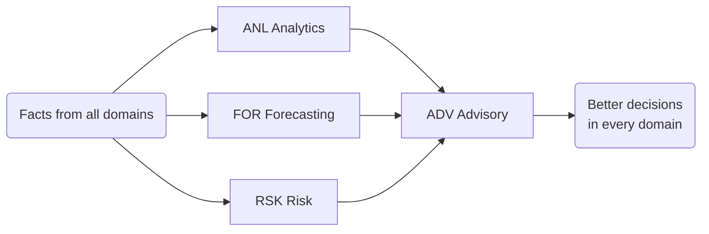

# CAP-0010 — Dairy Intelligence & Advisory Domain (DIA)

## 1. Domain Definition

Turning the ecosystem's facts into foresight and better decisions: analytics that show performance, benchmarks that show position, forecasts that show what is coming, advice that shows what to do, and early warnings that show what to avoid. This is the domain where Lacteva's **AI-first identity** concentrates — but it is defined here strictly as business ability: every capability describes a decision improved, not a model deployed.

**Defining constraint:** this domain **owns no primary facts**. It consumes what other domains record and returns insight to them. Its authority is earned through demonstrated accuracy, never assumed.

**Global note:** intelligence must work for a smallholder receiving one actionable message a week in a local language, and for an analyst exploring cross-country benchmarks — the same abilities at different depths.

## 2. Subdomain Overview

| Code | Subdomain | Ability |
| --- | --- | --- |
| `ANL` | Analytics & Benchmarking | Showing performance and relative position |
| `FOR` | Forecasting | Predicting supply, demand, and prices |
| `ADV` | Advisory | Recommending actions and testing scenarios |
| `RSK` | Risk Intelligence | Warning early about disease, climate, and market shocks |

## 3. ANL — Analytics & Benchmarking

### DIA.ANL.01 — Farm & Herd Performance Analytics

**Purpose:** Show each dairy business its own performance — production, quality, reproduction, economics — in forms that drive action at its level of sophistication.

| Attribute | Detail |
| --- | --- |
| Actors | Farmers; herd managers; cooperative/processor field teams; advisors |
| Business value | Most farms have never seen their own performance systematically; visibility alone moves behavior before any advice is given |
| Dependencies | FPR.MLK.02 (yields); QFS.GRD.01 (quality); PEF.SET.01 (economics); FPR.BRE.01 (reproduction) — all with consent per ETE.DGV.01 |
| Business events | Performance Summary Issued; Performance Milestone Reached; Performance Deterioration Flagged |
| AI opportunities | Automatic insight narration in local language ("your evening yields dropped 8% since the feed change"); KPI anomaly surfacing |
| Reports | Farm performance summaries; herd trend analyses; quality-income linkage views |
| KPIs | % active businesses viewing their analytics; insight-to-action conversion; user-reported decision value |

### DIA.ANL.02 — Cross-Market Benchmarking

**Purpose:** Let businesses compare themselves against relevant peers — similar herd size, system, region — and let regional/national actors see aggregate performance, all on consented, anonymized bases.

| Attribute | Detail |
| --- | --- |
| Actors | Producers and processors (comparing); cooperatives/governments (aggregate view); analysts |
| Business value | "You are in the bottom quartile for your system" motivates as nothing absolute can; aggregate views guide sector investment |
| Dependencies | DIA.ANL.01 (the metrics); ETE.DGV.01/02 (consent and anonymization rules — hard gate); ETE.LOC.01 (comparable definitions across markets) |
| Business events | Benchmark Cohort Published; Benchmark Position Updated; Aggregate Report Released |
| AI opportunities | Fair peer-cohort construction (comparing like with like across heterogeneous systems); metric harmonization across markets |
| Reports | Peer benchmark reports; sector/regional aggregates; performance distribution atlases |
| KPIs | Benchmark participation %; cohort comparability quality; benchmark-driven improvement rate |

## 4. FOR — Forecasting

### DIA.FOR.01 — Yield & Supply Forecasting

**Purpose:** Predict milk supply — per animal, farm, route, region — from days to seasons ahead, as the planning input for collection, processing, and commitments.

| Attribute | Detail |
| --- | --- |
| Actors | Collection planners; processing planners; commercial teams; the forecast-consuming capabilities |
| Business value | Every planning capability in the chain (MCL.RTE, PRO.PLN, CMA.PRI) is only as good as its supply expectation |
| Dependencies | FPR.MLK.02 (yield history); FPR.HRD.02/BRE.01 (herd and lactation structure); DIA.RSK.02 (weather/climate inputs) |
| Business events | Supply Forecast Published; Forecast Revised; Forecast Deviation Explained |
| AI opportunities | The capability *is* an AI opportunity end-to-end: lactation-curve-based individual prediction aggregating to regional supply; disruption-adjusted forecasting |
| Reports | Rolling supply forecasts per aggregation level; forecast accuracy tracking |
| KPIs | Forecast error (per horizon and level); forecast adoption by planning capabilities; revision stability |

### DIA.FOR.02 — Demand & Price Forecasting

**Purpose:** Predict product demand and milk/dairy price movements per market — the commercial mirror of supply forecasting.

| Attribute | Detail |
| --- | --- |
| Actors | Commercial and pricing teams; production planners; pricing-scheme owners; marketplace participants |
| Business value | Processors that see price and demand turns early choose better product mixes and contract terms; producers with price outlooks time investments |
| Dependencies | CMA.SLS.01 (demand history); CMA.MKT.01 (market price signals); external market indicators via ETE.PRT.01 partnerships |
| Business events | Demand Forecast Published; Price Outlook Published; Market Turn Signaled |
| AI opportunities | Multi-market price modeling; demand seasonality/event modeling; scenario-conditional outlooks |
| Reports | Demand forecasts by product/market; price outlook bulletins; accuracy tracking |
| KPIs | Forecast error; signal lead time before market turns; commercial decisions citing the outlook |

## 5. ADV — Advisory

### DIA.ADV.01 — Personalized Advisory & Recommendations

**Purpose:** Deliver specific, timely, actionable recommendations to each business — "dry off cow 214 next week", "switch to evening collection in the hot season" — grounded in its own data.

| Attribute | Detail |
| --- | --- |
| Actors | Producers (primary recipients); field officers (mediated delivery); all operating capabilities (advice surfaces inside their work) |
| Business value | This is Lacteva's core promise: a million businesses each acting on advice previously available only to those employing specialists |
| Dependencies | DIA.ANL.01 (the evidence); DIA.FOR.01/RSK.* (the outlook); FPR/MCL/PEF capability knowledge (the domain logic); CPR.EXT.02 (human reinforcement channel); ETE.LOC.01 (language, practices per market) |
| Business events | Recommendation Issued; Recommendation Accepted/Dismissed; Outcome Observed |
| AI opportunities | End-to-end: recommendation generation, prioritization (one good message beats ten), local-language conversational delivery, outcome-based learning |
| Reports | Recommendation logs; adoption and outcome tracking; advisory effectiveness review |
| KPIs | Recommendation adoption %; measured outcome delta of adopters; recipient trust score |

### DIA.ADV.02 — Scenario Planning & What-If Analysis

**Purpose:** Let decision-makers test futures before committing — herd expansion, scheme changes, new products, market entries — with modeled consequences.

| Attribute | Detail |
| --- | --- |
| Actors | Farm owners (investment decisions); cooperative boards (scheme changes); processors (capacity/product decisions); Lacteva's own market planners |
| Business value | Dairy decisions are slow to reverse (a heifer takes two years to milk); simulation is the cheap place to make mistakes |
| Dependencies | DIA.FOR.01/02 (baseline futures); PEF.MPR.01 (scheme simulation demand); domain parameters from FPR/PRO/CMA |
| Business events | Scenario Defined; Scenario Evaluated; Decision Recorded Against Scenario |
| AI opportunities | Whole-farm/whole-business simulation; sensitivity surfacing ("your plan lives or dies on the feed price") |
| Reports | Scenario comparison packs; decision records with modeled vs actual follow-up |
| KPIs | Decisions preceded by scenario analysis %; model-vs-actual tracking error; user confidence rating |

## 6. RSK — Risk Intelligence

### DIA.RSK.01 — Disease Outbreak Early Warning

**Purpose:** Detect emerging animal-disease events from aggregated signals — health cases, yield anomalies, movement patterns — and warn the exposed population before spread.

| Attribute | Detail |
| --- | --- |
| Actors | Farmers (warned); veterinary services; cooperatives; public animal-health authorities |
| Business value | Days of earlier warning determine whether an outbreak is a village event or a national one; aggregated private data sees outbreaks before official systems do |
| Dependencies | FPR.HLT.01 (case signals); FPR.MLK.02 (yield anomalies); FPR.HRD.03 (movement, spread paths); ETE.DGV.02 (data sharing with authorities under governance) |
| Business events | Outbreak Signal Detected; Warning Issued; Authority Alerted; All-Clear Issued |
| AI opportunities | End-to-end: multi-signal outbreak detection, spread modeling, targeted warning with recommended actions |
| Reports | Disease surveillance bulletins; warning logs with outcomes; detection performance reviews |
| KPIs | Warning lead time vs official detection; false-alarm rate; warned-population protective action rate |

### DIA.RSK.02 — Climate & Market Risk Intelligence

**Purpose:** Warn businesses about weather, climate, and market shocks relevant to them — heat stress, drought, feed price spikes, demand collapses — with time to act.

| Attribute | Detail |
| --- | --- |
| Actors | Producers; collection and processing planners; financial partners (portfolio risk); insurers |
| Business value | Heat stress alone costs measurable yield per event; forewarned businesses pre-position feed, water, cooling, and contracts |
| Dependencies | External weather/market feeds via ETE.PRT.01; DIA.FOR.01/02 (impact translation); PEF.INS.01 (parametric insurance triggers) |
| Business events | Risk Alert Issued; Impact Materialized; Alert Effectiveness Reviewed |
| AI opportunities | Localized impact translation ("this heatwave means −12% yield for herds like yours; do X"); compound-risk detection |
| Reports | Risk bulletins; alert log with realized impact; seasonal risk outlooks |
| KPIs | Alert lead time; impact prediction accuracy; loss reduction among alerted vs non-alerted |

## 7. Cross-Domain Dependencies

| This Domain Needs | From | For |
| --- | --- | --- |
| Every domain's business events and records | All | Its entire input |
| Consent, anonymization, sharing governance | ETE | License to compute on tenant data |
| Delivery channels (field officers, statements) | CPR, PEF | Reaching users who aren't on screens |
| Its outputs consumed by | All | Planning, pricing, advisory, warning loops |

## Change Log

| Version | Date | Author | Change |
| --- | --- | --- | --- |
| 0.1 | 2026-08-02 | Enterprise Architecture | Initial draft: 4 subdomains, 8 capabilities. |
