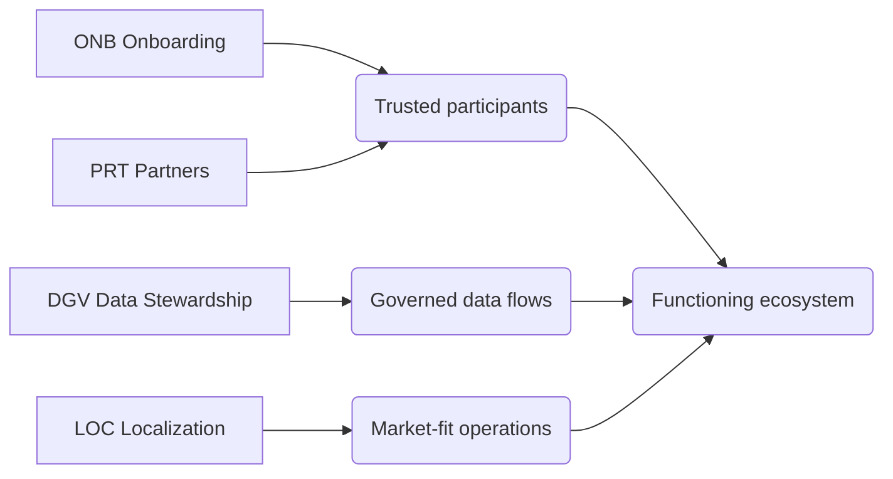

# CAP-0011 — Ecosystem & Tenant Enablement Domain (ETE)

## 1. Domain Definition

The business abilities that make a multi-party, multi-country ecosystem function at all: knowing that a business is who it claims to be, bringing the ecosystem's professional partners (labs, vets, banks, carriers, insurers) into governed relationships, ruling who may use whose data for what, and adapting everything to each country's rules, language, and practices. These are **business** capabilities — trust, partnership, stewardship, and localization — even though they will one day be realized partly in platform machinery.

**Global note:** this domain is why "50+ countries" is a design property and not a hope: every other domain delegates its market variability here.

## 2. Subdomain Overview

| Code | Subdomain | Ability |
| --- | --- | --- |
| `ONB` | Onboarding | Verifying and admitting businesses |
| `PRT` | Partners | Governing the professional ecosystem |
| `DGV` | Data Stewardship | Ruling data ownership, consent, and sharing |
| `LOC` | Localization | Adapting to each market |

## 3. ONB — Onboarding

### ETE.ONB.01 — Business Onboarding & Identity Verification

**Purpose:** Admit a dairy business into the ecosystem with verified identity — legal existence, ownership, role, and market — proportionate to its scale and risk.

| Attribute | Detail |
| --- | --- |
| Actors | Applying businesses; verification staff/agents; identity and registry authorities; existing members as vouchers (community verification) |
| Business value | Every payment, trade, credit decision, and registry in the ecosystem inherits its integrity from this gate; proportionate verification keeps smallholders in while keeping fraud out |
| Dependencies | ETE.LOC.01 (identity norms per market — national ID, business registry, community attestation); CPR.MEM.02 (cooperative onboarding builds on it) |
| Business events | Application Submitted; Identity Verified; Business Admitted; Verification Renewed; Business Deactivated |
| AI opportunities | Document verification assistance; duplicate/synthetic-identity detection; risk-proportionate verification routing |
| Reports | Onboarding pipeline; verification outcome log; active business census |
| KPIs | Verification turnaround time; verification pass integrity (post-hoc fraud rate); onboarding drop-off % |

## 4. PRT — Partners

### ETE.PRT.01 — Ecosystem Partner Management

**Purpose:** Establish and govern relationships with the ecosystem's service providers — laboratories, veterinarians, carriers, banks, mobile-money operators, insurers, input suppliers, data providers — including standards, performance, and accountability.

| Attribute | Detail |
| --- | --- |
| Actors | Partnership managers; partners; capabilities that consume partner services (QFS.TST.02, PEF.SET.02, MCL.LGX.01 …) |
| Business value | The ecosystem's promises to producers are executed largely by partners; partner quality governance is therefore product quality governance |
| Dependencies | ETE.ONB.01 (partners are verified businesses too); SWC.REG.01 (partner licensure requirements); consuming capabilities (service definitions) |
| Business events | Partner Engaged; Service Level Agreed; Partner Performance Reviewed; Partner Suspended/Exited |
| AI opportunities | Partner performance scoring from operational outcomes; coverage-gap detection (regions lacking labs/vets/rails) |
| Reports | Partner register by service and region; performance scorecards; coverage maps |
| KPIs | Service coverage % (by region and service type); partner SLA attainment; partner-caused incident rate |

## 5. DGV — Data Stewardship

### ETE.DGV.01 — Data Ownership & Consent Management

**Purpose:** Establish and enforce, as business policy, that each business owns its data, and manage the consents by which others — buyers, lenders, benchmarks, AI capabilities — may use it.

| Attribute | Detail |
| --- | --- |
| Actors | Data-owning businesses; consent-requesting parties (lenders, buyers, DIA capabilities); data steward; regulators (privacy/data law) |
| Business value | Producer trust in data ownership is the precondition for the data-rich ecosystem everything else assumes; one betrayal poisons a market for years |
| Dependencies | ETE.ONB.01 (who owns); ETE.LOC.01 (data law per market); consuming capabilities declare purposes (PEF.FIN.01, DIA.ANL.02 …) |
| Business events | Consent Requested; Consent Granted/Refused; Consent Revoked; Use-Purpose Audited |
| AI opportunities | Plain-language consent explanation per literacy level; consent-anomaly detection (uses without matching grants) |
| Reports | Consent registers; use-purpose audit results; revocation handling log |
| KPIs | Consents with informed-grant evidence %; use-without-consent incidents (target: zero); revocation execution time |

### ETE.DGV.02 — Data Sharing & Interoperability Governance

**Purpose:** Govern structured data exchange with external systems and institutions — governments, milk recording schemes, breed associations, research — under agreements that protect owners and serve the sector.

| Attribute | Detail |
| --- | --- |
| Actors | Data steward; institutional counterparties; data-owning businesses (represented); sector bodies |
| Business value | Sector-level value (disease surveillance, national statistics, genetic evaluation) requires sharing; governed sharing earns institutional standing, ungoverned sharing destroys tenant trust |
| Dependencies | ETE.DGV.01 (consents underpin every share); DIA.RSK.01 (surveillance sharing); SWC.REG.01 (mandatory reporting); ETE.PRT.01 (counterparty standing) |
| Business events | Sharing Agreement Concluded; Data Shared Under Agreement; Agreement Reviewed; Agreement Terminated |
| AI opportunities | Privacy-preserving aggregate sharing design; agreement compliance monitoring |
| Reports | Sharing agreement register; shared-data logs; counterparty compliance reviews |
| KPIs | Shares covered by agreement % (target: 100); agreement breach incidents; sector-value returns documented |

## 6. LOC — Localization

### ETE.LOC.01 — Country & Market Localization

**Purpose:** Maintain, per operating market, the complete adaptation package every other capability consumes: regulatory rule packs, administered prices and schemes, languages, units, calendars, identity norms, payment customs, and dairy-practice variants.

| Attribute | Detail |
| --- | --- |
| Actors | Market entry teams; local regulatory and domain experts; every capability owner (consumers); translation/terminology maintainers |
| Business value | This capability is the difference between a platform that works in 50 countries and one exported from its first market 50 times; centralized market knowledge makes entry a process, not an adventure |
| Dependencies | SWC.REG.01 (regulatory content — co-produced); ETE.PRT.01 (local expert partners); every domain (declares its variation points) |
| Business events | Market Pack Assembled; Market Rule Updated; Market Launched; Market Pack Audited |
| AI opportunities | Regulatory/practice research acceleration for new markets; terminology and content localization at scale; market-pack consistency checking |
| Reports | Market pack status per country; variation-point coverage matrix; market launch readiness reviews |
| KPIs | Market pack completeness % per country; time-to-assemble new market pack; localization defects found post-launch |

## 7. Cross-Domain Dependencies

| This Domain Needs | From | For |
| --- | --- | --- |
| Variation-point declarations | All domains | Knowing what to localize |
| Regulatory content | SWC | Market rule packs |
| Its verification, consent, partners, and localization consumed by | All domains | Every capability's legality and market fit |

## Change Log

| Version | Date | Author | Change |
| --- | --- | --- | --- |
| 0.1 | 2026-08-02 | Enterprise Architecture | Initial draft: 4 subdomains, 5 capabilities. |
