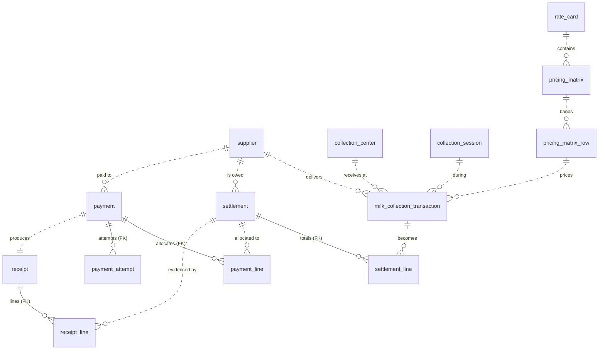
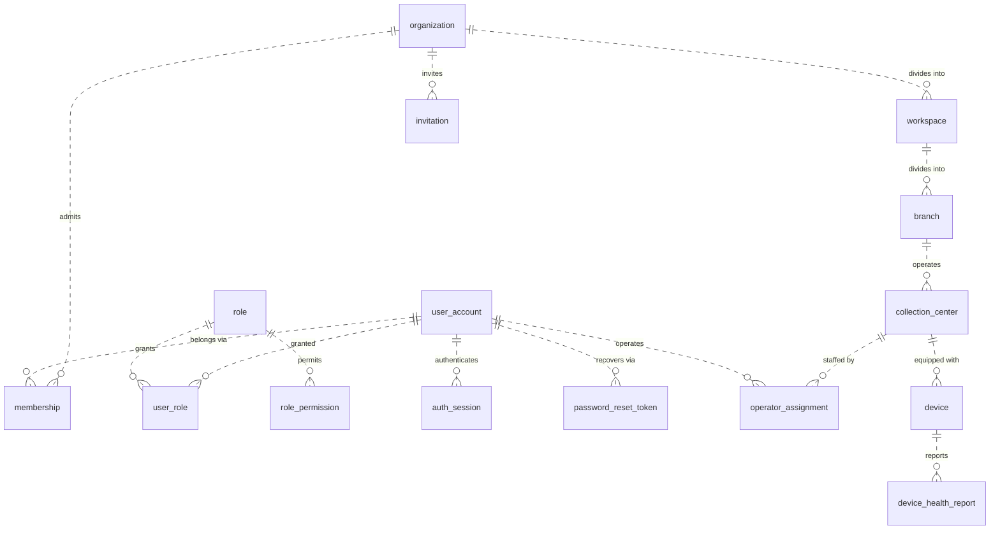
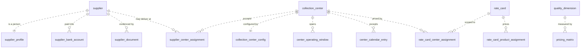
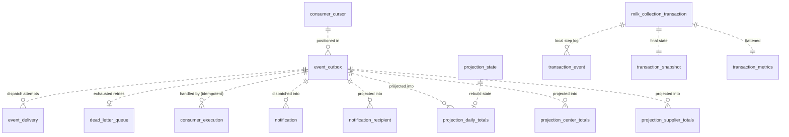
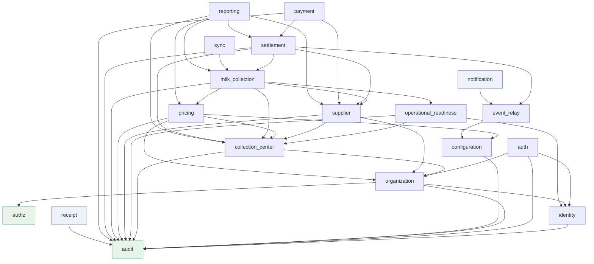

# DBD-0001 — Platform Core Database

The permanent database architecture reference for Lacteva. Produced by **DBR-001 (Database Inventory & Review Pack)**, a documentation-and-review work order: **no schema, migration, or line of code was changed to produce it.**

## 1. Overview

- **Owning service:** `platform-core` — the modular monolith. One database, one schema (`public`); no other process connects.
- **Engine:** PostgreSQL 16 in CI and production. SQLite is the *test* engine, and that divergence has consequences documented in §10.
- **Workload:** OLTP with a heavy append-only component. Reads are overwhelmingly tenant-scoped point and range queries; the analytical load is served by projections rather than by scanning transactional tables.
- **Structure of record:** the Alembic migrations in `services/platform-core/migrations/versions/` are authoritative for **structure**. This document is authoritative for **intent** — why the schema is shaped this way and what each table is for. Divergence between them is a defect.
- **Generated from:** `Base.metadata` after `import_all_models()` (see §13). Every column, key, constraint, and index below is transcribed from the live metadata, not from memory.

### 1.1 Inventory at a glance

| Measure | Count |
| --- | --- |
| Tables | **56** (+ `alembic_version`, owned by the migration tool) |
| Columns | 548 |
| Indexes | 158 |
| Unique constraints | 38 |
| Check constraints | **2** |
| Foreign key constraints | **4** |
| Migrations in the chain | 20, linear, forward-only |
| Event types flowing through the outbox | 58 |
| Registered consumers | 4 (2 of them projections) |

Two of those numbers are the story of this review: **4 foreign keys and 2 check constraints across 56 tables.** See findings F-1 and F-2 in §10.

### 1.2 Tables by module

| Module | Tables | Role |
| --- | --- | --- |
| `event_relay` | 6 | Outbox, dispatch, consumer bookkeeping |
| `pricing` | 6 | Rate cards, matrices, price bands |
| `milk_collection` | 5 | The central business fact and its evidence |
| `organization` | 5 | Tenant, structure, membership |
| `supplier` | 5 | Producer identity, person, banking, placement |
| `collection_center` | 4 | Facility, settings, opening hours |
| `authz` | 3 | Roles and grants |
| `operational_readiness` | 3 | Devices, operators |
| `payment` | 3 | Payment, allocation, attempts |
| `reporting` | 3 | Rebuildable read models |
| `auth` | 2 | Sessions, reset tokens |
| `notification` | 2 | Messages and the recipient directory |
| `receipt` | 2 | Receipt and its lines |
| `settlement` | 2 | Payable and its lines |
| `audit` | 1 | The immutable trail |
| `configuration` | 1 | Settings |
| `identity` | 1 | User accounts |
| `sync` | 1 | Offline operation log |
| `core.backup` | 1 | Backup/restore history |

### 1.3 Tables by classification

| Class | Count | Meaning |
| --- | --- | --- |
| Transactional | 15 | Business facts that change state and carry money or evidence |
| Reference | 24 | Configuration and master data; small, read constantly |
| Projection | 5 | Derived read models, rebuildable from the event log (BR-0015) |
| Audit | 3 | Append-only history: `audit_record`, `transaction_event`, `payment_attempt` |
| Infrastructure | 9 | Outbox, consumers, sessions, backup bookkeeping |

The **backup** classification (`critical` / `important` / `rebuildable` / `ephemeral`) is a separate axis, derived independently by `core/backup/classification.py` and reported per table in §6.

## 2. Multi-Tenancy Model

**`organization.id` IS `tenant_id`.** There is no separate tenant table; the organization row is the tenant, and every other table's `tenant_id` points at it. There is one database and one schema for all tenants — isolation is by row, not by schema or database.

Isolation is enforced in two places, deliberately:

1. **The application** filters by `tenant_id` on every query, through `require_current_tenant()`.
2. **PostgreSQL row-level security** enforces the same predicate in the database, so a query that forgets its filter returns nothing rather than another tenant's data (BR-0022). Policies use `FORCE ROW LEVEL SECURITY` — the application connects as the table owner, which would otherwise bypass its own policies — and cover writes through `WITH CHECK`, so a row cannot be moved *into* another tenant.

The binding is `SET LOCAL lacteva.tenant_id` inside the request's transaction, so a pooled connection cannot carry a tenant across requests. Cross-tenant machinery (relay dispatch, consumers, projection rebuilds, platform administration) sets an explicit, transaction-scoped, logged `lacteva.bypass_rls` — never a superuser connection.

### 2.1 RLS coverage

| | Tables |
| --- | --- |
| `tenant_id` column **and** an RLS policy | **50** |
| Isolated by identity (`organization`) | **1** |
| Platform-global, deliberately unprotected, reason on record | **5** |
| **Undeclared** | **0** |

> **Updated by SEC-002.** When this document was first written the split was 37 / 19, and the 19 had no isolation strategy at all. Thirteen of them were tenant-owned child tables and now carry their own `tenant_id`; `organization` is isolated by its own primary key; five are platform-global by decision, each with the reason recorded in `core/rls.py`. `unclassified_tables()` returns nothing, and a test asserts it.

The 19 unprotected tables were not an oversight in the sense that someone forgot a column — they were child tables whose tenancy was defined by their parent. But the consequence was precise, and it qualified BR-0022's promise:

> ~~**A query against one of those 19 tables that forgets its join returns every tenant's rows.**~~ **Closed by SEC-002.**

Four of the nineteen (`payment_line`, `payment_attempt`, `receipt_line`, `settlement_line`) at least had a foreign key to their parent. The other fifteen — including `supplier_profile`, which holds names, phone numbers, and national ID numbers, and `supplier_bank_account`, which holds account numbers — had neither a `tenant_id` nor a foreign key, so nothing at the database level tied those rows to a tenant at all. That was finding **F-1**, and migration `f2d18ba60c47` closed it: thirteen tables gained `tenant_id` and an ordinary policy. **The foreign keys remain absent — F-2 is still open** — so the composite `(parent_id, tenant_id)` reinforcement described in §7.1 has not been applied; the denormalised tenant is currently kept correct by the services, not by the database.

### 2.2 Platform-global rows

Ten tables allow `tenant_id IS NULL`, meaning the row belongs to no tenant: `user_account` (before joining an organization), `role` (the system role catalog), `user_role` (a platform-wide grant), `audit_record`, `auth_session`, `config_entry` (platform scope), `event_outbox`, `consumer_execution`, `dead_letter_queue`, `notification`.

The RLS policy must say so explicitly, because SQL three-valued logic makes `NULL = 'x'` neither true nor false. The original SEC-001 policy omitted the clause, and every platform-global row was invisible to every session — **registration itself would have failed in production.** Fixed by migration `c94b1ea27f31` (CI-001).

## 3. Entity-Relationship Diagrams

**Read these as logical relationships, not as declared constraints.** With four foreign keys in the entire schema, almost every line below is enforced by service code, not by the database (finding F-2). Dashed relationships (`}o..o{`) are the ones with no FK; solid ones are the four that exist.

There is a second reason every "Relationships" field in §6 reads *resolved in the service layer*: **the codebase declares zero SQLAlchemy `relationship()` mappings.** Every model is a flat mapped class and every traversal is an explicit query. That is a real design choice with a real upside — no accidental lazy load, no N+1 appearing because someone touched an attribute, and no ORM cascade quietly deleting rows — and a real cost: the object graph exists only in the services' heads, and neither the ORM nor the database will stop a child from outliving its parent. It is worth stating because it is invisible in the models and load-bearing everywhere.

### 3.1 The money path

Supplier delivers milk → the milk is priced → priced collections become a settlement → the settlement is paid → the payment produces a receipt. This is the chain BAK-001's restore test and CI-001's proof both walk end to end.

### 3.2 Tenant, identity, and access

### 3.3 Supplier and center reference data

### 3.4 The event framework

Everything here is infrastructure. `event_outbox` is written inside the business transaction; everything downstream reads it.

## 4. Module Dependency Graph

Derived from actual `from platform_core.modules.<x>` imports, not from intent.

Three properties are worth naming:

- **`audit` and `authz` import nothing.** They are true leaves, which is why every module can depend on them without creating a cycle.
- **`receipt` and `notification` depend on almost nothing** (`audit` and `event_relay` respectively) despite being downstream of payment, settlement, and supplier. That is the event-driven design working: they read enriched event payloads instead of calling back into the modules that produced them.
- **There are no cycles**, and the deepest chain is `reporting → settlement → milk_collection → pricing → collection_center → organization → identity → audit` (8 levels).

The one shape to watch: **`reporting` imports five modules** to read live transactional data. That is the documented boundary exception (REP-001 owns nothing and writes nothing), and the projections in §6.16 are the migration path away from it.

## 5. Scale Model

Every growth estimate in this document derives from one stated model. Change the model and the numbers move together.

| Segment | Tenants | Centers each | Suppliers each | Collections/day each |
| --- | --- | --- | --- | --- |
| Small dairy | 8,000 | 1 | 60 | 120 |
| Mid-size | 1,800 | 8 | 400 | 800 |
| Large / cooperative union | 200 | 60 | 5,000 | 10,000 |
| **Total** | **10,000** | ~34,000 | ~4.1 M | **~4.4 M/day** |

At 300 collection days per year: **≈ 1.3 billion milk collections per year.**

Two caveats stated up front. First, this is the *modelled horizon*, not the vision — "1M+ dairy businesses" is the addressable market; 10,000 active tenants is what the schema should be designed to survive without redesign. Second, the platform has **no production deployment and therefore no measured data**; every number below is derived from this model, and the first month of real traffic should replace it.

## 6. Table Specifications

Every fact in this section — columns, types, nullability, keys, constraints, indexes, relationships — is transcribed programmatically from `Base.metadata` (§13). Purpose, growth, lifecycle, and partitioning are judgement.

### 6.1 Identity

Who can authenticate.

#### `user_account`

A person who can authenticate. `tenant_id IS NULL` until they join an organization — which is precisely the case CI-001 found the RLS policy had made invisible.

| Column | Type | Null | Key |
| --- | --- | --- | --- |
| `tenant_id` | CHAR(32) | yes | idx |
| `email` | VARCHAR(320) | no | idx |
| `password_hash` | VARCHAR(255) | no | — |
| `full_name` | VARCHAR(200) | no | — |
| `locale` | VARCHAR(8) | no | — |
| `is_active` | BOOLEAN | no | — |
| `created_at` | DATETIME | no | — |
| `id` | CHAR(32) | no | **PK** |

- **Primary key:** `id`
- **Foreign keys:** **None** — references are unconstrained `CHAR(32)` (see finding F-2)
- **Unique constraints:** `uq_user_tenant_email` (`tenant_id`, `email`)
- **Check constraints:** —
- **Indexes:** `ix_user_account_email` (`email`); `ix_user_account_tenant_id` (`tenant_id`)
- **Relationships:** — (references resolved in the service layer)
- **Classification:** Reference · backup class `critical` · lifecycle **hot**
- **Tenant-owned:** Yes — `tenant_id` nullable (NULL = platform-global), RLS enforced
- **Outbox / event framework:** Emits `identity.user-registered.v1`
- **Expected growth:** ~1 per operator/manager, plus platform staff. Platform ≈ 10 M.
- **Should it be partitioned?** No — bounded by structure, not by time

### 6.2 Authentication

Sessions and credential recovery. Holds no user record of its own.

#### `auth_session`

A live refresh-token session. `previous_token_hash` retains the rotated-out token so a replay is detectable as theft rather than merely rejected.

| Column | Type | Null | Key |
| --- | --- | --- | --- |
| `user_id` | CHAR(32) | no | idx |
| `tenant_id` | CHAR(32) | yes | idx |
| `refresh_token_hash` | VARCHAR(64) | no | unique idx |
| `previous_token_hash` | VARCHAR(64) | yes | idx |
| `created_at` | DATETIME | no | — |
| `last_used_at` | DATETIME | no | — |
| `expires_at` | DATETIME | no | — |
| `revoked_at` | DATETIME | yes | — |
| `revoke_reason` | VARCHAR(40) | yes | — |
| `id` | CHAR(32) | no | **PK** |

- **Primary key:** `id`
- **Foreign keys:** **None** — references are unconstrained `CHAR(32)` (see finding F-2)
- **Unique constraints:** —
- **Check constraints:** —
- **Indexes:** `ix_auth_session_previous_token_hash` (`previous_token_hash`); `ix_auth_session_refresh_token_hash` (`refresh_token_hash`) UNIQUE; `ix_auth_session_tenant_id` (`tenant_id`); `ix_auth_session_user_id` (`user_id`)
- **Relationships:** — (references resolved in the service layer)
- **Classification:** Infrastructure · backup class `important` · lifecycle **hot**
- **Tenant-owned:** Yes — `tenant_id` nullable (NULL = platform-global), RLS enforced
- **Outbox / event framework:** No
- **Expected growth:** Bounded by active users × devices, not by time — expired rows are the only accumulation. Platform ≈ 20 M live + expired backlog.
- **Should it be partitioned?** No — bounded by structure, not by time

#### `password_reset_token`

A single-use, short-lived reset token (hash only — the plaintext exists once, in the response).

| Column | Type | Null | Key |
| --- | --- | --- | --- |
| `user_id` | CHAR(32) | no | idx |
| `token_hash` | VARCHAR(64) | no | unique idx |
| `created_at` | DATETIME | no | — |
| `expires_at` | DATETIME | no | — |
| `used_at` | DATETIME | yes | — |
| `id` | CHAR(32) | no | **PK** |

- **Primary key:** `id`
- **Foreign keys:** **None** — references are unconstrained `CHAR(32)` (see finding F-2)
- **Unique constraints:** —
- **Check constraints:** —
- **Indexes:** `ix_password_reset_token_token_hash` (`token_hash`) UNIQUE; `ix_password_reset_token_user_id` (`user_id`)
- **Relationships:** — (references resolved in the service layer)
- **Classification:** Infrastructure · backup class `important` · lifecycle **hot**
- **Tenant-owned:** **No `tenant_id` column and no RLS policy** — isolation is inherited from its parent row (see finding F-1)
- **Outbox / event framework:** Emits `identity.password-reset-requested.v1` from the issuing service
- **Expected growth:** Small and self-limiting; rows are dead within an hour of issue. Platform ≈ 100 K live.
- **Should it be partitioned?** No — bounded by structure, not by time

### 6.3 Authorization

Roles and permission grants. Imports nothing — it is a leaf every module depends on.

#### `role`

A named permission bundle. `tenant_id IS NULL` marks a system role shared by every tenant; a non-null tenant_id marks a tenant-defined role.

| Column | Type | Null | Key |
| --- | --- | --- | --- |
| `tenant_id` | CHAR(32) | yes | idx |
| `name` | VARCHAR(80) | no | — |
| `description` | VARCHAR(300) | no | — |
| `id` | CHAR(32) | no | **PK** |

- **Primary key:** `id`
- **Foreign keys:** **None** — references are unconstrained `CHAR(32)` (see finding F-2)
- **Unique constraints:** `uq_role_tenant_name` (`tenant_id`, `name`)
- **Check constraints:** —
- **Indexes:** `ix_role_tenant_id` (`tenant_id`)
- **Relationships:** — (references resolved in the service layer)
- **Classification:** Reference · backup class `critical` · lifecycle **warm**
- **Tenant-owned:** Yes — `tenant_id` nullable (NULL = platform-global), RLS enforced
- **Outbox / event framework:** No
- **Expected growth:** Effectively fixed: ~6 system roles + a handful per tenant. Platform < 100 K.
- **Should it be partitioned?** No — bounded by structure, not by time

#### `role_permission`

One permission key granted to one role. Permission keys are strings owned by the modules that check them, not a table — a module ships its keys with its code.

| Column | Type | Null | Key |
| --- | --- | --- | --- |
| `role_id` | CHAR(32) | no | idx |
| `permission_key` | VARCHAR(120) | no | — |
| `id` | CHAR(32) | no | **PK** |

- **Primary key:** `id`
- **Foreign keys:** **None** — references are unconstrained `CHAR(32)` (see finding F-2)
- **Unique constraints:** `uq_role_permission` (`role_id`, `permission_key`)
- **Check constraints:** —
- **Indexes:** `ix_role_permission_role_id` (`role_id`)
- **Relationships:** — (references resolved in the service layer)
- **Classification:** Reference · backup class `critical` · lifecycle **warm**
- **Tenant-owned:** **No `tenant_id` column and no RLS policy** — isolation is inherited from its parent row (see finding F-1)
- **Outbox / event framework:** No
- **Expected growth:** ~15 rows per role. Platform < 1 M.
- **Should it be partitioned?** No — bounded by structure, not by time

#### `user_role`

Grants a role to a user, optionally scoped to a tenant. A NULL tenant_id is a platform-wide grant (this is how platform-admin exists).

| Column | Type | Null | Key |
| --- | --- | --- | --- |
| `user_id` | CHAR(32) | no | idx |
| `role_id` | CHAR(32) | no | idx |
| `tenant_id` | CHAR(32) | yes | idx |
| `id` | CHAR(32) | no | **PK** |

- **Primary key:** `id`
- **Foreign keys:** **None** — references are unconstrained `CHAR(32)` (see finding F-2)
- **Unique constraints:** `uq_user_role_tenant` (`user_id`, `role_id`, `tenant_id`)
- **Check constraints:** —
- **Indexes:** `ix_user_role_role_id` (`role_id`); `ix_user_role_tenant_id` (`tenant_id`); `ix_user_role_user_id` (`user_id`)
- **Relationships:** — (references resolved in the service layer)
- **Classification:** Reference · backup class `critical` · lifecycle **hot**
- **Tenant-owned:** Yes — `tenant_id` nullable (NULL = platform-global), RLS enforced
- **Outbox / event framework:** No
- **Expected growth:** ~1–3 per user per tenant. Platform ≈ 30 M. Read on **every authenticated request** (see the permission-cache finding).
- **Should it be partitioned?** No — bounded by structure, not by time

### 6.4 Organization

The tenant and its internal structure. `organization.id` is the tenant id used by every other module.

#### `branch`

A division of a workspace; centers, suppliers, and rate cards may be scoped to one.

| Column | Type | Null | Key |
| --- | --- | --- | --- |
| `tenant_id` | CHAR(32) | no | idx |
| `workspace_id` | CHAR(32) | no | idx |
| `name` | VARCHAR(200) | no | — |
| `code` | VARCHAR(40) | no | — |
| `status` | VARCHAR(20) | no | — |
| `created_at` | DATETIME | no | — |
| `id` | CHAR(32) | no | **PK** |

- **Primary key:** `id`
- **Foreign keys:** **None** — references are unconstrained `CHAR(32)` (see finding F-2)
- **Unique constraints:** `uq_branch_tenant_code` (`tenant_id`, `code`)
- **Check constraints:** —
- **Indexes:** `ix_branch_tenant_id` (`tenant_id`); `ix_branch_workspace_id` (`workspace_id`)
- **Relationships:** — (references resolved in the service layer)
- **Classification:** Reference · backup class `critical` · lifecycle **warm**
- **Tenant-owned:** Yes — `tenant_id` NOT NULL, RLS enforced
- **Outbox / event framework:** Emits `organization.branch-created.v1`
- **Expected growth:** 1–50 per tenant. Platform < 500 K.
- **Should it be partitioned?** No — bounded by structure, not by time

#### `invitation`

A pending invitation to join a tenant with a named role, keyed by a token hash. Kept after acceptance as the record of how someone got in.

| Column | Type | Null | Key |
| --- | --- | --- | --- |
| `tenant_id` | CHAR(32) | no | idx |
| `email` | VARCHAR(320) | no | idx |
| `role_name` | VARCHAR(80) | no | — |
| `token_hash` | VARCHAR(64) | no | unique idx |
| `invited_by` | CHAR(32) | no | — |
| `created_at` | DATETIME | no | — |
| `expires_at` | DATETIME | no | — |
| `accepted_at` | DATETIME | yes | — |
| `revoked_at` | DATETIME | yes | — |
| `id` | CHAR(32) | no | **PK** |

- **Primary key:** `id`
- **Foreign keys:** **None** — references are unconstrained `CHAR(32)` (see finding F-2)
- **Unique constraints:** —
- **Check constraints:** —
- **Indexes:** `ix_invitation_email` (`email`); `ix_invitation_tenant_id` (`tenant_id`); `ix_invitation_token_hash` (`token_hash`) UNIQUE
- **Relationships:** — (references resolved in the service layer)
- **Classification:** Transactional · backup class `important` · lifecycle **warm**
- **Tenant-owned:** Yes — `tenant_id` NOT NULL, RLS enforced
- **Outbox / event framework:** Emits `organization.invitation-issued.v1`
- **Expected growth:** Roughly one per user ever added. Platform ≈ 15 M.
- **Should it be partitioned?** No — bounded by structure, not by time

#### `membership`

A user belongs to a tenant. Distinct from `user_role`: membership is *whether* you are in, roles are *what* you may do.

| Column | Type | Null | Key |
| --- | --- | --- | --- |
| `tenant_id` | CHAR(32) | no | idx |
| `user_id` | CHAR(32) | no | idx |
| `status` | VARCHAR(20) | no | — |
| `joined_at` | DATETIME | no | — |
| `invited_by` | CHAR(32) | yes | — |
| `id` | CHAR(32) | no | **PK** |

- **Primary key:** `id`
- **Foreign keys:** **None** — references are unconstrained `CHAR(32)` (see finding F-2)
- **Unique constraints:** `uq_membership_tenant_user` (`tenant_id`, `user_id`)
- **Check constraints:** —
- **Indexes:** `ix_membership_tenant_id` (`tenant_id`); `ix_membership_user_id` (`user_id`)
- **Relationships:** — (references resolved in the service layer)
- **Classification:** Reference · backup class `critical` · lifecycle **hot**
- **Tenant-owned:** Yes — `tenant_id` NOT NULL, RLS enforced
- **Outbox / event framework:** Emits `organization.member-added.v1`
- **Expected growth:** ~1 per user per tenant. Platform ≈ 12 M.
- **Should it be partitioned?** No — bounded by structure, not by time

#### `organization`

**The tenant itself.** `organization.id` IS `tenant_id` everywhere else in this schema — there is no separate tenant table, by design.

| Column | Type | Null | Key |
| --- | --- | --- | --- |
| `name` | VARCHAR(200) | no | — |
| `slug` | VARCHAR(80) | no | unique idx |
| `country_code` | VARCHAR(2) | no | — |
| `org_type` | VARCHAR(40) | no | — |
| `status` | VARCHAR(20) | no | — |
| `default_locale` | VARCHAR(8) | no | — |
| `created_at` | DATETIME | no | — |
| `id` | CHAR(32) | no | **PK** |

- **Primary key:** `id`
- **Foreign keys:** **None** — references are unconstrained `CHAR(32)` (see finding F-2)
- **Unique constraints:** —
- **Check constraints:** —
- **Indexes:** `ix_organization_slug` (`slug`) UNIQUE
- **Relationships:** — (references resolved in the service layer)
- **Classification:** Reference · backup class `critical` · lifecycle **hot**
- **Tenant-owned:** **No `tenant_id` column and no RLS policy** — isolation is inherited from its parent row (see finding F-1)
- **Outbox / event framework:** Emits `organization.organization-created.v1`
- **Expected growth:** One per dairy business. 10 K in the modelled horizon; 1 M+ is the vision.
- **Should it be partitioned?** No — bounded by structure, not by time

#### `workspace`

The top structural division inside a tenant (a region or a business line).

| Column | Type | Null | Key |
| --- | --- | --- | --- |
| `tenant_id` | CHAR(32) | no | idx |
| `name` | VARCHAR(200) | no | — |
| `slug` | VARCHAR(80) | no | — |
| `created_at` | DATETIME | no | — |
| `id` | CHAR(32) | no | **PK** |

- **Primary key:** `id`
- **Foreign keys:** **None** — references are unconstrained `CHAR(32)` (see finding F-2)
- **Unique constraints:** `uq_workspace_tenant_slug` (`tenant_id`, `slug`)
- **Check constraints:** —
- **Indexes:** `ix_workspace_tenant_id` (`tenant_id`)
- **Relationships:** — (references resolved in the service layer)
- **Classification:** Reference · backup class `critical` · lifecycle **warm**
- **Tenant-owned:** Yes — `tenant_id` NOT NULL, RLS enforced
- **Outbox / event framework:** Emits `organization.workspace-created.v1`
- **Expected growth:** 1–10 per tenant. Platform < 100 K.
- **Should it be partitioned?** No — bounded by structure, not by time

### 6.5 Configuration

Platform- and tenant-scoped settings, resolved tenant → platform → code default.

#### `config_entry`

A platform- or tenant-scoped setting. The resolution order is tenant → platform → code default, so a tenant row overrides without a deploy. Also the consumer kill switches.

| Column | Type | Null | Key |
| --- | --- | --- | --- |
| `scope` | VARCHAR(10) | no | — |
| `tenant_id` | CHAR(32) | yes | idx |
| `key` | VARCHAR(160) | no | idx |
| `value` | JSON | no | — |
| `updated_at` | DATETIME | no | — |
| `id` | CHAR(32) | no | **PK** |

- **Primary key:** `id`
- **Foreign keys:** **None** — references are unconstrained `CHAR(32)` (see finding F-2)
- **Unique constraints:** `uq_config_scope_tenant_key` (`scope`, `tenant_id`, `key`)
- **Check constraints:** —
- **Indexes:** `ix_config_entry_key` (`key`); `ix_config_entry_tenant_id` (`tenant_id`)
- **Relationships:** — (references resolved in the service layer)
- **Classification:** Reference · backup class `critical` · lifecycle **hot**
- **Tenant-owned:** Yes — `tenant_id` nullable (NULL = platform-global), RLS enforced
- **Outbox / event framework:** No
- **Expected growth:** Tens of rows per tenant. Platform < 1 M. Read very frequently — a caching candidate.
- **Should it be partitioned?** No — bounded by structure, not by time

### 6.6 Collection Center

The physical facility: identity, settings, and when it is open.

#### `center_calendar_entry`

A dated exception to the operating windows — a holiday or an unscheduled closure.

| Column | Type | Null | Key |
| --- | --- | --- | --- |
| `center_id` | CHAR(32) | no | idx |
| `day` | DATE | no | — |
| `kind` | VARCHAR(20) | no | — |
| `note` | VARCHAR(300) | no | — |
| `id` | CHAR(32) | no | **PK** |

- **Primary key:** `id`
- **Foreign keys:** **None** — references are unconstrained `CHAR(32)` (see finding F-2)
- **Unique constraints:** `uq_calendar_center_day` (`center_id`, `day`)
- **Check constraints:** —
- **Indexes:** `ix_center_calendar_entry_center_id` (`center_id`)
- **Relationships:** — (references resolved in the service layer)
- **Classification:** Reference · backup class `critical` · lifecycle **warm**
- **Tenant-owned:** **No `tenant_id` column and no RLS policy** — isolation is inherited from its parent row (see finding F-1)
- **Outbox / event framework:** No
- **Expected growth:** ~20 per center per year. Platform ≈ 1 M/yr.
- **Should it be partitioned?** No — bounded by structure, not by time

#### `center_operating_window`

A recurring open period for one weekday. Several rows per day model split morning/evening shifts.

| Column | Type | Null | Key |
| --- | --- | --- | --- |
| `center_id` | CHAR(32) | no | idx |
| `day_of_week` | INTEGER | no | — |
| `opens` | TIME | no | — |
| `closes` | TIME | no | — |
| `id` | CHAR(32) | no | **PK** |

- **Primary key:** `id`
- **Foreign keys:** **None** — references are unconstrained `CHAR(32)` (see finding F-2)
- **Unique constraints:** `uq_window_center_day_open` (`center_id`, `day_of_week`, `opens`)
- **Check constraints:** —
- **Indexes:** `ix_center_operating_window_center_id` (`center_id`)
- **Relationships:** — (references resolved in the service layer)
- **Classification:** Reference · backup class `critical` · lifecycle **warm**
- **Tenant-owned:** **No `tenant_id` column and no RLS policy** — isolation is inherited from its parent row (see finding F-1)
- **Outbox / event framework:** No
- **Expected growth:** ~10 per center. Platform < 1 M.
- **Should it be partitioned?** No — bounded by structure, not by time

#### `collection_center`

A physical milk reception point. The unit that operations, pricing scope, supplier placement, and readiness all hang from.

| Column | Type | Null | Key |
| --- | --- | --- | --- |
| `tenant_id` | CHAR(32) | no | idx |
| `branch_id` | CHAR(32) | no | idx |
| `name` | VARCHAR(200) | no | — |
| `code` | VARCHAR(40) | no | — |
| `status` | VARCHAR(20) | no | idx |
| `timezone` | VARCHAR(40) | no | — |
| `created_at` | DATETIME | no | — |
| `updated_at` | DATETIME | no | — |
| `id` | CHAR(32) | no | **PK** |

- **Primary key:** `id`
- **Foreign keys:** **None** — references are unconstrained `CHAR(32)` (see finding F-2)
- **Unique constraints:** `uq_center_tenant_code` (`tenant_id`, `code`)
- **Check constraints:** —
- **Indexes:** `ix_collection_center_branch_id` (`branch_id`); `ix_collection_center_status` (`status`); `ix_collection_center_tenant_id` (`tenant_id`)
- **Relationships:** — (references resolved in the service layer)
- **Classification:** Reference · backup class `critical` · lifecycle **hot**
- **Tenant-owned:** Yes — `tenant_id` NOT NULL, RLS enforced
- **Outbox / event framework:** Emits `collection.center-created.v1`, `collection.center-status-changed.v1`
- **Expected growth:** Fixed per tenant (1–60). Platform ≈ 60 K. Small but read constantly.
- **Should it be partitioned?** No — bounded by structure, not by time

#### `collection_center_config`

Per-center settings as a JSON document (1:1 with the center) — deliberately schemaless so a market can add a setting without a migration.

| Column | Type | Null | Key |
| --- | --- | --- | --- |
| `center_id` | CHAR(32) | no | unique idx |
| `settings` | JSON | no | — |
| `updated_at` | DATETIME | no | — |
| `id` | CHAR(32) | no | **PK** |

- **Primary key:** `id`
- **Foreign keys:** **None** — references are unconstrained `CHAR(32)` (see finding F-2)
- **Unique constraints:** —
- **Check constraints:** —
- **Indexes:** `ix_collection_center_config_center_id` (`center_id`) UNIQUE
- **Relationships:** — (references resolved in the service layer)
- **Classification:** Reference · backup class `critical` · lifecycle **warm**
- **Tenant-owned:** **No `tenant_id` column and no RLS policy** — isolation is inherited from its parent row (see finding F-1)
- **Outbox / event framework:** No
- **Expected growth:** Exactly one row per center. Platform ≈ 60 K.
- **Should it be partitioned?** No — bounded by structure, not by time

### 6.7 Operational Readiness

Devices and operators, and the gate that decides whether a center may collect.

#### `device`

A scale, analyzer, printer, or tablet in the registry, optionally assigned to a center. Readiness gating reads this.

| Column | Type | Null | Key |
| --- | --- | --- | --- |
| `tenant_id` | CHAR(32) | no | idx |
| `center_id` | CHAR(32) | yes | idx |
| `category` | VARCHAR(30) | no | idx |
| `name` | VARCHAR(200) | no | — |
| `serial_number` | VARCHAR(80) | no | — |
| `status` | VARCHAR(20) | no | idx |
| `created_at` | DATETIME | no | — |
| `updated_at` | DATETIME | no | — |
| `id` | CHAR(32) | no | **PK** |

- **Primary key:** `id`
- **Foreign keys:** **None** — references are unconstrained `CHAR(32)` (see finding F-2)
- **Unique constraints:** `uq_device_serial` (`tenant_id`, `serial_number`)
- **Check constraints:** —
- **Indexes:** `ix_device_category` (`category`); `ix_device_center_id` (`center_id`); `ix_device_status` (`status`); `ix_device_tenant_id` (`tenant_id`)
- **Relationships:** — (references resolved in the service layer)
- **Classification:** Reference · backup class `critical` · lifecycle **hot**
- **Tenant-owned:** Yes — `tenant_id` NOT NULL, RLS enforced
- **Outbox / event framework:** Emits `operations.device-registered.v1`, `device-assigned.v1`, `device-status-changed.v1`
- **Expected growth:** ~4 per center. Platform ≈ 250 K.
- **Should it be partitioned?** No — bounded by structure, not by time

#### `device_health_report`

A point-in-time hardware state report. Append-only; the newest row per device is the live state.

| Column | Type | Null | Key |
| --- | --- | --- | --- |
| `device_id` | CHAR(32) | no | idx |
| `state` | VARCHAR(20) | no | — |
| `note` | VARCHAR(300) | no | — |
| `reported_by` | CHAR(32) | yes | — |
| `reported_at` | DATETIME | no | idx |
| `id` | CHAR(32) | no | **PK** |

- **Primary key:** `id`
- **Foreign keys:** **None** — references are unconstrained `CHAR(32)` (see finding F-2)
- **Unique constraints:** —
- **Check constraints:** —
- **Indexes:** `ix_device_health_report_device_id` (`device_id`); `ix_device_health_report_reported_at` (`reported_at`)
- **Relationships:** — (references resolved in the service layer)
- **Classification:** Transactional · backup class `important` · lifecycle **warm**
- **Tenant-owned:** **No `tenant_id` column and no RLS policy** — isolation is inherited from its parent row (see finding F-1)
- **Outbox / event framework:** Emits `operations.device-health-reported.v1`
- **Expected growth:** ~2 per device per day ⇒ platform ≈ 180 M/yr.
- **Should it be partitioned?** RANGE on reported_at (monthly)

#### `operator_assignment`

Which user may operate which center, and in what role. Read by readiness gating and by every collection.

| Column | Type | Null | Key |
| --- | --- | --- | --- |
| `tenant_id` | CHAR(32) | no | idx |
| `center_id` | CHAR(32) | no | idx |
| `user_id` | CHAR(32) | no | idx |
| `role_label` | VARCHAR(20) | no | — |
| `assigned_at` | DATETIME | no | — |
| `id` | CHAR(32) | no | **PK** |

- **Primary key:** `id`
- **Foreign keys:** **None** — references are unconstrained `CHAR(32)` (see finding F-2)
- **Unique constraints:** `uq_operator_center_user` (`center_id`, `user_id`)
- **Check constraints:** —
- **Indexes:** `ix_operator_assignment_center_id` (`center_id`); `ix_operator_assignment_tenant_id` (`tenant_id`); `ix_operator_assignment_user_id` (`user_id`)
- **Relationships:** — (references resolved in the service layer)
- **Classification:** Reference · backup class `critical` · lifecycle **hot**
- **Tenant-owned:** Yes — `tenant_id` NOT NULL, RLS enforced
- **Outbox / event framework:** Emits `operations.operator-assigned.v1`
- **Expected growth:** ~3 per center. Platform ≈ 200 K.
- **Should it be partitioned?** No — bounded by structure, not by time

### 6.8 Supplier

The milk producer: identity, person, banking, documents, and center placement.

#### `supplier`

The identity and lifecycle state of a milk producer. Deliberately thin — personal data lives in `supplier_profile`.

| Column | Type | Null | Key |
| --- | --- | --- | --- |
| `tenant_id` | CHAR(32) | no | idx |
| `code` | VARCHAR(20) | no | idx |
| `status` | VARCHAR(20) | no | idx |
| `branch_id` | CHAR(32) | yes | idx |
| `created_at` | DATETIME | no | — |
| `updated_at` | DATETIME | no | — |
| `id` | CHAR(32) | no | **PK** |

- **Primary key:** `id`
- **Foreign keys:** **None** — references are unconstrained `CHAR(32)` (see finding F-2)
- **Unique constraints:** `uq_supplier_tenant_code` (`tenant_id`, `code`)
- **Check constraints:** —
- **Indexes:** `ix_supplier_branch_id` (`branch_id`); `ix_supplier_code` (`code`); `ix_supplier_status` (`status`); `ix_supplier_tenant_id` (`tenant_id`)
- **Relationships:** — (references resolved in the service layer)
- **Classification:** Reference · backup class `critical` · lifecycle **hot**
- **Tenant-owned:** Yes — `tenant_id` NOT NULL, RLS enforced
- **Outbox / event framework:** Emits `supplier.supplier-registered.v1`, `supplier-status-changed.v1`, `supplier-import-completed.v1`
- **Expected growth:** 4 M under the scale model; grows with reach, not with time.
- **Should it be partitioned?** No — bounded by structure, not by time

#### `supplier_bank_account`

Where a supplier is paid. Account numbers are stored in the clear — see the encryption finding.

| Column | Type | Null | Key |
| --- | --- | --- | --- |
| `supplier_id` | CHAR(32) | no | idx |
| `account_name` | VARCHAR(200) | no | — |
| `account_number` | VARCHAR(60) | no | — |
| `bank_code` | VARCHAR(40) | no | — |
| `is_primary` | BOOLEAN | no | — |
| `created_at` | DATETIME | no | — |
| `id` | CHAR(32) | no | **PK** |

- **Primary key:** `id`
- **Foreign keys:** **None** — references are unconstrained `CHAR(32)` (see finding F-2)
- **Unique constraints:** —
- **Check constraints:** —
- **Indexes:** `ix_supplier_bank_account_supplier_id` (`supplier_id`)
- **Relationships:** — (references resolved in the service layer)
- **Classification:** Reference · backup class `critical` · lifecycle **warm**
- **Tenant-owned:** **No `tenant_id` column and no RLS policy** — isolation is inherited from its parent row (see finding F-1)
- **Outbox / event framework:** No
- **Expected growth:** ~1 per supplier ⇒ 4 M.
- **Should it be partitioned?** No — bounded by structure, not by time

#### `supplier_center_assignment`

Which centers a supplier may deliver to (many-to-many). Checked on every collection.

| Column | Type | Null | Key |
| --- | --- | --- | --- |
| `tenant_id` | CHAR(32) | no | idx |
| `supplier_id` | CHAR(32) | no | idx |
| `center_id` | CHAR(32) | no | idx |
| `assigned_at` | DATETIME | no | — |
| `id` | CHAR(32) | no | **PK** |

- **Primary key:** `id`
- **Foreign keys:** **None** — references are unconstrained `CHAR(32)` (see finding F-2)
- **Unique constraints:** `uq_supplier_center` (`supplier_id`, `center_id`)
- **Check constraints:** —
- **Indexes:** `ix_supplier_center_assignment_center_id` (`center_id`); `ix_supplier_center_assignment_supplier_id` (`supplier_id`); `ix_supplier_center_assignment_tenant_id` (`tenant_id`)
- **Relationships:** — (references resolved in the service layer)
- **Classification:** Reference · backup class `critical` · lifecycle **hot**
- **Tenant-owned:** Yes — `tenant_id` NOT NULL, RLS enforced
- **Outbox / event framework:** Emits `supplier.supplier-assigned-to-center.v1`
- **Expected growth:** ~1.3 per supplier ⇒ 5 M.
- **Should it be partitioned?** No — bounded by structure, not by time

#### `supplier_document`

Metadata for a file held in object storage (`object_key`); the bytes are never in the database.

| Column | Type | Null | Key |
| --- | --- | --- | --- |
| `supplier_id` | CHAR(32) | no | idx |
| `kind` | VARCHAR(20) | no | — |
| `file_name` | VARCHAR(200) | no | — |
| `content_type` | VARCHAR(100) | no | — |
| `object_key` | VARCHAR(300) | no | — |
| `uploaded_by` | CHAR(32) | yes | — |
| `uploaded_at` | DATETIME | no | — |
| `id` | CHAR(32) | no | **PK** |

- **Primary key:** `id`
- **Foreign keys:** **None** — references are unconstrained `CHAR(32)` (see finding F-2)
- **Unique constraints:** —
- **Check constraints:** —
- **Indexes:** `ix_supplier_document_supplier_id` (`supplier_id`)
- **Relationships:** — (references resolved in the service layer)
- **Classification:** Reference · backup class `critical` · lifecycle **cold**
- **Tenant-owned:** **No `tenant_id` column and no RLS policy** — isolation is inherited from its parent row (see finding F-1)
- **Outbox / event framework:** No
- **Expected growth:** ~2 per supplier ⇒ 8 M.
- **Should it be partitioned?** No — bounded by structure, not by time

#### `supplier_profile`

The person behind the supplier: name, phone, national ID, village, locale. **The platform's densest concentration of PII.**

| Column | Type | Null | Key |
| --- | --- | --- | --- |
| `supplier_id` | CHAR(32) | no | unique idx |
| `full_name` | VARCHAR(200) | no | idx |
| `phone` | VARCHAR(30) | no | idx |
| `national_id` | VARCHAR(60) | no | — |
| `village` | VARCHAR(120) | no | — |
| `locale` | VARCHAR(8) | no | — |
| `extra` | JSON | no | — |
| `id` | CHAR(32) | no | **PK** |

- **Primary key:** `id`
- **Foreign keys:** **None** — references are unconstrained `CHAR(32)` (see finding F-2)
- **Unique constraints:** —
- **Check constraints:** —
- **Indexes:** `ix_supplier_profile_full_name` (`full_name`); `ix_supplier_profile_phone` (`phone`); `ix_supplier_profile_supplier_id` (`supplier_id`) UNIQUE
- **Relationships:** — (references resolved in the service layer)
- **Classification:** Reference · backup class `critical` · lifecycle **hot**
- **Tenant-owned:** **No `tenant_id` column and no RLS policy** — isolation is inherited from its parent row (see finding F-1)
- **Outbox / event framework:** Feeds the recipient-directory projection
- **Expected growth:** Exactly one per supplier ⇒ 4 M.
- **Should it be partitioned?** No — bounded by structure, not by time

### 6.9 Milk Collection

The platform's central business event and its complete evidence trail.

#### `collection_session`

A readiness-gated collection window at one center. Every transaction belongs to exactly one session; closing it freezes the shift.

| Column | Type | Null | Key |
| --- | --- | --- | --- |
| `tenant_id` | CHAR(32) | no | idx |
| `center_id` | CHAR(32) | no | idx |
| `status` | VARCHAR(10) | no | idx |
| `label` | VARCHAR(40) | no | — |
| `opened_by` | CHAR(32) | no | — |
| `opened_at` | DATETIME | no | — |
| `closed_by` | CHAR(32) | yes | — |
| `closed_at` | DATETIME | yes | — |
| `id` | CHAR(32) | no | **PK** |

- **Primary key:** `id`
- **Foreign keys:** **None** — references are unconstrained `CHAR(32)` (see finding F-2)
- **Unique constraints:** —
- **Check constraints:** —
- **Indexes:** `ix_collection_session_center_id` (`center_id`); `ix_collection_session_status` (`status`); `ix_collection_session_tenant_id` (`tenant_id`)
- **Relationships:** — (references resolved in the service layer)
- **Classification:** Transactional · backup class `critical` · lifecycle **hot**
- **Tenant-owned:** Yes — `tenant_id` NOT NULL, RLS enforced
- **Outbox / event framework:** Emits `collection.session-opened.v1`, `collection.session-closed.v1`
- **Expected growth:** ~2 per center per day. Platform ≈ 40 M/yr.
- **Should it be partitioned?** No — bounded by structure, not by time

#### `milk_collection_transaction`

**The platform's central business fact**: one delivery of milk by one supplier — identity, weight, quality, pricing outcome, and accept/reject decision, as a state machine rather than a form.

| Column | Type | Null | Key |
| --- | --- | --- | --- |
| `tenant_id` | CHAR(32) | no | idx |
| `session_id` | CHAR(32) | no | idx |
| `center_id` | CHAR(32) | no | idx |
| `supplier_id` | CHAR(32) | yes | idx |
| `operator_id` | CHAR(32) | no | idx |
| `state` | VARCHAR(24) | no | idx |
| `milk_type` | VARCHAR(20) | yes | — |
| `milk_type_custom` | VARCHAR(60) | yes | — |
| `container_type` | VARCHAR(40) | yes | — |
| `container_identifier` | VARCHAR(80) | yes | — |
| `arrival_temperature_c` | FLOAT | yes | — |
| `arrived_at` | DATETIME | yes | — |
| `weight_unit` | VARCHAR(8) | yes | — |
| `gross_weight` | FLOAT | yes | — |
| `tare_weight` | FLOAT | yes | — |
| `net_weight` | FLOAT | yes | — |
| `weight_source` | VARCHAR(20) | yes | — |
| `fat` | FLOAT | yes | — |
| `snf` | FLOAT | yes | — |
| `clr` | FLOAT | yes | — |
| `density` | FLOAT | yes | — |
| `quality_temperature_c` | FLOAT | yes | — |
| `quality_remarks` | VARCHAR(300) | no | — |
| `quality_source` | VARCHAR(20) | yes | — |
| `pricing_status` | VARCHAR(30) | yes | — |
| `unit_price` | NUMERIC(12, 4) | yes | — |
| `gross_amount` | NUMERIC(16, 2) | yes | — |
| `currency` | VARCHAR(3) | yes | — |
| `calculation_id` | CHAR(32) | yes | idx |
| `pricing_detail` | VARCHAR(300) | yes | — |
| `rejected_reason` | VARCHAR(300) | yes | — |
| `decided_by` | CHAR(32) | yes | — |
| `decided_at` | DATETIME | yes | — |
| `cancelled_reason` | VARCHAR(300) | yes | — |
| `created_at` | DATETIME | no | — |
| `completed_at` | DATETIME | yes | — |
| `id` | CHAR(32) | no | **PK** |

- **Primary key:** `id`
- **Foreign keys:** **None** — references are unconstrained `CHAR(32)` (see finding F-2)
- **Unique constraints:** —
- **Check constraints:** —
- **Indexes:** `ix_milk_collection_transaction_calculation_id` (`calculation_id`); `ix_milk_collection_transaction_center_id` (`center_id`); `ix_milk_collection_transaction_operator_id` (`operator_id`); `ix_milk_collection_transaction_session_id` (`session_id`); `ix_milk_collection_transaction_state` (`state`); `ix_milk_collection_transaction_supplier_id` (`supplier_id`); `ix_milk_collection_transaction_tenant_id` (`tenant_id`)
- **Relationships:** — (references resolved in the service layer)
- **Classification:** Transactional · backup class `critical` · lifecycle **hot**
- **Tenant-owned:** Yes — `tenant_id` NOT NULL, RLS enforced
- **Outbox / event framework:** Emits 11 `collection.*` events across its lifecycle
- **Expected growth:** ~4.4 M/day platform-wide under the scale model below; **≈ 1.3 B rows/yr, ~500 GB/yr before indexes.** The largest business table.
- **Should it be partitioned?** RANGE on created_at (monthly), sub-keyed by tenant if a tenant ever dominates

#### `transaction_event`

The append-only step history of one transaction (`sequence` is gapless per transaction). It is why a completed collection can be explained months later.

| Column | Type | Null | Key |
| --- | --- | --- | --- |
| `tenant_id` | CHAR(32) | no | idx |
| `transaction_id` | CHAR(32) | no | idx |
| `sequence` | INTEGER | no | — |
| `event_type` | VARCHAR(40) | no | — |
| `data` | JSON | no | — |
| `actor_id` | CHAR(32) | yes | — |
| `created_at` | DATETIME | no | — |
| `id` | CHAR(32) | no | **PK** |

- **Primary key:** `id`
- **Foreign keys:** **None** — references are unconstrained `CHAR(32)` (see finding F-2)
- **Unique constraints:** `uq_txevent_tx_seq` (`transaction_id`, `sequence`)
- **Check constraints:** —
- **Indexes:** `ix_transaction_event_tenant_id` (`tenant_id`); `ix_transaction_event_transaction_id` (`transaction_id`)
- **Relationships:** — (references resolved in the service layer)
- **Classification:** Audit · backup class `critical` · lifecycle **warm**
- **Tenant-owned:** Yes — `tenant_id` NOT NULL, RLS enforced
- **Outbox / event framework:** No — this is the transaction's own local event log, distinct from the outbox
- **Expected growth:** ~6 per transaction ⇒ platform ≈ 8 B/yr. Larger than the transactions themselves.
- **Should it be partitioned?** RANGE on created_at (monthly)

#### `transaction_metrics`

Flattened per-transaction timing and outcome for operational analytics, so reporting never scans the transaction table's wide rows.

| Column | Type | Null | Key |
| --- | --- | --- | --- |
| `tenant_id` | CHAR(32) | no | idx |
| `transaction_id` | CHAR(32) | no | unique idx |
| `session_id` | CHAR(32) | no | idx |
| `center_id` | CHAR(32) | no | idx |
| `supplier_id` | CHAR(32) | yes | idx |
| `operator_id` | CHAR(32) | no | idx |
| `started_at` | DATETIME | no | — |
| `completed_at` | DATETIME | no | — |
| `duration_seconds` | FLOAT | no | — |
| `final_state` | VARCHAR(24) | no | — |
| `id` | CHAR(32) | no | **PK** |

- **Primary key:** `id`
- **Foreign keys:** **None** — references are unconstrained `CHAR(32)` (see finding F-2)
- **Unique constraints:** —
- **Check constraints:** —
- **Indexes:** `ix_transaction_metrics_center_id` (`center_id`); `ix_transaction_metrics_operator_id` (`operator_id`); `ix_transaction_metrics_session_id` (`session_id`); `ix_transaction_metrics_supplier_id` (`supplier_id`); `ix_transaction_metrics_tenant_id` (`tenant_id`); `ix_transaction_metrics_transaction_id` (`transaction_id`) UNIQUE
- **Relationships:** — (references resolved in the service layer)
- **Classification:** Projection · backup class `rebuildable` · lifecycle **warm**
- **Tenant-owned:** Yes — `tenant_id` NOT NULL, RLS enforced
- **Outbox / event framework:** No — derived from transaction completion
- **Expected growth:** One per completed transaction ⇒ platform ≈ 1.3 B/yr.
- **Should it be partitioned?** RANGE on completed_at (monthly)

#### `transaction_snapshot`

The frozen final JSON state of a completed transaction — one row, read without replaying the event log.

| Column | Type | Null | Key |
| --- | --- | --- | --- |
| `tenant_id` | CHAR(32) | no | idx |
| `transaction_id` | CHAR(32) | no | unique idx |
| `data` | JSON | no | — |
| `created_at` | DATETIME | no | — |
| `id` | CHAR(32) | no | **PK** |

- **Primary key:** `id`
- **Foreign keys:** **None** — references are unconstrained `CHAR(32)` (see finding F-2)
- **Unique constraints:** —
- **Check constraints:** —
- **Indexes:** `ix_transaction_snapshot_tenant_id` (`tenant_id`); `ix_transaction_snapshot_transaction_id` (`transaction_id`) UNIQUE
- **Relationships:** — (references resolved in the service layer)
- **Classification:** Transactional · backup class `critical` · lifecycle **warm**
- **Tenant-owned:** Yes — `tenant_id` NOT NULL, RLS enforced
- **Outbox / event framework:** No
- **Expected growth:** One per completed transaction ⇒ platform ≈ 1.3 B/yr.
- **Should it be partitioned?** RANGE on created_at (monthly)

### 6.10 Pricing

The rate card, its quality matrices, and the price bands that turn a reading into a price.

#### `pricing_matrix`

The price bands for one product × one quality dimension within one rate card. Its lifecycle rides the card's.

| Column | Type | Null | Key |
| --- | --- | --- | --- |
| `tenant_id` | CHAR(32) | no | idx |
| `rate_card_id` | CHAR(32) | no | idx |
| `name` | VARCHAR(200) | no | — |
| `product_code` | VARCHAR(40) | no | idx |
| `product_name` | VARCHAR(120) | no | — |
| `dimension_code` | VARCHAR(30) | no | — |
| `status` | VARCHAR(20) | no | idx |
| `version` | INTEGER | no | — |
| `created_at` | DATETIME | no | — |
| `updated_at` | DATETIME | no | — |
| `id` | CHAR(32) | no | **PK** |

- **Primary key:** `id`
- **Foreign keys:** **None** — references are unconstrained `CHAR(32)` (see finding F-2)
- **Unique constraints:** `uq_matrix_card_product_dimension` (`rate_card_id`, `product_code`, `dimension_code`)
- **Check constraints:** —
- **Indexes:** `ix_pricing_matrix_product_code` (`product_code`); `ix_pricing_matrix_rate_card_id` (`rate_card_id`); `ix_pricing_matrix_status` (`status`); `ix_pricing_matrix_tenant_id` (`tenant_id`)
- **Relationships:** — (references resolved in the service layer)
- **Classification:** Reference · backup class `critical` · lifecycle **hot**
- **Tenant-owned:** Yes — `tenant_id` NOT NULL, RLS enforced
- **Outbox / event framework:** Emits `pricing.pricing-matrix-created/updated/archived.v1`
- **Expected growth:** ~2 per card. Platform ≈ 200 K/yr.
- **Should it be partitioned?** No — bounded by structure, not by time

#### `pricing_matrix_row`

One half-open `[from, to)` quality band and its unit price. Exactly one row may match a reading (BR-0003); bands may not overlap (BR-0004).

| Column | Type | Null | Key |
| --- | --- | --- | --- |
| `matrix_id` | CHAR(32) | no | idx |
| `sequence` | INTEGER | no | — |
| `from_value` | FLOAT | no | — |
| `to_value` | FLOAT | no | — |
| `unit_price` | FLOAT | no | — |
| `active` | BOOLEAN | no | — |
| `created_at` | DATETIME | no | — |
| `updated_at` | DATETIME | no | — |
| `id` | CHAR(32) | no | **PK** |

- **Primary key:** `id`
- **Foreign keys:** **None** — references are unconstrained `CHAR(32)` (see finding F-2)
- **Unique constraints:** —
- **Check constraints:** `ck_matrix_row_price`: `unit_price > 0`; `ck_matrix_row_range`: `to_value > from_value`
- **Indexes:** `ix_matrix_row_lookup` (`matrix_id`, `active`, `from_value`); `ix_pricing_matrix_row_matrix_id` (`matrix_id`)
- **Relationships:** — (references resolved in the service layer)
- **Classification:** Reference · backup class `critical` · lifecycle **hot**
- **Tenant-owned:** **No `tenant_id` column and no RLS policy** — isolation is inherited from its parent row (see finding F-1)
- **Outbox / event framework:** Emits `pricing.pricing-matrix-row-created/updated/deleted.v1`
- **Expected growth:** ~8 per matrix. Platform ≈ 1.6 M/yr. **Read on every single milk collection.**
- **Should it be partitioned?** No — bounded by structure, not by time

#### `quality_dimension`

A tenant-defined quality axis (FAT, SNF, CLR…) with its unit and valid range. FAT is data, not code — this table is why a new market can price on a dimension the platform has never seen.

| Column | Type | Null | Key |
| --- | --- | --- | --- |
| `tenant_id` | CHAR(32) | no | idx |
| `code` | VARCHAR(30) | no | — |
| `name` | VARCHAR(100) | no | — |
| `unit` | VARCHAR(20) | no | — |
| `min_value` | FLOAT | yes | — |
| `max_value` | FLOAT | yes | — |
| `active` | BOOLEAN | no | — |
| `created_at` | DATETIME | no | — |
| `id` | CHAR(32) | no | **PK** |

- **Primary key:** `id`
- **Foreign keys:** **None** — references are unconstrained `CHAR(32)` (see finding F-2)
- **Unique constraints:** `uq_quality_dimension_tenant_code` (`tenant_id`, `code`)
- **Check constraints:** —
- **Indexes:** `ix_quality_dimension_tenant_id` (`tenant_id`)
- **Relationships:** — (references resolved in the service layer)
- **Classification:** Reference · backup class `critical` · lifecycle **hot**
- **Tenant-owned:** Yes — `tenant_id` NOT NULL, RLS enforced
- **Outbox / event framework:** No
- **Expected growth:** ~5 per tenant. Platform < 100 K.
- **Should it be partitioned?** No — bounded by structure, not by time

#### `rate_card`

The versioned, reviewable price book. Immutable once published (BR-0001); a change is a new version, and at most one published card covers a center+product+date (BR-0002).

| Column | Type | Null | Key |
| --- | --- | --- | --- |
| `tenant_id` | CHAR(32) | no | idx |
| `branch_id` | CHAR(32) | yes | idx |
| `code` | VARCHAR(30) | no | idx |
| `name` | VARCHAR(200) | no | — |
| `description` | VARCHAR(500) | no | — |
| `currency` | VARCHAR(3) | no | — |
| `effective_from` | DATE | no | — |
| `effective_until` | DATE | yes | — |
| `status` | VARCHAR(20) | no | idx |
| `version` | INTEGER | no | — |
| `created_at` | DATETIME | no | — |
| `updated_at` | DATETIME | no | — |
| `published_at` | DATETIME | yes | — |
| `archived_at` | DATETIME | yes | — |
| `id` | CHAR(32) | no | **PK** |

- **Primary key:** `id`
- **Foreign keys:** **None** — references are unconstrained `CHAR(32)` (see finding F-2)
- **Unique constraints:** `uq_rate_card_tenant_code_version` (`tenant_id`, `code`, `version`)
- **Check constraints:** —
- **Indexes:** `ix_rate_card_active_window` (`tenant_id`, `status`, `effective_from`); `ix_rate_card_branch_id` (`branch_id`); `ix_rate_card_code` (`code`); `ix_rate_card_status` (`status`); `ix_rate_card_tenant_id` (`tenant_id`)
- **Relationships:** — (references resolved in the service layer)
- **Classification:** Reference · backup class `critical` · lifecycle **hot**
- **Tenant-owned:** Yes — `tenant_id` NOT NULL, RLS enforced
- **Outbox / event framework:** Emits 6 `pricing.rate-card-*` events
- **Expected growth:** ~10 per tenant per year. Platform ≈ 100 K/yr. Small, but on the hot path of every collection.
- **Should it be partitioned?** No — bounded by structure, not by time

#### `rate_card_center_assignment`

Which centers a rate card applies to. Copied, not shared, when a new version is created.

| Column | Type | Null | Key |
| --- | --- | --- | --- |
| `tenant_id` | CHAR(32) | no | idx |
| `rate_card_id` | CHAR(32) | no | idx |
| `center_id` | CHAR(32) | no | idx |
| `assigned_at` | DATETIME | no | — |
| `id` | CHAR(32) | no | **PK** |

- **Primary key:** `id`
- **Foreign keys:** **None** — references are unconstrained `CHAR(32)` (see finding F-2)
- **Unique constraints:** `uq_rate_card_center` (`rate_card_id`, `center_id`)
- **Check constraints:** —
- **Indexes:** `ix_rate_card_center_assignment_center_id` (`center_id`); `ix_rate_card_center_assignment_rate_card_id` (`rate_card_id`); `ix_rate_card_center_assignment_tenant_id` (`tenant_id`)
- **Relationships:** — (references resolved in the service layer)
- **Classification:** Reference · backup class `critical` · lifecycle **hot**
- **Tenant-owned:** Yes — `tenant_id` NOT NULL, RLS enforced
- **Outbox / event framework:** No
- **Expected growth:** ~8 per card. Platform ≈ 1 M/yr.
- **Should it be partitioned?** No — bounded by structure, not by time

#### `rate_card_product_assignment`

Which products a rate card prices. `product_code` is a string, not an FK — there is no product catalog table yet.

| Column | Type | Null | Key |
| --- | --- | --- | --- |
| `tenant_id` | CHAR(32) | no | idx |
| `rate_card_id` | CHAR(32) | no | idx |
| `product_code` | VARCHAR(40) | no | idx |
| `product_name` | VARCHAR(120) | no | — |
| `assigned_at` | DATETIME | no | — |
| `id` | CHAR(32) | no | **PK** |

- **Primary key:** `id`
- **Foreign keys:** **None** — references are unconstrained `CHAR(32)` (see finding F-2)
- **Unique constraints:** `uq_rate_card_product` (`rate_card_id`, `product_code`)
- **Check constraints:** —
- **Indexes:** `ix_rate_card_product_assignment_product_code` (`product_code`); `ix_rate_card_product_assignment_rate_card_id` (`rate_card_id`); `ix_rate_card_product_assignment_tenant_id` (`tenant_id`)
- **Relationships:** — (references resolved in the service layer)
- **Classification:** Reference · backup class `critical` · lifecycle **hot**
- **Tenant-owned:** Yes — `tenant_id` NOT NULL, RLS enforced
- **Outbox / event framework:** No
- **Expected growth:** ~2 per card. Platform ≈ 200 K/yr.
- **Should it be partitioned?** No — bounded by structure, not by time

### 6.11 Settlement

What a supplier is owed for a period, built from durable calculation events.

#### `settlement`

What one supplier is owed for one period at one center. Lines are built from durable calculation events — amounts are never client-supplied — and finalization freezes the total (BR-0010, BR-0011).

| Column | Type | Null | Key |
| --- | --- | --- | --- |
| `tenant_id` | CHAR(32) | no | idx |
| `supplier_id` | CHAR(32) | no | idx |
| `center_id` | CHAR(32) | no | idx |
| `settlement_number` | VARCHAR(30) | no | — |
| `period_from` | DATE | no | — |
| `period_to` | DATE | no | — |
| `currency` | VARCHAR(3) | no | — |
| `gross_amount` | NUMERIC(16, 2) | no | — |
| `adjustments_amount` | NUMERIC(16, 2) | no | — |
| `net_amount` | NUMERIC(16, 2) | no | — |
| `status` | VARCHAR(12) | no | idx |
| `created_at` | DATETIME | no | — |
| `updated_at` | DATETIME | no | — |
| `finalized_at` | DATETIME | yes | — |
| `cancelled_at` | DATETIME | yes | — |
| `id` | CHAR(32) | no | **PK** |

- **Primary key:** `id`
- **Foreign keys:** **None** — references are unconstrained `CHAR(32)` (see finding F-2)
- **Unique constraints:** `uq_settlement_number` (`tenant_id`, `settlement_number`)
- **Check constraints:** —
- **Indexes:** `ix_settlement_center_id` (`center_id`); `ix_settlement_status` (`status`); `ix_settlement_supplier_id` (`supplier_id`); `ix_settlement_supplier_period` (`tenant_id`, `supplier_id`, `period_from`); `ix_settlement_tenant_id` (`tenant_id`)
- **Relationships:** — (references resolved in the service layer)
- **Classification:** Transactional · backup class `critical` · lifecycle **hot**
- **Tenant-owned:** Yes — `tenant_id` NOT NULL, RLS enforced
- **Outbox / event framework:** Emits `settlement.created/updated/finalized/cancelled.v1`
- **Expected growth:** ~26 per supplier per year (fortnightly) ⇒ platform ≈ 100 M/yr.
- **Should it be partitioned?** No — bounded by structure, not by time

#### `settlement_line`

One priced collection included in a settlement, carrying quantity, unit price, gross amount, and a trace reference back to the calculation that produced it.

| Column | Type | Null | Key |
| --- | --- | --- | --- |
| `settlement_id` | CHAR(32) | no | FK → `settlement` idx |
| `calculation_id` | CHAR(32) | no | idx |
| `transaction_id` | CHAR(32) | yes | idx |
| `transaction_date` | DATE | no | — |
| `quantity` | NUMERIC(14, 3) | no | — |
| `quantity_unit` | VARCHAR(20) | no | — |
| `unit_price` | NUMERIC(12, 4) | no | — |
| `gross_amount` | NUMERIC(16, 2) | no | — |
| `trace_reference` | CHAR(32) | no | — |
| `created_at` | DATETIME | no | — |
| `id` | CHAR(32) | no | **PK** |

- **Primary key:** `id`
- **Foreign keys:** `settlement_id` → `settlement.id`
- **Unique constraints:** `uq_settlement_line_calc` (`settlement_id`, `calculation_id`); `uq_settlement_line_tx` (`settlement_id`, `transaction_id`)
- **Check constraints:** —
- **Indexes:** `ix_settlement_line_calculation_id` (`calculation_id`); `ix_settlement_line_settlement_id` (`settlement_id`); `ix_settlement_line_transaction_id` (`transaction_id`)
- **Relationships:** — (references resolved in the service layer)
- **Classification:** Transactional · backup class `critical` · lifecycle **hot**
- **Tenant-owned:** **No `tenant_id` column and no RLS policy** — isolation is inherited from its parent row (see finding F-1)
- **Outbox / event framework:** Built from `pricing.calculated.v1` events found in the outbox
- **Expected growth:** One per priced collection ⇒ platform ≈ 1.3 B/yr. **The largest money-bearing table.**
- **Should it be partitioned?** RANGE on created_at (monthly)

### 6.12 Payment

Money moving against finalized settlements, with a full attempt history.

#### `payment`

One payment to one supplier in one currency, allocated across settlements. Methods are metadata — this table records that money moved, it does not move it.

| Column | Type | Null | Key |
| --- | --- | --- | --- |
| `tenant_id` | CHAR(32) | no | idx |
| `supplier_id` | CHAR(32) | no | idx |
| `payment_number` | VARCHAR(30) | no | — |
| `currency` | VARCHAR(3) | no | — |
| `method` | VARCHAR(20) | no | — |
| `amount` | NUMERIC(16, 2) | no | — |
| `reference` | VARCHAR(120) | yes | — |
| `method_details` | JSON | no | — |
| `status` | VARCHAR(12) | no | idx |
| `idempotency_key` | VARCHAR(80) | yes | — |
| `attempt_count` | INTEGER | no | — |
| `failure_reason` | TEXT | yes | — |
| `note` | TEXT | yes | — |
| `created_at` | DATETIME | no | — |
| `updated_at` | DATETIME | no | — |
| `completed_at` | DATETIME | yes | — |
| `failed_at` | DATETIME | yes | — |
| `cancelled_at` | DATETIME | yes | — |
| `id` | CHAR(32) | no | **PK** |

- **Primary key:** `id`
- **Foreign keys:** **None** — references are unconstrained `CHAR(32)` (see finding F-2)
- **Unique constraints:** `uq_payment_idempotency` (`tenant_id`, `idempotency_key`); `uq_payment_number` (`tenant_id`, `payment_number`)
- **Check constraints:** —
- **Indexes:** `ix_payment_history` (`tenant_id`, `created_at`); `ix_payment_status` (`status`); `ix_payment_supplier` (`tenant_id`, `supplier_id`, `status`); `ix_payment_supplier_id` (`supplier_id`); `ix_payment_tenant_id` (`tenant_id`)
- **Relationships:** — (references resolved in the service layer)
- **Classification:** Transactional · backup class `critical` · lifecycle **hot**
- **Tenant-owned:** Yes — `tenant_id` NOT NULL, RLS enforced
- **Outbox / event framework:** Emits 6 `payment.*` events; `payment.completed.v1` drives receipt generation
- **Expected growth:** ~1 per supplier per settlement period ⇒ platform ≈ 100 M/yr.
- **Should it be partitioned?** No — bounded by structure, not by time

#### `payment_attempt`

One execution attempt with its provider, reference, operator, and failure reason. A new row per attempt, so a payment's failure history survives its eventual success (BR-0019).

| Column | Type | Null | Key |
| --- | --- | --- | --- |
| `payment_id` | CHAR(32) | no | FK → `payment` idx |
| `attempt_number` | INTEGER | no | — |
| `provider` | VARCHAR(40) | no | — |
| `reference` | VARCHAR(120) | yes | — |
| `status` | VARCHAR(12) | no | — |
| `operator_id` | CHAR(32) | yes | — |
| `failure_reason` | TEXT | yes | — |
| `started_at` | DATETIME | no | — |
| `completed_at` | DATETIME | yes | — |
| `id` | CHAR(32) | no | **PK** |

- **Primary key:** `id`
- **Foreign keys:** `payment_id` → `payment.id`
- **Unique constraints:** `uq_payment_attempt_number` (`payment_id`, `attempt_number`)
- **Check constraints:** —
- **Indexes:** `ix_payment_attempt_payment_id` (`payment_id`)
- **Relationships:** — (references resolved in the service layer)
- **Classification:** Audit · backup class `critical` · lifecycle **warm**
- **Tenant-owned:** **No `tenant_id` column and no RLS policy** — isolation is inherited from its parent row (see finding F-1)
- **Outbox / event framework:** No (part of the payment aggregate)
- **Expected growth:** ~1.1 per payment ⇒ platform ≈ 110 M/yr.
- **Should it be partitioned?** No — bounded by structure, not by time

#### `payment_line`

The amount of one payment allocated against one settlement. This table is what makes partial payment, remaining balance, and duplicate prevention a single rule (BR-0018).

| Column | Type | Null | Key |
| --- | --- | --- | --- |
| `payment_id` | CHAR(32) | no | FK → `payment` idx |
| `settlement_id` | CHAR(32) | no | idx |
| `settlement_number` | VARCHAR(30) | no | — |
| `amount` | NUMERIC(16, 2) | no | — |
| `created_at` | DATETIME | no | — |
| `id` | CHAR(32) | no | **PK** |

- **Primary key:** `id`
- **Foreign keys:** `payment_id` → `payment.id`
- **Unique constraints:** `uq_payment_line_settlement` (`payment_id`, `settlement_id`)
- **Check constraints:** —
- **Indexes:** `ix_payment_line_payment_id` (`payment_id`); `ix_payment_line_settlement_id` (`settlement_id`)
- **Relationships:** — (references resolved in the service layer)
- **Classification:** Transactional · backup class `critical` · lifecycle **hot**
- **Tenant-owned:** **No `tenant_id` column and no RLS policy** — isolation is inherited from its parent row (see finding F-1)
- **Outbox / event framework:** No (part of the payment aggregate)
- **Expected growth:** ~1.2 per payment ⇒ platform ≈ 120 M/yr.
- **Should it be partitioned?** No — bounded by structure, not by time

### 6.13 Receipt

The immutable artifact generated from a completed payment.

#### `receipt`

The immutable artifact a farmer can hold. Content is **copied** at generation, never re-derived, because a receipt must show the world as it was when the money moved (BR-0020).

| Column | Type | Null | Key |
| --- | --- | --- | --- |
| `tenant_id` | CHAR(32) | no | idx |
| `receipt_number` | VARCHAR(30) | no | — |
| `payment_id` | CHAR(32) | no | idx |
| `supplier_id` | CHAR(32) | no | idx |
| `supplier_name` | VARCHAR(200) | no | — |
| `supplier_code` | VARCHAR(30) | no | — |
| `payment_number` | VARCHAR(30) | no | — |
| `payment_reference` | VARCHAR(120) | yes | — |
| `payment_method` | VARCHAR(20) | no | — |
| `payment_date` | DATETIME | yes | — |
| `currency` | VARCHAR(3) | no | — |
| `gross_amount` | NUMERIC(16, 2) | no | — |
| `adjustments_amount` | NUMERIC(16, 2) | no | — |
| `net_amount` | NUMERIC(16, 2) | no | — |
| `status` | VARCHAR(12) | no | idx |
| `render_format` | VARCHAR(8) | no | — |
| `version` | INTEGER | no | — |
| `source_event_id` | CHAR(32) | yes | — |
| `correlation_id` | CHAR(32) | yes | — |
| `generated_at` | DATETIME | no | — |
| `delivered_at` | DATETIME | yes | — |
| `archived_at` | DATETIME | yes | — |
| `id` | CHAR(32) | no | **PK** |

- **Primary key:** `id`
- **Foreign keys:** **None** — references are unconstrained `CHAR(32)` (see finding F-2)
- **Unique constraints:** `uq_receipt_payment` (`tenant_id`, `payment_id`); `uq_receipt_number` (`tenant_id`, `receipt_number`)
- **Check constraints:** —
- **Indexes:** `ix_receipt_history` (`tenant_id`, `generated_at`); `ix_receipt_payment_id` (`payment_id`); `ix_receipt_status` (`status`); `ix_receipt_supplier` (`tenant_id`, `supplier_id`, `status`); `ix_receipt_supplier_id` (`supplier_id`); `ix_receipt_tenant_id` (`tenant_id`)
- **Relationships:** — (references resolved in the service layer)
- **Classification:** Transactional · backup class `critical` · lifecycle **hot**
- **Tenant-owned:** Yes — `tenant_id` NOT NULL, RLS enforced
- **Outbox / event framework:** **Consumes** `payment.completed.v1`; emits `receipt.generated/delivered/archived.v1`
- **Expected growth:** Exactly one per completed payment ⇒ platform ≈ 100 M/yr.
- **Should it be partitioned?** No — bounded by structure, not by time

#### `receipt_line`

One settlement covered by the receipt, with its period, center, and amounts frozen at generation.

| Column | Type | Null | Key |
| --- | --- | --- | --- |
| `receipt_id` | CHAR(32) | no | FK → `receipt` idx |
| `settlement_id` | CHAR(32) | no | idx |
| `settlement_number` | VARCHAR(30) | no | — |
| `center_id` | CHAR(32) | yes | — |
| `period_from` | DATE | yes | — |
| `period_to` | DATE | yes | — |
| `gross_amount` | NUMERIC(16, 2) | no | — |
| `adjustments_amount` | NUMERIC(16, 2) | no | — |
| `net_amount` | NUMERIC(16, 2) | no | — |
| `amount_paid` | NUMERIC(16, 2) | no | — |
| `metadata_json` | JSON | no | — |
| `id` | CHAR(32) | no | **PK** |

- **Primary key:** `id`
- **Foreign keys:** `receipt_id` → `receipt.id`
- **Unique constraints:** `uq_receipt_line_settlement` (`receipt_id`, `settlement_id`)
- **Check constraints:** —
- **Indexes:** `ix_receipt_line_receipt_id` (`receipt_id`); `ix_receipt_line_settlement_id` (`settlement_id`)
- **Relationships:** — (references resolved in the service layer)
- **Classification:** Transactional · backup class `critical` · lifecycle **hot**
- **Tenant-owned:** **No `tenant_id` column and no RLS policy** — isolation is inherited from its parent row (see finding F-1)
- **Outbox / event framework:** No (part of the receipt aggregate)
- **Expected growth:** ~1.2 per receipt ⇒ platform ≈ 120 M/yr.
- **Should it be partitioned?** No — bounded by structure, not by time

### 6.14 Notification

Messaging as a consumer of the event log, never as something modules call.

#### `notification`

One rendered message for one (event, template, channel). Owns its own retry budget, because a delivery failure must not roll back the event that caused it (BR-0017).

| Column | Type | Null | Key |
| --- | --- | --- | --- |
| `tenant_id` | CHAR(32) | yes | idx |
| `event_id` | CHAR(32) | no | idx |
| `event_name` | VARCHAR(120) | no | — |
| `template_key` | VARCHAR(60) | no | idx |
| `channel` | VARCHAR(10) | no | idx |
| `language` | VARCHAR(8) | no | — |
| `recipient_ref` | CHAR(32) | yes | idx |
| `recipient` | VARCHAR(200) | yes | — |
| `payload` | JSON | no | — |
| `title` | VARCHAR(200) | yes | — |
| `rendered_text` | TEXT | yes | — |
| `status` | VARCHAR(10) | no | idx |
| `provider` | VARCHAR(40) | yes | — |
| `provider_reference` | VARCHAR(120) | yes | — |
| `attempt_count` | INTEGER | no | — |
| `next_attempt_at` | DATETIME | yes | — |
| `error` | VARCHAR(500) | yes | — |
| `created_at` | DATETIME | no | — |
| `sent_at` | DATETIME | yes | — |
| `failed_at` | DATETIME | yes | — |
| `id` | CHAR(32) | no | **PK** |

- **Primary key:** `id`
- **Foreign keys:** **None** — references are unconstrained `CHAR(32)` (see finding F-2)
- **Unique constraints:** `uq_notification_event` (`event_id`, `template_key`, `channel`)
- **Check constraints:** —
- **Indexes:** `ix_notification_channel` (`channel`); `ix_notification_event_id` (`event_id`); `ix_notification_history` (`tenant_id`, `created_at`); `ix_notification_recipient_ref` (`recipient_ref`); `ix_notification_retry` (`status`, `next_attempt_at`); `ix_notification_status` (`status`); `ix_notification_template_key` (`template_key`); `ix_notification_tenant_id` (`tenant_id`)
- **Relationships:** — (references resolved in the service layer)
- **Classification:** Transactional · backup class `critical` · lifecycle **hot**
- **Tenant-owned:** Yes — `tenant_id` nullable (NULL = platform-global), RLS enforced
- **Outbox / event framework:** **Consumes** the outbox — `notification-dispatch` maps 8 event types onto templates
- **Expected growth:** ~3 per payment/settlement/registration ⇒ platform ≈ 300 M/yr.
- **Should it be partitioned?** RANGE on created_at (monthly)

#### `notification_recipient`

A read model of phone/email/locale per supplier or user, so the dispatcher never calls back into a business module to find out where to send a message.

| Column | Type | Null | Key |
| --- | --- | --- | --- |
| `tenant_id` | CHAR(32) | no | idx |
| `subject_id` | CHAR(32) | no | idx |
| `subject_type` | VARCHAR(20) | no | — |
| `display_name` | VARCHAR(200) | no | — |
| `code` | VARCHAR(40) | no | — |
| `phone` | VARCHAR(30) | no | — |
| `email` | VARCHAR(200) | no | — |
| `language` | VARCHAR(8) | no | — |
| `active` | BOOLEAN | no | — |
| `updated_at` | DATETIME | no | — |
| `id` | CHAR(32) | no | **PK** |

- **Primary key:** `id`
- **Foreign keys:** **None** — references are unconstrained `CHAR(32)` (see finding F-2)
- **Unique constraints:** `uq_notification_recipient` (`tenant_id`, `subject_id`)
- **Check constraints:** —
- **Indexes:** `ix_notification_recipient_subject_id` (`subject_id`); `ix_notification_recipient_tenant_id` (`tenant_id`)
- **Relationships:** — (references resolved in the service layer)
- **Classification:** Projection · backup class `rebuildable` · lifecycle **hot**
- **Tenant-owned:** Yes — `tenant_id` NOT NULL, RLS enforced
- **Outbox / event framework:** **Projection** over the outbox (`notification-recipient-directory`) — rebuildable per BR-0015
- **Expected growth:** One per notifiable subject ⇒ platform ≈ 15 M. Bounded, not time-series.
- **Should it be partitioned?** No — bounded by structure, not by time

### 6.15 Offline Sync

The server-side record of operations captured on a device with no connectivity.

#### `sync_operation`

One operation captured on a device while offline, with its client-generated id (the idempotency key), its resolved server id, and its conflict outcome. The server-side half of OFF-001's durable queue.

| Column | Type | Null | Key |
| --- | --- | --- | --- |
| `tenant_id` | CHAR(32) | no | idx |
| `operation_id` | CHAR(32) | no | idx |
| `device_id` | VARCHAR(80) | no | — |
| `operator_id` | CHAR(32) | yes | — |
| `kind` | VARCHAR(40) | no | — |
| `sequence` | INTEGER | no | — |
| `client_reference` | VARCHAR(80) | yes | — |
| `target_ref` | VARCHAR(80) | yes | — |
| `payload` | JSON | no | — |
| `status` | VARCHAR(12) | no | idx |
| `applied` | BOOLEAN | no | — |
| `server_id` | CHAR(32) | yes | — |
| `conflict_reason` | VARCHAR(40) | yes | — |
| `conflict_detail` | TEXT | yes | — |
| `error` | TEXT | yes | — |
| `attempts` | INTEGER | no | — |
| `recorded_at` | DATETIME | yes | — |
| `created_at` | DATETIME | no | — |
| `applied_at` | DATETIME | yes | — |
| `id` | CHAR(32) | no | **PK** |

- **Primary key:** `id`
- **Foreign keys:** **None** — references are unconstrained `CHAR(32)` (see finding F-2)
- **Unique constraints:** `uq_sync_operation_id` (`tenant_id`, `operation_id`)
- **Check constraints:** —
- **Indexes:** `ix_sync_operation_device` (`tenant_id`, `device_id`, `created_at`); `ix_sync_operation_monitor` (`tenant_id`, `status`, `created_at`); `ix_sync_operation_operation_id` (`operation_id`); `ix_sync_operation_reference` (`tenant_id`, `client_reference`); `ix_sync_operation_status` (`status`); `ix_sync_operation_tenant_id` (`tenant_id`)
- **Relationships:** — (references resolved in the service layer)
- **Classification:** Transactional · backup class `important` · lifecycle **hot**
- **Tenant-owned:** Yes — `tenant_id` NOT NULL, RLS enforced
- **Outbox / event framework:** No — replayed operations emit the ordinary `collection.*` events through the online service
- **Expected growth:** ~1 per offline collection. If half of all collections are offline ⇒ platform ≈ 650 M/yr.
- **Should it be partitioned?** RANGE on created_at (monthly)

### 6.16 Reporting

Rebuildable read models over the event log.

#### `projection_center_totals`

The same totals cut by center.

| Column | Type | Null | Key |
| --- | --- | --- | --- |
| `tenant_id` | CHAR(32) | no | idx |
| `day` | DATE | no | idx |
| `center_id` | CHAR(32) | no | idx |
| `id` | CHAR(32) | no | **PK** |
| `transactions` | INTEGER | no | — |
| `accepted` | INTEGER | no | — |
| `rejected` | INTEGER | no | — |
| `total_net_weight` | NUMERIC(16, 3) | no | — |
| `payable_amount` | NUMERIC(16, 2) | no | — |
| `currency` | VARCHAR(3) | yes | — |
| `updated_at` | DATETIME | no | — |

- **Primary key:** `id`
- **Foreign keys:** **None** — references are unconstrained `CHAR(32)` (see finding F-2)
- **Unique constraints:** `uq_projection_center` (`tenant_id`, `day`, `center_id`)
- **Check constraints:** —
- **Indexes:** `ix_projection_center_totals_center_id` (`center_id`); `ix_projection_center_totals_day` (`day`); `ix_projection_center_totals_tenant_id` (`tenant_id`)
- **Relationships:** — (references resolved in the service layer)
- **Classification:** Projection · backup class `rebuildable` · lifecycle **hot**
- **Tenant-owned:** Yes — `tenant_id` NOT NULL, RLS enforced
- **Outbox / event framework:** **Projection** over the outbox (`reporting-projection`)
- **Expected growth:** centers × 365 ⇒ platform ≈ 25 M/yr.
- **Should it be partitioned?** No — bounded by structure, not by time

#### `projection_daily_totals`

Per-tenant per-day collection totals, maintained from event payloads so a dashboard never aggregates the transaction table.

| Column | Type | Null | Key |
| --- | --- | --- | --- |
| `tenant_id` | CHAR(32) | no | idx |
| `day` | DATE | no | idx |
| `id` | CHAR(32) | no | **PK** |
| `transactions` | INTEGER | no | — |
| `accepted` | INTEGER | no | — |
| `rejected` | INTEGER | no | — |
| `total_net_weight` | NUMERIC(16, 3) | no | — |
| `payable_amount` | NUMERIC(16, 2) | no | — |
| `currency` | VARCHAR(3) | yes | — |
| `updated_at` | DATETIME | no | — |

- **Primary key:** `id`
- **Foreign keys:** **None** — references are unconstrained `CHAR(32)` (see finding F-2)
- **Unique constraints:** `uq_projection_daily` (`tenant_id`, `day`)
- **Check constraints:** —
- **Indexes:** `ix_projection_daily_totals_day` (`day`); `ix_projection_daily_totals_tenant_id` (`tenant_id`)
- **Relationships:** — (references resolved in the service layer)
- **Classification:** Projection · backup class `rebuildable` · lifecycle **hot**
- **Tenant-owned:** Yes — `tenant_id` NOT NULL, RLS enforced
- **Outbox / event framework:** **Projection** over the outbox (`reporting-projection`) — rebuildable per BR-0015
- **Expected growth:** 365 rows per tenant per year. Platform ≈ 4 M/yr. Tiny and enormously valuable.
- **Should it be partitioned?** No — bounded by structure, not by time

#### `projection_supplier_totals`

The same totals cut by supplier — the farmer-facing 'what have I delivered this month' number.

| Column | Type | Null | Key |
| --- | --- | --- | --- |
| `tenant_id` | CHAR(32) | no | idx |
| `day` | DATE | no | idx |
| `supplier_id` | CHAR(32) | no | idx |
| `id` | CHAR(32) | no | **PK** |
| `transactions` | INTEGER | no | — |
| `accepted` | INTEGER | no | — |
| `rejected` | INTEGER | no | — |
| `total_net_weight` | NUMERIC(16, 3) | no | — |
| `payable_amount` | NUMERIC(16, 2) | no | — |
| `currency` | VARCHAR(3) | yes | — |
| `updated_at` | DATETIME | no | — |

- **Primary key:** `id`
- **Foreign keys:** **None** — references are unconstrained `CHAR(32)` (see finding F-2)
- **Unique constraints:** `uq_projection_supplier` (`tenant_id`, `day`, `supplier_id`)
- **Check constraints:** —
- **Indexes:** `ix_projection_supplier_totals_day` (`day`); `ix_projection_supplier_totals_supplier_id` (`supplier_id`); `ix_projection_supplier_totals_tenant_id` (`tenant_id`)
- **Relationships:** — (references resolved in the service layer)
- **Classification:** Projection · backup class `rebuildable` · lifecycle **hot**
- **Tenant-owned:** Yes — `tenant_id` NOT NULL, RLS enforced
- **Outbox / event framework:** **Projection** over the outbox (`reporting-projection`)
- **Expected growth:** active suppliers × days ⇒ platform ≈ 1 B/yr. **By far the largest projection**, and the one whose retention policy matters.
- **Should it be partitioned?** RANGE on day (quarterly) if supplier-day cardinality is kept indefinitely

### 6.17 Event Relay (Outbox + Consumers)

The durable event log, its dispatch machinery, and the consumer bookkeeping that makes replay safe.

#### `consumer_cursor`

One row per consumer holding its `(created_at, id)` position. Advancing this is what makes consumption resumable after a crash.

| Column | Type | Null | Key |
| --- | --- | --- | --- |
| `consumer_name` | VARCHAR(80) | no | unique idx |
| `position_created_at` | DATETIME | yes | — |
| `position_event_id` | CHAR(32) | yes | — |
| `updated_at` | DATETIME | no | — |
| `id` | CHAR(32) | no | **PK** |

- **Primary key:** `id`
- **Foreign keys:** **None** — references are unconstrained `CHAR(32)` (see finding F-2)
- **Unique constraints:** —
- **Check constraints:** —
- **Indexes:** `ix_consumer_cursor_consumer_name` (`consumer_name`) UNIQUE
- **Relationships:** — (references resolved in the service layer)
- **Classification:** Infrastructure · backup class `important` · lifecycle **hot**
- **Tenant-owned:** **No `tenant_id` column and no RLS policy** — isolation is inherited from its parent row (see finding F-1)
- **Outbox / event framework:** The read position of each consumer over the outbox log
- **Expected growth:** One row per registered consumer. Currently 3. Never grows with business volume.
- **Should it be partitioned?** No — bounded by structure, not by time

#### `consumer_execution`

Proves a consumer has already handled an event, which is what makes replay safe (BR-0014). Also the per-consumer execution history and dead-letter record.

| Column | Type | Null | Key |
| --- | --- | --- | --- |
| `consumer_name` | VARCHAR(80) | no | idx |
| `event_id` | CHAR(32) | no | idx |
| `event_name` | VARCHAR(120) | no | — |
| `tenant_id` | CHAR(32) | yes | idx |
| `status` | VARCHAR(12) | no | — |
| `attempts` | INTEGER | no | — |
| `next_attempt_at` | DATETIME | yes | — |
| `last_error` | VARCHAR(500) | yes | — |
| `latency_ms` | FLOAT | yes | — |
| `processed_at` | DATETIME | yes | — |
| `created_at` | DATETIME | no | — |
| `id` | CHAR(32) | no | **PK** |

- **Primary key:** `id`
- **Foreign keys:** **None** — references are unconstrained `CHAR(32)` (see finding F-2)
- **Unique constraints:** `uq_consumer_execution` (`consumer_name`, `event_id`)
- **Check constraints:** —
- **Indexes:** `ix_consumer_execution_consumer_name` (`consumer_name`); `ix_consumer_execution_event_id` (`event_id`); `ix_consumer_execution_status` (`consumer_name`, `status`); `ix_consumer_execution_tenant_id` (`tenant_id`)
- **Relationships:** — (references resolved in the service layer)
- **Classification:** Infrastructure · backup class `important` · lifecycle **hot**
- **Tenant-owned:** Yes — `tenant_id` nullable (NULL = platform-global), RLS enforced
- **Outbox / event framework:** The idempotency ledger over the outbox — one row per (consumer, event)
- **Expected growth:** outbox rows × subscribing consumers. Platform ≈ 20–40 B/yr. Second-largest infrastructure table.
- **Should it be partitioned?** RANGE on created_at (monthly)

#### `dead_letter_queue`

An event the relay could not deliver after every retry, kept with its payload so it can be replayed after the cause is fixed. A non-empty DLQ is an alert, not a normal state.

| Column | Type | Null | Key |
| --- | --- | --- | --- |
| `event_id` | CHAR(32) | no | unique idx |
| `tenant_id` | CHAR(32) | yes | idx |
| `event_name` | VARCHAR(120) | no | — |
| `payload` | JSON | no | — |
| `reason` | VARCHAR(500) | no | — |
| `dead_at` | DATETIME | no | — |
| `replayed_at` | DATETIME | yes | — |
| `replay_count` | INTEGER | no | — |
| `id` | CHAR(32) | no | **PK** |

- **Primary key:** `id`
- **Foreign keys:** **None** — references are unconstrained `CHAR(32)` (see finding F-2)
- **Unique constraints:** —
- **Check constraints:** —
- **Indexes:** `ix_dead_letter_queue_event_id` (`event_id`) UNIQUE; `ix_dead_letter_queue_tenant_id` (`tenant_id`)
- **Relationships:** — (references resolved in the service layer)
- **Classification:** Infrastructure · backup class `critical` · lifecycle **hot**
- **Tenant-owned:** Yes — `tenant_id` nullable (NULL = platform-global), RLS enforced
- **Outbox / event framework:** Terminal state for an outbox event that exhausted its retries
- **Expected growth:** Should be near-zero. Any sustained growth is an incident.
- **Should it be partitioned?** No — bounded by structure, not by time

#### `event_delivery`

One row per delivery attempt per event — the forensic answer to 'why was this event late?'. Not business truth; a failed attempt is history, not state.

| Column | Type | Null | Key |
| --- | --- | --- | --- |
| `event_id` | CHAR(32) | no | idx |
| `attempt` | INTEGER | no | — |
| `status` | VARCHAR(10) | no | — |
| `transport` | VARCHAR(30) | no | — |
| `error` | VARCHAR(500) | yes | — |
| `latency_ms` | FLOAT | yes | — |
| `created_at` | DATETIME | no | — |
| `id` | CHAR(32) | no | **PK** |

- **Primary key:** `id`
- **Foreign keys:** **None** — references are unconstrained `CHAR(32)` (see finding F-2)
- **Unique constraints:** —
- **Check constraints:** —
- **Indexes:** `ix_event_delivery_event_id` (`event_id`)
- **Relationships:** — (references resolved in the service layer)
- **Classification:** Infrastructure · backup class `important` · lifecycle **warm**
- **Tenant-owned:** **No `tenant_id` column and no RLS policy** — isolation is inherited from its parent row (see finding F-1)
- **Outbox / event framework:** Records outbox dispatch attempts
- **Expected growth:** ≥1 per outbox row, more when retries occur. Platform ≈ 20 B/yr. Grows in lockstep with the outbox and is the best candidate for aggressive retention.
- **Should it be partitioned?** RANGE on created_at (monthly)

#### `event_outbox`

The durable event log. Every business event is written here in the SAME transaction as the business change, then dispatched. It is simultaneously the transport, the replay source for every projection (BR-0015), and the audit of what the platform decided.

| Column | Type | Null | Key |
| --- | --- | --- | --- |
| `tenant_id` | CHAR(32) | yes | idx |
| `aggregate_type` | VARCHAR(60) | yes | — |
| `aggregate_id` | CHAR(32) | yes | idx |
| `event_name` | VARCHAR(120) | no | idx |
| `payload` | JSON | no | — |
| `correlation_id` | VARCHAR(64) | yes | idx |
| `causation_id` | CHAR(32) | yes | — |
| `occurred_at` | DATETIME | no | — |
| `created_by` | CHAR(32) | yes | — |
| `version` | INTEGER | no | — |
| `status` | VARCHAR(12) | no | idx |
| `attempts` | INTEGER | no | — |
| `next_attempt_at` | DATETIME | no | — |
| `claimed_at` | DATETIME | yes | — |
| `delivered_at` | DATETIME | yes | — |
| `last_error` | VARCHAR(500) | yes | — |
| `created_at` | DATETIME | no | — |
| `id` | CHAR(32) | no | **PK** |

- **Primary key:** `id`
- **Foreign keys:** **None** — references are unconstrained `CHAR(32)` (see finding F-2)
- **Unique constraints:** —
- **Check constraints:** —
- **Indexes:** `ix_event_outbox_aggregate_id` (`aggregate_id`); `ix_event_outbox_correlation_id` (`correlation_id`); `ix_event_outbox_event_name` (`event_name`); `ix_event_outbox_status` (`status`); `ix_event_outbox_tenant_id` (`tenant_id`); `ix_outbox_consume` (`created_at`, `id`); `ix_outbox_dispatch` (`status`, `next_attempt_at`)
- **Relationships:** — (references resolved in the service layer)
- **Classification:** Infrastructure · backup class `critical` · lifecycle **hot**
- **Tenant-owned:** Yes — `tenant_id` nullable (NULL = platform-global), RLS enforced
- **Outbox / event framework:** **Is** the outbox — every event in the platform is a row here
- **Expected growth:** ~8–10 rows per milk collection plus everything else. Per tenant ≈ 2 M/yr; **platform ≈ 15–20 B/yr — the largest table by an order of magnitude.**
- **Should it be partitioned?** RANGE on created_at (weekly) — **the single most important partitioning decision in the schema**

#### `projection_state`

Per-projection version, rebuild progress, cancellation flag, and last error — the state PLT-001's rebuild engine reads and writes.

| Column | Type | Null | Key |
| --- | --- | --- | --- |
| `projection_name` | VARCHAR(80) | no | unique idx |
| `version` | INTEGER | no | — |
| `status` | VARCHAR(16) | no | — |
| `last_rebuild_at` | DATETIME | yes | — |
| `last_rebuild_ms` | FLOAT | yes | — |
| `rebuild_started_at` | DATETIME | yes | — |
| `rebuild_total` | INTEGER | no | — |
| `rebuild_done` | INTEGER | no | — |
| `cancel_requested` | BOOLEAN | no | — |
| `last_error` | VARCHAR(500) | yes | — |
| `updated_at` | DATETIME | no | — |
| `id` | CHAR(32) | no | **PK** |

- **Primary key:** `id`
- **Foreign keys:** **None** — references are unconstrained `CHAR(32)` (see finding F-2)
- **Unique constraints:** —
- **Check constraints:** —
- **Indexes:** `ix_projection_state_projection_name` (`projection_name`) UNIQUE
- **Relationships:** — (references resolved in the service layer)
- **Classification:** Infrastructure · backup class `rebuildable` · lifecycle **hot**
- **Tenant-owned:** **No `tenant_id` column and no RLS policy** — isolation is inherited from its parent row (see finding F-1)
- **Outbox / event framework:** Tracks rebuild lifecycle for projections fed by the outbox
- **Expected growth:** One row per projection. Currently 2. Fixed.
- **Should it be partitioned?** No — bounded by structure, not by time

### 6.18 Audit

The immutable record of who did what.

#### `audit_record`

One immutable record of who did what to which resource. Written on every state-changing operation across every module; never updated, never deleted.

| Column | Type | Null | Key |
| --- | --- | --- | --- |
| `tenant_id` | CHAR(32) | yes | idx |
| `actor_id` | CHAR(32) | yes | — |
| `action` | VARCHAR(120) | no | idx |
| `resource_type` | VARCHAR(60) | no | — |
| `resource_id` | VARCHAR(64) | no | — |
| `detail` | JSON | no | — |
| `request_id` | VARCHAR(64) | yes | — |
| `created_at` | DATETIME | no | idx |
| `id` | CHAR(32) | no | **PK** |

- **Primary key:** `id`
- **Foreign keys:** **None** — references are unconstrained `CHAR(32)` (see finding F-2)
- **Unique constraints:** —
- **Check constraints:** —
- **Indexes:** `ix_audit_record_action` (`action`); `ix_audit_record_created_at` (`created_at`); `ix_audit_record_tenant_id` (`tenant_id`)
- **Relationships:** — (references resolved in the service layer)
- **Classification:** Audit · backup class `critical` · lifecycle **warm**
- **Tenant-owned:** Yes — `tenant_id` nullable (NULL = platform-global), RLS enforced
- **Outbox / event framework:** No — the audit trail is written in the business transaction, not through the outbox
- **Expected growth:** ~1 row per write request. Per tenant ≈ 500 K/yr; platform ≈ 5 B/yr. Second-largest table after the outbox.
- **Should it be partitioned?** RANGE on created_at (monthly)

### 6.19 Backup (platform core)

The recorded history of backup, restore, and verification runs.

#### `backup_run`

The recorded history of every backup, restore, and verification, including the integrity report. This table is what makes 'are we protected right now?' answerable (BR-0025).

| Column | Type | Null | Key |
| --- | --- | --- | --- |
| `kind` | VARCHAR(12) | no | idx |
| `status` | VARCHAR(12) | no | idx |
| `backup_id` | CHAR(32) | yes | — |
| `location` | VARCHAR(500) | no | — |
| `tables` | INTEGER | no | — |
| `rows` | INTEGER | no | — |
| `bytes_written` | INTEGER | no | — |
| `verified` | BOOLEAN | no | — |
| `integrity` | JSON | no | — |
| `error` | TEXT | yes | — |
| `started_at` | DATETIME | no | — |
| `finished_at` | DATETIME | yes | — |
| `id` | CHAR(32) | no | **PK** |

- **Primary key:** `id`
- **Foreign keys:** **None** — references are unconstrained `CHAR(32)` (see finding F-2)
- **Unique constraints:** —
- **Check constraints:** —
- **Indexes:** `ix_backup_run_kind` (`kind`); `ix_backup_run_status` (`status`)
- **Relationships:** — (references resolved in the service layer)
- **Classification:** Infrastructure · backup class `critical` · lifecycle **warm**
- **Tenant-owned:** **No `tenant_id` column and no RLS policy** — isolation is inherited from its parent row (see finding F-1)
- **Outbox / event framework:** No
- **Expected growth:** ~2 rows/day per deployment. Trivial.
- **Should it be partitioned?** No — bounded by structure, not by time

## 7. Table Lifecycle Classification

"Hot / warm / cold" here means **access recency**, not importance. A cold table can be business-critical; it simply is not read on the request path.

- **Hot** — read or written on the request path, or continuously by a background loop. Must stay in shared buffers. Latency-sensitive.
- **Warm** — queried by operators, reports, and investigations, but not by the collection or payment path. Seconds are acceptable.
- **Cold** — written once and read rarely; a candidate for cheaper storage and aggressive archival.

| Lifecycle | Tables | Count |
| --- | --- | --- |
| **Hot** | `auth_session`, `password_reset_token`, `user_role`, `user_account`, `membership`, `organization`, `collection_center`, `config_entry`, `device`, `operator_assignment`, `supplier`, `supplier_profile`, `supplier_center_assignment`, `collection_session`, `milk_collection_transaction`, `rate_card`, `rate_card_center_assignment`, `rate_card_product_assignment`, `pricing_matrix`, `pricing_matrix_row`, `quality_dimension`, `settlement`, `settlement_line`, `payment`, `payment_line`, `receipt`, `receipt_line`, `notification`, `notification_recipient`, `sync_operation`, `event_outbox`, `consumer_cursor`, `consumer_execution`, `dead_letter_queue`, `projection_state`, `projection_daily_totals`, `projection_center_totals`, `projection_supplier_totals` | 38 |
| **Warm** | `role`, `role_permission`, `workspace`, `branch`, `invitation`, `collection_center_config`, `center_operating_window`, `center_calendar_entry`, `device_health_report`, `supplier_bank_account`, `transaction_event`, `transaction_snapshot`, `transaction_metrics`, `payment_attempt`, `audit_record`, `event_delivery`, `backup_run` | 17 |
| **Cold** | `supplier_document` | 1 |

Three observations follow directly from that split:

1. **The hot set is dominated by a handful of enormous tables.** `event_outbox`, `milk_collection_transaction`, `settlement_line`, `consumer_execution`, and `projection_supplier_totals` are all hot *and* in the top ten by size. Everything else hot is small enough to stay cached indefinitely. Keeping those five from growing without bound is the entire performance strategy (§9).
2. **`event_outbox` is hot only at its head.** Dispatch reads pending rows; consumers read forward from a cursor. Rows older than the slowest cursor are never read again except during a projection rebuild — which is exactly the access pattern partitioning is built for.
3. **The cold set is almost empty**, because the platform currently deletes nothing and archives nothing. That is the retention gap in §8.

## 8. Data Lifecycle

**Retention.** There is currently **no retention policy and no deletion path anywhere in the schema.** Every table grows monotonically. `event_delivery`, `consumer_execution`, `transaction_event`, and `audit_record` accumulate at billions of rows per year against a business value that decays within weeks for the first two. Recommended starting points, to be ratified rather than assumed:

| Table | Suggested retention | Rationale |
| --- | --- | --- |
| `event_delivery` | 30 days | Forensic only; the outbox row holds the durable truth |
| `consumer_execution` (succeeded) | 90 days | Idempotency only matters while the event is still replayable |
| `event_outbox` | 12 months hot, then archived — **never deleted** | It is the rebuild source for every projection (BR-0015); deleting it deletes the ability to rebuild |
| `audit_record` | 7 years | Regulatory floor in most target markets; archive after 12 months |
| `transaction_event` | 24 months hot, archive after | The transaction snapshot answers most questions after that |
| `device_health_report` | 90 days | Only the latest row per device is operationally meaningful |
| `password_reset_token` | 7 days after expiry | Dead on arrival |
| `auth_session` (revoked/expired) | 90 days | Theft detection needs a window, not a history |

**Archival.** Nothing exists. The logical backup engine (BAK-001) captures the whole database, which conflates *backup* with *archive* — a restore of a 5 TB database to answer a two-year-old audit question is the wrong tool. Partition detach-and-export (§9) is the natural mechanism once partitioning lands.

**Deletion and tenant offboarding.** There is no tenant-deletion path. Removing a tenant today means deleting from 37 tables in dependency order plus 19 child tables reachable only by join — with four foreign keys, no `ON DELETE CASCADE` will help. **Right-to-erasure requests cannot currently be executed reliably**, and this is the most consequential gap in this section: `supplier_profile` (name, phone, national ID), `supplier_bank_account` (account numbers), `user_account` (email), and `notification.recipient` (phone/email, copied) all hold personal data across markets with GDPR-equivalent regimes. This is finding **F-3**.

**Immutability.** Several tables are append-only by contract and must never gain an `UPDATE` path: `audit_record`, `transaction_event`, `payment_attempt`, `event_delivery`, and `receipt` after generation (its only permitted mutation is the `generated → delivered → archived` status walk, BR-0020).

## 9. Volumetrics

### 9.1 Top 20 largest expected tables

Annual row growth at the §5 scale model (10,000 tenants, ~4.4 M collections/day). Byte estimates are heap only — **indexes typically add 40–80% on top**, and the tables at the head of this list carry six or seven indexes each.

| # | Table | Rows/year | ≈ Heap/year | Driver |
| --- | --- | ---: | ---: | --- |
| 1 | `event_outbox` | ~12 B | ~4.8 TB | ~8 events per collection + settlement/payment/receipt/supplier events |
| 2 | `event_delivery` | ~12 B | ~1.4 TB | ≥1 dispatch attempt per outbox row |
| 3 | `transaction_event` | ~7.8 B | ~1.6 TB | ~6 lifecycle steps per collection |
| 4 | `audit_record` | ~5 B | ~1.5 TB | ~1 row per state-changing request |
| 5 | `consumer_execution` | ~2 B | ~400 GB | outbox rows × subscribing consumers (4 registered) |
| 6 | `milk_collection_transaction` | ~1.3 B | ~520 GB | The central business fact; 37 columns |
| 7 | `settlement_line` | ~1.3 B | ~250 GB | One per priced collection — **the largest money-bearing table** |
| 8 | `transaction_snapshot` | ~1.3 B | ~450 GB | Frozen final JSON per completed transaction |
| 9 | `transaction_metrics` | ~1.3 B | ~200 GB | One flattened analytics row per completed transaction |
| 10 | `projection_supplier_totals` | ~1 B | ~120 GB | active suppliers × days; **the only projection that scales with time** |
| 11 | `sync_operation` | ~650 M | ~200 GB | Assumes half of all collections are captured offline |
| 12 | `notification` | ~300 M | ~90 GB | ~3 messages per payment / settlement / registration |
| 13 | `device_health_report` | ~180 M | ~25 GB | ~2 reports per device per day |
| 14 | `payment_line` | ~120 M | ~15 GB | ~1.2 allocations per payment |
| 15 | `receipt_line` | ~120 M | ~20 GB | ~1.2 settlements per receipt |
| 16 | `payment_attempt` | ~110 M | ~15 GB | ~1.1 execution attempts per payment |
| 17 | `settlement` | ~100 M | ~20 GB | ~26 fortnightly periods per supplier per year |
| 18 | `payment` | ~100 M | ~25 GB | One per settlement paid |
| 19 | `receipt` | ~100 M | ~25 GB | Exactly one per completed payment (BR-0020) |
| 20 | `collection_session` | ~40 M | ~5 GB | ~2 sessions per center per day |

**Total ≈ 45 B rows and 12 TB of heap per year**, before indexes and before any retention policy — because there is no retention policy (§8).

Three conclusions the table forces:

1. **The top five are all infrastructure, not business data.** The event log and its bookkeeping outweigh every milk collection, settlement, payment, and receipt combined by roughly 6:1. That is the cost of the durability guarantee, and it is worth paying — but it means the retention and partitioning decisions for `event_outbox`, `event_delivery`, `consumer_execution`, and `transaction_event` matter more than every business-table decision put together.
2. **`event_delivery` is the cheapest large win.** ~1.4 TB/year of pure forensics with a value half-life measured in days. A 30-day retention removes ~92% of it and costs nothing anyone will miss.
3. **Below rank 11 nothing is alarming.** The entire business layer — payments, receipts, settlements, sessions — fits in ~150 GB/year. The schema's scaling problem is concentrated in ten tables, and nine of them are the same shape: append-only, time-ordered, queried by recency.

### 9.2 Partitioning assessment

No table is partitioned today. Nine should be, and the criterion is uniform: **the table is time-series, grows without bound, and is queried by recency or dropped wholesale.**

| Table | Recommended | Key | Interval | Why |
| --- | --- | --- | --- | --- |
| `event_outbox` | **Strongly** | `created_at` | Weekly | ~12 B rows/yr. Dispatch touches the newest partition only; consumers walk forward. Old partitions become read-only and archivable. **The single highest-value change in this document.** |
| `event_delivery` | **Strongly** | `created_at` | Monthly | ~12 B rows/yr with 30-day value. `DROP PARTITION` replaces a delete that would never finish. |
| `consumer_execution` | **Strongly** | `created_at` | Monthly | ~2 B rows/yr. Same argument; the unique `(consumer_name, event_id)` must include the partition key. |
| `transaction_event` | Yes | `created_at` | Monthly | ~7.8 B rows/yr, queried per transaction (recent) or per period (bounded). |
| `audit_record` | Yes | `created_at` | Monthly | ~5 B rows/yr, always queried by time window. Also the archival mechanism for the 7-year retention above. |
| `milk_collection_transaction` | Yes | `created_at` | Monthly | ~1.3 B rows/yr. Nearly every query is period-bounded (a session, a day, a settlement period). |
| `transaction_snapshot` | Yes | `created_at` | Monthly | Follows its transaction. |
| `transaction_metrics` | Yes | `completed_at` | Monthly | Analytical, always time-ranged. |
| `settlement_line` | Yes | `created_at` | Monthly | ~1.3 B rows/yr, the largest money-bearing table. |
| `sync_operation` | Yes | `created_at` | Monthly | ~650 M rows/yr with days of operational value. |
| `device_health_report` | Optional | `reported_at` | Monthly | ~180 M rows/yr; only the latest row per device matters. |
| `projection_supplier_totals` | Optional | `day` | Quarterly | ~1 B rows/yr if kept indefinitely; a rebuild can regenerate any window. |

**What should *not* be partitioned:** everything else. The 24 reference tables are bounded by structure (tenants × centers × suppliers), and partitioning a small table adds planning cost for no benefit. `payment`, `receipt`, and `settlement` are borderline at ~100 M rows/yr — revisit at real volume rather than pre-emptively.

**Do not partition by `tenant_id`.** It is tempting under RLS, but the tenant distribution is extremely skewed (200 tenants generate 45% of all collections), so hash partitioning would produce badly unbalanced partitions and list partitioning would need DDL for every signup. Time is the right key; tenant is the right *index prefix*.

**Prerequisite:** PostgreSQL requires the partition key to be part of every unique constraint. `consumer_execution.uq_consumer_execution (consumer_name, event_id)` and `transaction_event.uq_txevent_tx_seq (transaction_id, sequence)` would both need `created_at` added — a real design decision, not a mechanical change, because it weakens the uniqueness guarantee to per-partition. This must be settled before any partitioning work begins.

## 10. PostgreSQL Optimization Opportunities

Findings are ordered by consequence, not by effort. **Nothing here has been implemented** — this work order is review only.

### F-1 · ~~Nineteen tables have no tenant isolation in the database~~ — **CLOSED by SEC-002**

> Migration `f2d18ba60c47` gave thirteen tenant-owned child tables their own `tenant_id` and the standard policy, isolated `organization` by identity, and recorded the five genuinely platform-global tables with their reasons. Option (c) below was the one taken. The remaining exposure is that the denormalised `tenant_id` is kept correct by services rather than by a composite foreign key — see F-2, still open.

**Original text, retained. Severity: high.** `tenant_id` is absent from 19 of 56 tables, so RLS protects 37. Four have a foreign key to their parent; fifteen have nothing at all tying them to a tenant. Two of them hold the platform's most sensitive data:

- `supplier_profile` — full name, phone, national ID, village
- `supplier_bank_account` — account name, account number, bank code

BR-0022 promises that "a query that forgets its filter returns NOTHING rather than another tenant's data." For these tables that promise does not hold; correctness depends entirely on every present and future query remembering to join through the parent — which is precisely the dependency RLS was introduced to remove.

**Options, in ascending cost:** (a) accept and document, relying on the service layer; (b) add RLS policies expressed as `EXISTS (SELECT 1 FROM parent WHERE parent.id = child.parent_id AND parent.tenant_id = current_setting(...))` — correct, but a subquery per row is expensive on hot tables; (c) denormalize `tenant_id` onto all 19 and give them ordinary policies — costs a column and a backfill, and makes the guarantee uniform. **(c) is recommended for at least `supplier_profile`, `supplier_bank_account`, `supplier_document`, and `settlement_line`.**

### F-2 · Four foreign keys in a 56-table schema

**Severity: high.** Only `payment_line`, `payment_attempt`, `receipt_line`, and `settlement_line` declare a foreign key. Every other reference — `center_id`, `supplier_id`, `user_id`, `branch_id`, `workspace_id`, `rate_card_id`, `matrix_id`, `session_id`, `tenant_id` — is an unconstrained `CHAR(32)`.

Cross-module absence is defensible: this is a modular monolith heading toward service extraction, and a foreign key across a module boundary is a coupling that has to be undone later. **Intra-module absence is not.** `supplier_profile.supplier_id`, `center_operating_window.center_id`, `pricing_matrix_row.matrix_id`, and `role_permission.role_id` all point inside their own module and could be constrained today, with `ON DELETE CASCADE` replacing hand-written cleanup.

The concrete risk is orphans. `core/backup/integrity.py` already checks for them, which is an admission that they are possible — the platform verifies after the fact what the database could have made impossible. **Recommendation:** add FKs for every intra-module reference; leave cross-module references unconstrained and document that boundary explicitly.

### F-3 · No retention, no archival, no tenant deletion

**Severity: high.** Covered in §8. The compounding consequence: at the modelled scale the database grows by roughly **8–10 TB per year** before indexes, and nothing ever leaves. Right-to-erasure cannot be executed reliably, which is a regulatory exposure in most target markets, not merely an operational one.

### F-4 · ~~`DATETIME` is `TIMESTAMP WITHOUT TIME ZONE`~~ — **WITHDRAWN**

> **This finding was wrong.** It was derived from `str(column.type)`, which renders through SQLAlchemy's *default* dialect rather than PostgreSQL's. All 97 columns are declared `sa.DateTime(timezone=True)` and compile to `TIMESTAMP WITH TIME ZONE`; the migration DDL confirms it. No work is required. Retained rather than deleted so the error, and its cause, stay on the record. (ABR-002 §0.)

**Original text, superseded. Severity: high.** Every timestamp column in the schema maps to `timestamp without time zone` on PostgreSQL. The application writes UTC consistently and `as_utc()` normalizes on read, so behaviour is currently correct — but for a platform explicitly targeting 50+ countries, a naive timestamp is a defect waiting for its first daylight-saving boundary or its first report written by someone who did not know the convention. `TIMESTAMPTZ` costs the same 8 bytes and makes the convention unforgeable.

This is a large, mechanical migration (97 columns) and should be done once, deliberately, before the tables are large enough that rewriting them requires a maintenance window.

### F-5 · `JSON` instead of `JSONB` — 13 columns

**Severity: medium.** `event_outbox.payload`, `transaction_event.data`, `transaction_snapshot.data`, `audit_record.detail`, `config_entry.value`, `notification.payload`, `sync_operation.payload`, `payment.method_details`, `receipt_line.metadata_json`, `supplier_profile.extra`, `collection_center_config.settings`, `dead_letter_queue.payload`, `backup_run.integrity`.

PostgreSQL's `json` stores the original text and **reparses it on every access**; `jsonb` stores a parsed binary form, supports containment operators, and can be indexed with GIN. On `event_outbox.payload` — read by every consumer, every projection rebuild, and every backup — this is the difference between a parse per read and none. `jsonb` does not preserve key order or duplicate keys; nothing in this schema depends on either.

Recommendation: convert all 13. Prioritize `event_outbox`, `transaction_event`, and `transaction_snapshot`.

### F-6a · ~~Float aggregation in reporting~~ — **CLOSED by DB-002**

> The half of F-6 that was an active defect rather than a latent one. `SUM(net_weight)` and the weighted-quality numerators/denominators aggregated `double precision`, and floating point addition is not associative — so the total depended on the plan, and it was written into a `NUMERIC(16,3)` projection column, which made a non-reproducible number look exact. Every such aggregate now casts to `NUMERIC` first (`_exact()` in `reporting/service.py`), and a structural test fails if a future report sums a float column directly.
>
> DB-002 also found and closed a second, unreported divergence: the reporting **projection** rounded its running total whenever a flush happened to occur — once per event incrementally, once per batch during a rebuild — so a rebuilt projection did not reproduce the incrementally built one for weights carrying more decimals than the column stores. That was a hole in BR-0015. The handler now quantizes to the column's scale explicitly, making the flush boundary irrelevant.
>
> **Still open:** the column *types*. `pricing_matrix_row.unit_price`, `from_value`, `to_value` and the three weight columns remain `FLOAT` — see below.

### F-6 · The published unit price is a `FLOAT`

**Severity: high — this one is a correctness finding, not a performance one.** BR-0005 requires all monetary arithmetic in `Decimal`. The calculator honours it, and `milk_collection_transaction.unit_price` is `NUMERIC(12,4)`. But the value it reads comes from **`pricing_matrix_row.unit_price`, which is `FLOAT`** — as are `from_value` and `to_value`, the band boundaries that decide which price applies.

So the platform converts a binary float to `Decimal` and then computes exactly. `40.15` is not representable in binary floating point; the exact decimal computation begins from an inexact input. Band boundaries have the same problem: `[3.0, 4.0)` and a reading of exactly `4.0` is a half-open-interval decision made on floats.

The three columns should be `NUMERIC` — `unit_price` as `NUMERIC(12,4)` to match the transaction column it feeds, `from_value`/`to_value` as `NUMERIC(10,4)`. This closes the residual of known divergence #8 for the one place where it touches money. (Quality readings — `fat`, `snf`, `clr`, `density`, temperatures — are measurements from instruments and are correctly floats. Weights are the borderline case: `net_weight` multiplies into money, so `NUMERIC(14,3)` matching `settlement_line.quantity` is the consistent choice.)

### F-7 · Thirty-eight redundant indexes

**Severity: medium.** 38 of 158 indexes (24%) are single-column indexes on a column that is already the **leading column** of a composite index or unique constraint on the same table. PostgreSQL uses the composite for a leading-column predicate, so the standalone index earns nothing on lookups while costing write amplification, bloat, and vacuum time on every insert.

Examples: `ix_payment_tenant_id` (covered by `ix_payment_history (tenant_id, created_at)`), `ix_settlement_tenant_id` (covered by `ix_settlement_supplier_period`), `ix_receipt_tenant_id`, `ix_notification_tenant_id`, `ix_sync_operation_tenant_id`, `ix_rate_card_tenant_id`, `ix_user_account_tenant_id`, `ix_supplier_tenant_id`, all three `ix_projection_*_tenant_id`, `ix_pricing_matrix_row_matrix_id`, `ix_settlement_line_settlement_id`, `ix_payment_line_payment_id`, `ix_receipt_line_receipt_id`, `ix_transaction_event_transaction_id`, `ix_role_permission_role_id`.

The full list is derivable from §6 and is reproduced in §10.1 below. **Caveat: do not drop them from this document.** Confirm against `pg_stat_user_indexes.idx_scan` after a representative production period — a standalone index is marginally cheaper for an index-only scan on that single column, and this analysis is structural, not empirical.

### F-8 · Eighteen low-cardinality status indexes without a tenant prefix

**Severity: medium.** `ix_payment_status`, `ix_receipt_status`, `ix_settlement_status`, `ix_supplier_status`, `ix_device_status`, `ix_collection_center_status`, `ix_pricing_matrix_status`, `ix_rate_card_status`, `ix_notification_status`, `ix_notification_channel`, `ix_notification_template_key`, `ix_sync_operation_status`, `ix_collection_session_status`, `ix_milk_collection_transaction_state`, `ix_device_category`, `ix_event_outbox_status`, `ix_backup_run_status`, `ix_backup_run_kind`.

A status column has a handful of distinct values, so an index on it alone selects a large fraction of the table and the planner will usually prefer a sequential scan. Worse, **every query in this platform is tenant-scoped**, so the useful index is `(tenant_id, status, …)`, not `(status)`. Several such composites already exist (`ix_payment_supplier`, `ix_receipt_supplier`) — the standalone ones are the leftovers.

**Where a status index genuinely pays, make it partial instead:**

| Instead of | Use | Why |
| --- | --- | --- |
| `ix_event_outbox_status (status)` | `... (status, next_attempt_at) WHERE status = 'pending'` | Dispatch only ever looks for pending work; the index shrinks from ~12 B rows to the backlog |
| `ix_notification_retry (status, next_attempt_at)` | same, `WHERE status IN ('failed','pending')` | The retry sweep never scans sent messages |
| `ix_consumer_execution_status (consumer_name, status)` | `... (consumer_name, next_attempt_at) WHERE status = 'failed'` | The retry path needs the due time, which this index does not carry |
| `ix_milk_collection_transaction_state (state)` | `(tenant_id, center_id, state)` | Operators ask "what is open at my center", never "what is open anywhere" |

### F-9 · ~~`CHAR(32)` identifiers instead of `uuid`~~ — **WITHDRAWN**

> **This finding was wrong**, for the same reason as F-4. Every id column is declared `sa.Uuid()` and compiles to native `uuid` (16 bytes) on PostgreSQL; `CHAR(32)` is what SQLite renders. No migration, no storage penalty. What *is* real is the generation strategy — random `uuid4()` scatters B-tree inserts on the append-heavy tables, and UUIDv7 would be a one-line change per model (ABR-002 §9). (ABR-002 §0.)

**Original text, superseded. Severity: medium.** Every id is a 32-character hex string. On PostgreSQL that is 33 bytes stored (with the length header) versus **16 bytes for a native `uuid`**, and comparisons are string comparisons rather than 128-bit integer comparisons.

At the modelled scale the arithmetic is not academic: `event_outbox` alone carries 6 id columns × ~12 B rows/yr, and every index entry pays the difference too. A rough estimate across the whole schema is **15–20% of total heap and index size**. The type was chosen for SQLite portability, which is a test-environment concern deciding a production storage layout — the same class of trade-off CI-001 examined for RLS. SQLAlchemy's `Uuid` type with `native_uuid=True` renders `uuid` on PostgreSQL and `CHAR(32)` on SQLite from one declaration, so the portability is preservable.

This is the largest single-line storage win available, and also the most invasive migration. It should be settled **before** first production load, not after.

### F-10 · No connection pool configuration

**Severity: medium.** `create_async_engine` is called with only `echo`; on PostgreSQL that leaves SQLAlchemy's defaults of `pool_size=5, max_overflow=10` — 15 connections per process — with **no `pool_pre_ping`, no `pool_recycle`, and no statement timeout anywhere.**

Three consequences: a connection killed by a network device or a failover is handed to a request and fails it; a runaway query has no upper bound and can hold locks indefinitely; and pool sizing is accidental rather than chosen. Recommended: explicit `pool_size`/`max_overflow` derived from `max_connections` ÷ replica count, `pool_pre_ping=True`, `pool_recycle=1800`, and a server-side `statement_timeout` set per role (generous for the relay, short for request-path sessions).

**Connection pooler caveat, and it is a hard constraint:** RLS binds the tenant with `SET LOCAL`, which is transaction-scoped. PgBouncer in **transaction** mode is compatible; **statement** mode is not, and **session** mode wastes the pooling. This must be stated in the deployment runbook before anyone reaches for a pooler, because the failure mode is a query running under the wrong tenant's binding.

### F-11 · Nullable columns inside unique constraints

**Severity: low, but the semantics must be known.** In PostgreSQL, `NULL` values do not conflict in a unique index, so a unique constraint containing a nullable column silently permits unlimited rows with a NULL there:

- `uq_payment_idempotency (tenant_id, idempotency_key)` — `idempotency_key` is nullable. Correct and intended: payments created without a key must not collide.
- `uq_settlement_line_tx (settlement_id, transaction_id)` — `transaction_id` is nullable. Multiple lines with no transaction reference are therefore permitted in one settlement. Probably intended (a line built from a calculation event that predates transaction linking), but it should be stated rather than inferred.
- `uq_role_tenant_name`, `uq_user_tenant_email`, `uq_user_role_tenant` — `tenant_id` is nullable. **This one matters:** it means the platform-global uniqueness of a system role name or a platform user's email is *not* enforced by the database. Two `role` rows named `platform-admin` with `tenant_id = NULL` are permitted. Consider `NULLS NOT DISTINCT` (PostgreSQL 15+) on these three, which makes NULL behave as a value for uniqueness purposes.

### F-12 · Two check constraints

**Severity: low.** `pricing_matrix_row` carries `ck_matrix_row_price (unit_price > 0)` and `ck_matrix_row_range (to_value > from_value)`. They are the only two in the schema, and they are exactly the right idea applied in exactly one place.

Candidates the database could enforce as cheaply: non-negative money on `payment.amount`, `settlement.gross_amount`, `receipt.net_amount`; `period_to >= period_from` on `settlement`; `expires_at > created_at` on `invitation`, `auth_session`, `password_reset_token`; `attempt_count >= 0`; and status columns as enumerated `CHECK (status IN (...))` rather than free `VARCHAR` — 15 tables carry a status string that only the application constrains.

### F-13 · Operational settings not yet configured

**Severity: low individually, collectively a production-readiness list.**

- **Autovacuum** is at defaults. On append-only giants (`event_outbox`, `audit_record`, `transaction_event`) the default `autovacuum_vacuum_scale_factor = 0.2` means a vacuum after 20% growth — on a billion-row table that is 200 M dead tuples of latency. Set per-table `autovacuum_vacuum_scale_factor = 0.01` with a high `autovacuum_vacuum_threshold`, and raise `autovacuum_vacuum_cost_limit` for those tables.
- **`fillfactor`** is 100 everywhere. Tables with hot in-place updates and no index change (`event_outbox.status`, `notification.status`, `consumer_cursor`, `projection_state`) benefit from `fillfactor = 85` to enable HOT updates.
- **TOAST** thresholds are default for the JSON columns; after the `jsonb` migration, `ALTER TABLE ... SET STORAGE EXTERNAL` on large payloads avoids decompression when the payload is not selected.
- **No `pg_stat_statements`**, so there is no query-level evidence to replace the structural analysis in this section. It should be the first extension enabled.
- **No read replica routing.** Reporting reads and the operator APIs are natural replica traffic; nothing in `core/db.py` can currently target one.

### 10.1 Redundant index list (F-7, full)

`ix_branch_tenant_id`, `ix_center_calendar_entry_center_id`, `ix_center_operating_window_center_id`, `ix_collection_center_tenant_id`, `ix_consumer_execution_consumer_name`, `ix_device_tenant_id`, `ix_event_outbox_status`, `ix_membership_tenant_id`, `ix_notification_event_id`, `ix_notification_status`, `ix_notification_tenant_id`, `ix_notification_recipient_tenant_id`, `ix_operator_assignment_center_id`, `ix_payment_tenant_id`, `ix_payment_attempt_payment_id`, `ix_payment_line_payment_id`, `ix_pricing_matrix_rate_card_id`, `ix_pricing_matrix_row_matrix_id`, `ix_projection_center_totals_tenant_id`, `ix_projection_daily_totals_tenant_id`, `ix_projection_supplier_totals_tenant_id`, `ix_quality_dimension_tenant_id`, `ix_rate_card_tenant_id`, `ix_rate_card_center_assignment_rate_card_id`, `ix_rate_card_product_assignment_rate_card_id`, `ix_receipt_tenant_id`, `ix_receipt_line_receipt_id`, `ix_role_tenant_id`, `ix_role_permission_role_id`, `ix_settlement_tenant_id`, `ix_settlement_line_settlement_id`, `ix_supplier_tenant_id`, `ix_supplier_center_assignment_supplier_id`, `ix_sync_operation_tenant_id`, `ix_transaction_event_transaction_id`, `ix_user_account_tenant_id`, `ix_user_role_user_id`, `ix_workspace_tenant_id`.

### 10.2 Suggested sequence

The findings are not independent. This order avoids doing the same table rewrite twice:

1. **F-13 (`pg_stat_statements`)** — before optimizing anything, make it measurable.
2. **F-6 (float unit price)** — a correctness defect on the money path; small, urgent, and independent.
3. **F-9 (`uuid`) + F-4 (`timestamptz`) + F-5 (`jsonb`)** — all three rewrite every table. Do them in **one** migration window, before production data exists.
4. **F-1 (tenant columns) + F-2 (foreign keys)** — schema additions; cheapest while tables are small.
5. **F-3 (retention) + §9 (partitioning)** — partitioning is the mechanism retention needs; design them together, and settle the unique-constraint question in §9 first.
6. **F-7 / F-8 (indexes)** — last, with `idx_scan` evidence from step 1.
7. **F-10 (pooling), F-11, F-12** — independent, do whenever.

## 11. Data Integrity Rules

Rules that span tables, or that no single constraint can express. Each names where it is actually enforced.

| Rule | Enforced by | Register |
| --- | --- | --- |
| A published rate card is immutable | Service-layer status guard; a change creates a new version row | BR-0001 |
| At most one published card per center + product + date | Service-layer overlap check on write | BR-0002 |
| Exactly one matrix row matches a reading | Half-open `[from, to)` bands + `ck_matrix_row_range` + service overlap check | BR-0003, BR-0004 |
| All monetary arithmetic in `Decimal` | `Money` value object; `NUMERIC` columns — **except the float input in F-6** | BR-0005 |
| A settlement's total equals the sum of its lines | Finalize-time integrity gate; re-verified by `backup/integrity.py` | BR-0011 |
| A settlement is payable only when finalized | Payment service precondition | BR-0018 |
| Live payment allocations never exceed the payable | `payable − live allocations`, computed in SQL per request | BR-0018 |
| Every completed payment has exactly one receipt | `uq_receipt_payment (tenant_id, payment_id)` — a real database constraint | BR-0020 |
| A consumer handles an event at most once | `uq_consumer_execution (consumer_name, event_id)` | BR-0014 |
| A consumer cursor lies within the log | Verified by `backup/integrity.py`; not constrainable | BR-0014 |
| Every projection rebuilds from the event log and matches | Shadow-replay drift check in the rebuild engine | BR-0015 |
| Tenant isolation | RLS on 37 tables; **service layer only on the other 19** (F-1) | BR-0022 |
| A whole-schema operation registers the whole schema | `core/model_registry.py` + guard tests | BR-0026 |

The pattern worth naming: **the platform verifies after the fact much of what the database could enforce up front.** `backup/integrity.py` exists partly because F-1 and F-2 leave gaps that only a checker can close. That is a defensible position for a fast-moving schema; it should be a decision, not an accident.

## 12. Migration Strategy and History

- **Tooling:** Alembic, forward-only, one linear chain (asserted by `test_migrations.py::test_migration_chain_is_linear`).
- **Autogenerate hazard:** `Base.metadata` completeness is an import-order property. `migrations/env.py` calls `import_all_models()` — a function call, not an import block, because the previous incarnation was deleted by a linter autofix and the next autogenerate would have dropped every table (BR-0026).
- **Zero-downtime rule:** expand → backfill → contract. No migration in the chain drops a column that a deployed version still reads.
- **Proof:** every migration is applied to an **empty** PostgreSQL database on every CI run, and the resulting schema is asserted to carry the full table set and forced RLS ([POSTGRES-PROOF](../03-architecture/06-operations/POSTGRES-PROOF.md)).

| Design version | Migrations | Summary |
| --- | --- | --- |
| 1.0 | `6a09fed0151a` … `c94b1ea27f31` (20) | Platform foundation through CI-001. Identity/org/authz, centers, readiness, suppliers, milk collection, outbox + consumers, projections, pricing (cards → matrices → resolution → calculation), settlement, notifications, payment, receipt, offline sync, RLS, backup, and the RLS platform-global fix. |

## 13. How This Document Was Produced

Reproducible, and it should be reproduced whenever the schema changes:

1. `import_all_models()` populates `Base.metadata` with all 56 tables (without it, a process sees only what it happened to import — the defect CI-001 closed).
2. Every column, key, unique constraint, check, index, and ORM relationship in §6 is transcribed from that metadata programmatically. **No structural fact here was typed by hand.**
3. RLS coverage is read from the `TENANT_TABLES` snapshot in migration `a1c7f3b90e22`.
4. Backup classification is read from `core/backup/classification.py`.
5. Projection ownership is read from the projection registry.
6. The module dependency graph is derived from actual cross-module imports.
7. Purpose, growth, lifecycle, partitioning, and the §10 findings are architectural judgement, applied on top of those facts, and are the parts that need re-examination rather than regeneration.

**What this document does not contain:** measured numbers. There is no production deployment, so every volume, size, and growth figure derives from the §5 model. The first month of real traffic should replace §5, §7, and the top-20 in §9 — and, per F-13, `pg_stat_statements` should replace the structural index analysis in §10 entirely.

## Change Log

| Version | Date | Author | Change |
| --- | --- | --- | --- |
| 1.2 | 2026-08-06 | Architecture Board | DB-002: float aggregation in reporting closed (F-6a); projection rebuild determinism restored (BR-0015). Column types remain open. |
| 1.1 | 2026-08-06 | Architecture Board | SEC-002: RLS coverage now complete (50 tenant-owned + identity-isolated `organization` + 5 declared global); F-1 closed; F-4 and F-9 struck as measurement errors (ABR-002 §0). |
| 1.0 | 2026-08-06 | Architecture Board | Established by DBR-001. Complete inventory of 56 tables, ERDs, module dependency graph, lifecycle classification, top-20 volumetrics, partitioning assessment, and 13 optimization findings. Documentation only — no schema change. |
