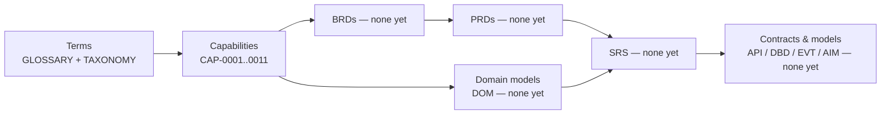

# QR-0003 — Traceability Matrix

## 1. Purpose and Maintenance Rule

The living record of how everything connects: concepts → domains → capabilities → (future) products, platform services, and SRS documents. Today the left half of every chain exists and the right half is deliberately empty — **an empty cell is a work item, not an error**.

**Maintenance rule:** every PR that adds a BRD, PRD, DOM, SRS, API, DBD, EVT, or AIM document MUST update this matrix in the same PR (reviewers check it per GOV-0001). When the matrix outgrows manual upkeep, generation from front-matter `related:` fields is the planned tooling step (see `tools/`).

## 2. The Traceability Chain

## 3. Concept → Capability Domain Trace

Core business concepts (glossary/taxonomy) and where they are governed. Full term-level mapping lives in [`TAXONOMY.md`](../11-glossary/TAXONOMY.md); this table traces the load-bearing concepts:

| Concept | Defined In | Governing Capabilities |
| --- | --- | --- |
| Producer, Herd, Lactation | GLOSSARY | FPR.HRD.*, FPR.BRE.* |
| Milk Collection | GLOSSARY | MCL.PCK.01/02 |
| Chilling Center, Cold Chain | GLOSSARY | MCL.CCH.01/02 |
| Milk Quality Grade, SCC, Adulteration | GLOSSARY | QFS.TST.*, QFS.GRD.* |
| Traceability, Withdrawal Period | GLOSSARY | QFS.TRC.*, FPR.HLT.04 |
| Settlement, Patronage | GLOSSARY | PEF.SET.*, CPR.GOV.02 |
| Cooperative, Extension Services | GLOSSARY | CPR.* |
| Tenant, Tenant Isolation, Model Card | GLOSSARY | ETE.ONB.01, ETE.DGV.01 (business side); realization in future platform ADRs |

## 4. Capability Domain → Future Document Trace

The forward matrix. Status values: **—** (not started), **Planned-P\<n\>** (roadmap phase in [QR-0004](QR-0004-documentation-roadmap.md)), or a document ID once it exists.

| Capability Domain | Domain Model (DOM) | BRD Coverage | PRD Coverage | SRS / Platform Services | Contracts (API/EVT/DBD/AIM) |
| --- | --- | --- | --- | --- | --- |
| FPR Farm Production | Planned-P1 (Herd & Animal context) | Planned-P1 (BRD-0001 market entry) | — | — | — |
| MCL Collection & Logistics | Planned-P1 (Collection context) | Planned-P1 | — | — | — |
| QFS Quality & Food Safety | Planned-P1 (Quality context) | Planned-P1 | — | — | — |
| PRO Processing & Manufacturing | Planned-P3 | — | — | — | — |
| CMA Commerce & Market Access | Planned-P3 | — | — | — | — |
| PEF Producer Economics | Planned-P1 (Settlement context) | Planned-P1 | — | — | — |
| CPR Cooperative Relations | Planned-P2 | Planned-P1 (membership scope) | — | — | — |
| SWC Sustainability & Compliance | Planned-P3 | — | — | — | — |
| DIA Intelligence & Advisory | Planned-P2 (Intelligence context) | Planned-P1 (advisory scope) | — | — | AIM documents required per model — Planned-P3+ |
| ETE Ecosystem Enablement | Planned-P2 | Planned-P1 (onboarding scope) | — | — | — |

## 5. Capability → Business Event Trace (seed for the event catalog)

Every capability's **Business events** row in CAP-0002…CAP-0011 is a pre-inventory of the future event catalog (`docs/09-events/`). Rule: when an `EVT` document is created, it MUST name the capability whose business event it formalizes; events with no capability trace are review-blocking. Current count: ~250 named business events across 86 capabilities, 0 formalized.

## 6. Capability → AI Opportunity Trace (seed for model cards)

Likewise, every capability's **AI opportunities** row pre-inventories future `AIM` documents. Rule: every AIM cites its capability ID(s); DIA-domain capabilities (whose core *is* AI) will each map to one or more model cards. Current count: 86 capabilities with stated AI opportunities, 0 model cards.

## 7. Cross-Cutting Traces

| From | To | Mechanism |
| --- | --- | --- |
| Capabilities → each other | Dependency rows in every capability block | Verified automated: 0 dangling references (QR-0001 §2) |
| Documents → documents | `related:` front-matter lists + inline links | Verified automated: link check (QR-0001 F-01) |
| Requirements → requirements | `BRD-NNNN-G01`-style sub-IDs + SRS traceability matrices (TPL-0004 §9) | Mechanism defined; first use in Phase 1–2 |
| Standards → enforcement | `tools/` validator specs name the standard they enforce | Defined in `tools/README.md`; not yet built |

## Change Log

| Version | Date | Author | Change |
| --- | --- | --- | --- |
| 1.0 | 2026-08-02 | Documentation Engineering | Initial matrix: concept and capability traces populated; product/service/SRS columns opened, empty by design. |
