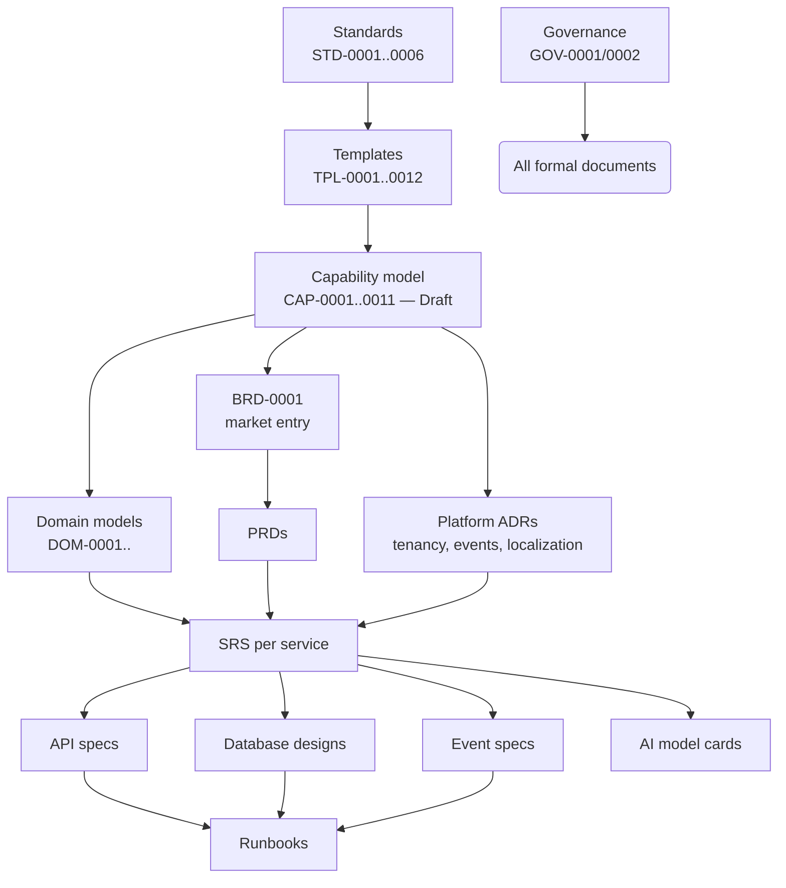

# QR-0004 — Documentation Roadmap & Dependency Graph

## 1. Documentation Dependency Graph

What must exist before what. Solid arrows = hard dependency (downstream cites upstream IDs); the graph is why the roadmap is ordered as it is.

Existing and approved: standards, governance, templates. Existing but Draft: the capability model. Everything below CAP is unwritten — which is correct: nothing below it can be written soundly until CAP is approved.

## 2. Roadmap

### Phase 0 — Make the repository operational (before any new documents)

| # | Item | Exit Criterion | Source Finding |
| --- | --- | --- | --- |
| 0.1 | ~~`git init`, initial commit, remote~~ **Done 2026-08-02** (GitHub `valorantstech/lacteva`); remaining: protected default branch | PR workflow physically enforced | QR-0001 F-06 |
| 0.2 | Staff minimal approver roles (Architecture Board of ≥2, domain owners); replace CODEOWNERS placeholders | GOV-0002 executable | QR-0001 F-05 |
| 0.3 | Approve the capability model: CAP-0001…0011 through GOV-0002, folding in QR-0002 model-gap decisions (byproducts, scope exclusions) | CAP suite status `Approved 1.0` | F-05, G-01…G-05 |
| 0.4 | Build the four CI validators specified in `tools/README.md` (front matter, IDs/index, links, diagrams) | CI red on standard violations | QR-0001 F-07 |
| 0.5 | Decide business-decision-record mechanism | Scoping decisions have a home | QR-0002 §3 |

### Phase 1 — Architectural and business foundation

Written against the approved capability model, in parallel tracks:

| # | Document(s) | Rationale for Position |
| --- | --- | --- |
| 1.1 | **BRD-0001 — Initial market entry** | First commercial commitment; selects which capabilities the first release monetizes; everything in Phase 2 traces to it |
| 1.2 | **Founding platform ADRs** — cloud/runtime baseline, tenancy & isolation model, event backbone, API conventions, localization architecture | Constrain every future SRS; the tenancy and localization ADRs realize ETE.DGV/ETE.LOC business rules and unblock TPL-0004's mandatory sections |
| 1.3 | **First domain models** — Herd & Animal (FPR), Collection (MCL), Quality (QFS), Settlement (PEF) | The four contexts on the industry's central loop (production → collection → quality → payment); each settles the shared-pattern ownership questions from QR-0002 §4 that touch it |
| 1.4 | **Security documentation home + first threat model scope** | Precedes any service design | 

### Phase 2 — Product definition

| # | Document(s) | Depends On |
| --- | --- | --- |
| 2.1 | Shared personas document | BRD-0001 |
| 2.2 | PRDs for the BRD-selected capability clusters (expected first: collection & settlement trust loop, farm records, advisory) | BRD-0001, personas |
| 2.3 | Remaining Phase-2 domain models: Intelligence (DIA), Membership/Cooperative (CPR), Enablement (ETE) | Phase 1 models |

### Phase 3 — System specification and contracts

| # | Document(s) | Depends On |
| --- | --- | --- |
| 3.1 | Platform SRS (cross-cutting requirements services inherit: tenancy, residency, observability) | ADRs 1.2 |
| 3.2 | Service SRSs for first services | PRDs, domain models, platform SRS |
| 3.3 | API + EVT + DBD specs alongside each SRS (contracts co-authored with the SRS, per dependency graph) | 3.2 |
| 3.4 | First AIM model cards (advisory/forecasting capabilities selected by BRD) | 3.2, DIA domain model |
| 3.5 | Remaining domain models (PRO, CMA, SWC) as those domains enter product scope | Phase 2 |

### Phase 4 — Operational readiness

| # | Document(s) | Trigger |
| --- | --- | --- |
| 4.1 | OPS runbook template (TPL-0013) | First service approaching production |
| 4.2 | Runbooks, incident-response, on-call docs per service | Production readiness reviews |

## 3. Sequencing Rules (why this order is binding)

1. **Nothing cites an unapproved upstream.** CAP approval (0.3) gates everything; BRD/DOM/ADR gate PRD/SRS; SRS gates contracts.
2. **Contracts are co-authored, never retrofitted.** API/EVT/DBD documents are written with their SRS, not after implementation.
3. **Shared patterns get owners before second use.** The four QR-0002 patterns (disputes, equipment care, regulatory content, transport) are assigned to a single context in whichever Phase 1/2 domain model first needs them; the second consumer references, never redefines.
4. **The matrices move with the work.** [QR-0003](QR-0003-traceability-matrix.md) and [`docs/INDEX.md`](../INDEX.md) update in the same PR as any new document — enforced in review until automated.

## Change Log

| Version | Date | Author | Change |
| --- | --- | --- | --- |
| 1.0 | 2026-08-02 | Documentation Engineering | Initial roadmap: Phase 0 operationalization through Phase 4 operational readiness. |
