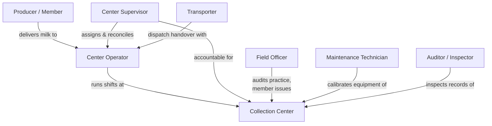

# PSP-0001 — Actors & Operational Roles

## 1. Purpose

Defines every human actor in and around a collection center, their responsibilities, and their role boundaries. Roles are **operational roles**, not job titles: one person may hold several roles (common in small centers), but every action in the product is attributed to exactly one role exercised by one identified person.

## 2. Actors

| Actor | Definition | Primary Capabilities Exercised |
| --- | --- | --- |
| **Center Operator** | Runs the day-to-day collection workflow: check-in, testing, weighing, receipts. Owns the shift while it is open. | MCL.PCK.01, QFS.TST.03 |
| **Center Supervisor** | Accountable for the center: approves overrides, reconciles shifts, manages operator assignments and escalations. | MCL.CCH.01, MCL.PCK.03 |
| **Producer (Member)** | Delivers milk; receives test result, weight, and receipt. The customer of the trust loop. | (subject of MCL.PCK.01, CPR.MEM.01) |
| **Transporter** | Collects bulked milk from the center for dispatch to plant; countersigns handover quantities. | MCL.LGX.01, MCL.PCK.02 (as dispatching side) |
| **Field Officer** | Cooperative/buyer representative: audits practice, handles member issues, delivers extension follow-up. | CPR.EXT.02, MCL.PCK.03 |
| **Maintenance Technician** | Services and calibrates center equipment; records calibration evidence. | MCL.LGX.02 (center equipment) |
| **Auditor / Inspector** | External or internal: inspects records, equipment, and hygiene against obligations. Read-only plus findings. | SWC.REG.02 |

## 3. Role Boundaries

Load-bearing separations (each backed by a rule in [PSP-0009](PSP-0009-business-rules.md)):

- **Operator ≠ Supervisor for controls:** overrides (failed equipment check, variance breach) require the Supervisor role — an operator cannot approve their own exception (R04, R08).
- **Operator owns exactly one open shift** at a time, at one center (R03).
- **Transporter countersigns** dispatch quantities — the handover is two-party by construction (R11).
- **Auditor never operates:** the role can read everything, change nothing, and file findings.
- Small-center reality: one person MAY hold Operator + Supervisor roles for *different shifts*, never for the same shift's override decisions (assumption A3, [REVIEW-NOTES](REVIEW-NOTES.md)).

## 4. Actor Relationship Diagram

## 5. Future Artifact Trace

| Aspect | Realized Later By |
| --- | --- |
| Role permissions model | Future SRS + platform identity ADR *(placeholder)* |
| Actor identity & verification | ETE.ONB.01 realization *(placeholder)* |
| Role-per-action attribution | Business events (PSP-0010) → future EVT contracts |

## Change Log

| Version | Date | Author | Change |
| --- | --- | --- | --- |
| 0.1 | 2026-08-02 | Lacteva Collect Product Team | Initial draft from approved chapter 1. |
