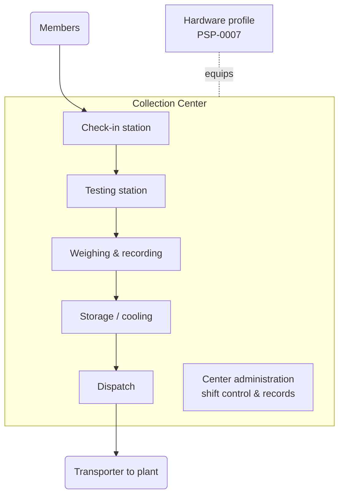

# PSP-0002 — Collection Center Architecture

## 1. Definition

A **collection center** is a fixed facility where producers deliver milk for testing, weighing, and bulking — the physical realization of capabilities MCL.PCK.01 (delivery flow) and, where cooling exists, MCL.CCH.01/02 ([CAP-0003](../../05-capabilities/CAP-0003-milk-collection-logistics.md)). A center with bulk cooling is a *chilling center* (glossary term); Lacteva Collect serves both cooled and un-cooled centers — the difference is a [hardware profile](PSP-0007-hardware-profile.md), not a different product.

## 2. Center Identity

| Attribute | Meaning |
| --- | --- |
| Center identity | Stable, unique within the operating organization (tenant); survives operator and equipment changes |
| Operating organization | The cooperative/collector/processor the center belongs to (verified per ETE.ONB.01) |
| Location & catchment | Where it is; which member villages/routes deliver to it |
| Hardware profile | The equipment class it runs ([PSP-0007](PSP-0007-hardware-profile.md)) |
| Session schedule | Its collection sessions (typically morning/evening) from which shifts are scheduled ([PSP-0003](PSP-0003-shift.md)) |

## 3. Stations (Functional Composition)

Stations are functional, not architectural prescriptions: in a small center they may be one table run by one operator; in a large one, separate counters. The flow order is fixed; the physical layout is not.

| Station | Function | Capability |
| --- | --- | --- |
| Check-in | Identify the member and delivery; eligibility check (incl. withdrawal exclusions, R10) | CPR.MEM.01, FPR.HLT.04 |
| Testing | Rapid quality tests gating acceptance | QFS.TST.03 |
| Weighing & recording | Measure quantity; record the collection transaction; issue receipt | MCL.PCK.01 |
| Storage / cooling | Pour to cans or bulk cooler; temperature discipline | MCL.CCH.01, MCL.CCH.02 |
| Dispatch | Bulk handover to transporter, countersigned (R11) | MCL.PCK.02 (dispatch side) |
| Center administration | Shift control, records, reconciliation, equipment log | PSP-0003…0006 |

## 4. Composition Diagram

## 5. Operating Model

- The center operates in **collection sessions** (morning/evening per local practice); every session is worked under exactly one **shift** — the accountability wrapper defined in [PSP-0003](PSP-0003-shift.md).
- Outside an open shift the center accepts nothing (R02); the center's records are therefore fully partitioned by shift.
- The center is the natural unit for: operational metrics ([PSP-0008](PSP-0008-operational-metrics.md)), equipment/calibration state ([PSP-0007](PSP-0007-hardware-profile.md)), and audit ([SWC.REG.02](../../05-capabilities/CAP-0009-sustainability-welfare-compliance.md)).

## 6. Future Artifact Trace

| Aspect | Realized Later By |
| --- | --- |
| Center as domain object | Collection context `DOM` + aggregate *(placeholder — dependency map Phase 1)* |
| Center registry & configuration | Future API/DBD *(placeholder)* |
| Center telemetry (cooling) | Future EVT + DIA monitoring *(placeholder)* |

## Change Log

| Version | Date | Author | Change |
| --- | --- | --- | --- |
| 0.1 | 2026-08-02 | Lacteva Collect Product Team | Initial draft from approved chapter 2. |
