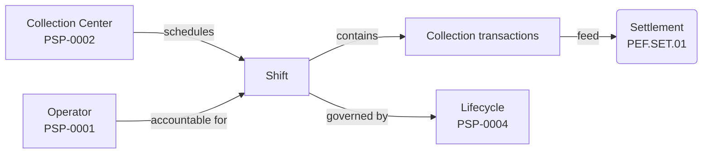

# PSP-0003 — Shift

## 1. Definition

A **shift** is the bounded, accountable operating period of one collection center: one operator responsible, one opening state, a stream of collection transactions, one closing reconciliation. The shift is the product's unit of trust — every transaction belongs to exactly one shift, and every shift answers "who was responsible, what came in, does it add up?"

A shift wraps exactly one collection session by default (morning or evening); multi-session shifts are a per-market configuration, not the norm (assumption A5, [REVIEW-NOTES](REVIEW-NOTES.md)).

## 2. Shift Attributes

| Attribute | Meaning | Set At |
| --- | --- | --- |
| Shift identity | Stable and unique; never reused | Scheduling |
| Center | The one center this shift operates | Scheduling |
| Session | The collection session it covers (date + morning/evening) | Scheduling |
| Assigned operator | The accountable Center Operator (R03) | Scheduling / reassignment before opening |
| Opening state | Equipment check results, opening storage measurement, opening exceptions | Opening ([PSP-0005](PSP-0005-shift-opening.md)) |
| Transaction stream | The shift's collection transactions (accepted and refused) | While Open |
| Closing state | Totals, physical measurement, variance, handover record | Closing ([PSP-0006](PSP-0006-shift-closing.md)) |
| Reconciliation verdict | Supervisor confirmation or investigation flag | Reconciliation |

## 3. Core Principles

1. **One open shift per center** at any moment (R01) — the center's physical milk can only be one accountable stream.
2. **No shift, no transactions** (R02) — outside an open shift the product records nothing except shift-control events.
3. **Attribution is total** (R08) — every transaction, exception, and override within the shift names its actor and role ([PSP-0001](PSP-0001-actors-and-roles.md)).
4. **Shifts are append-only history** — a closed shift's stream is never edited; corrections happen as recorded adjustments in the dispute/settlement flow (MCL.PCK.03, PEF.SET.01).
5. **Offline-tolerant** — a shift continues through connectivity loss; records queue locally and sync (R09). Global variability demands this (CAP-0001 §7).

## 4. Relationship Map

## 5. Future Artifact Trace

| Aspect | Realized Later By |
| --- | --- |
| Shift as domain object | Collection context aggregate (`AGG`) *(placeholder — the shift is the leading aggregate candidate)* |
| Shift records | Future DBD *(placeholder)* |
| Shift operations | Future API + UI (operator app) *(placeholder)* |

## Change Log

| Version | Date | Author | Change |
| --- | --- | --- | --- |
| 0.1 | 2026-08-02 | Lacteva Collect Product Team | Initial draft from approved chapter 3. |
