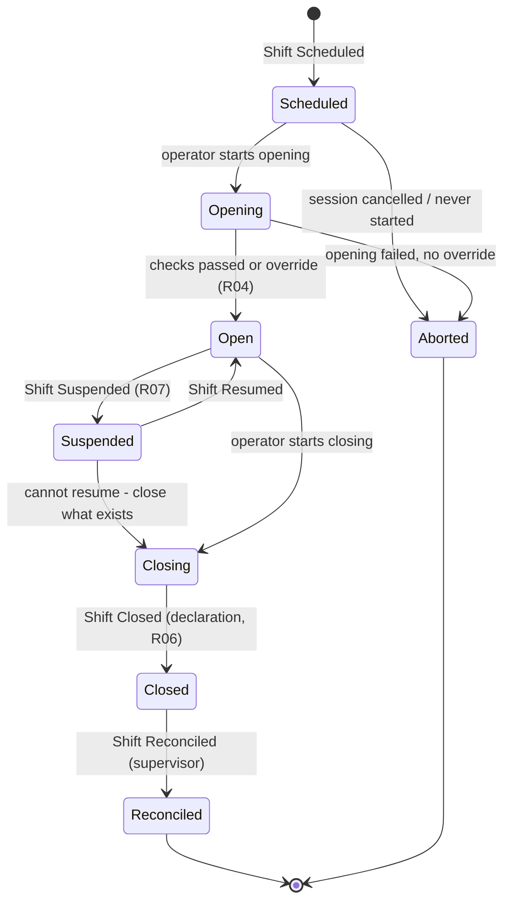

# PSP-0004 — Shift Lifecycle

## 1. States

| State | Meaning | Transactions Allowed? |
| --- | --- | --- |
| **Scheduled** | Shift exists for a future session; operator assigned | No |
| **Opening** | Opening workflow in progress ([PSP-0005](PSP-0005-shift-opening.md)) | No |
| **Open** | Center accepting deliveries under the accountable operator | **Yes** |
| **Suspended** | Temporarily halted (equipment failure, power loss beyond fallback, incident) | No |
| **Closing** | Closing workflow in progress ([PSP-0006](PSP-0006-shift-closing.md)); intake stopped | No |
| **Closed** | Operator declaration complete; totals and variance recorded | No |
| **Reconciled** | Supervisor verified the closing record — terminal success | No |
| **Aborted** | Scheduled/Opening shift that never opened (no transactions exist) — terminal | No |

## 2. Lifecycle Diagram

## 3. Transition Rules

| Transition | Guarded By | Event Emitted ([PSP-0010](PSP-0010-business-events.md)) |
| --- | --- | --- |
| → Scheduled | Center + session + assigned operator exist | Shift Scheduled |
| Scheduled → Opening | Assigned operator authenticated (R03) | Shift Opening Started |
| Opening → Open | All checks pass, or Supervisor override recorded (R04) | Shift Opened |
| Open → Suspended | Cause recorded; > threshold duration needs Supervisor (R07) | Shift Suspended |
| Suspended → Open | Cause cleared; re-check failed equipment | Shift Resumed |
| Open/Suspended → Closing | Operator initiates; intake stops immediately | Shift Closing Started |
| Closing → Closed | No unresolved pending transactions (R06); variance computed (R05) | Shift Closed |
| Closed → Reconciled | Supervisor review; variance breach → investigation flag before reconciliation | Shift Reconciled |
| Scheduled/Opening → Aborted | Zero transactions exist | Shift Aborted |

**No other transitions exist.** In particular: Closed shifts never reopen (append-only principle, PSP-0003 §3.4); corrections flow through disputes/adjustments, not state reversal.

## 4. Time and Ordering Guarantees

- Lifecycle events are strictly ordered per shift; the shift's transaction stream is bounded by Shift Opened and Shift Closing Started.
- Offline operation (R09): state transitions are valid offline and sync later; conflicting histories are impossible because one operator owns one shift on one device *(assumption A7 — device model, [REVIEW-NOTES](REVIEW-NOTES.md))*.

## Change Log

| Version | Date | Author | Change |
| --- | --- | --- | --- |
| 0.1 | 2026-08-02 | Lacteva Collect Product Team | Initial draft from approved chapter 3. |
