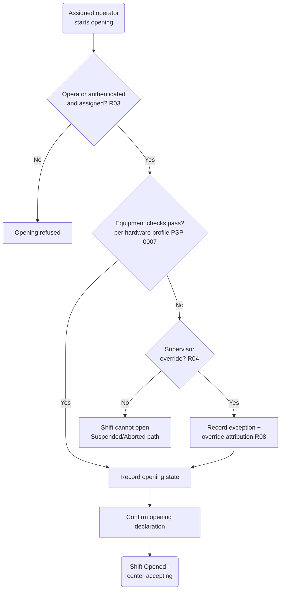

# PSP-0005 — Shift Opening

## 1. Purpose

The opening workflow establishes, before any milk is accepted, that (a) the accountable operator is present and authenticated, (b) the equipment measures truthfully, and (c) the center's starting physical state is on record. A shift that opens clean makes its closing reconciliation meaningful; a shift that opens sloppy cannot be reconciled at all.

## 2. Opening Workflow

## 3. Steps

| # | Step | Detail | Rule |
| --- | --- | --- | --- |
| 1 | Authenticate | The assigned operator identifies themselves; a different operator requires recorded reassignment before opening | R03 |
| 2 | Equipment readiness checks | Per the center's [hardware profile](PSP-0007-hardware-profile.md): scale zero/known-weight check, analyzer calibration status current, printer/receipt medium ready, power and fallback state | R04 |
| 3 | Record opening state | Opening storage measurement (tank dip/volume or can count), storage temperature where cooled, carried-over milk from previous shift if any | R05 (baseline for variance) |
| 4 | Exceptions & overrides | Any failed check either blocks opening or proceeds under a Supervisor override, recorded with reason and attribution | R04, R08 |
| 5 | Opening declaration | Operator confirms the recorded opening state; shift transitions to Open | — |

## 4. Events Emitted

Shift Opening Started · Equipment Check Recorded (per check) · Opening Exception Recorded · Shift Opened — see [PSP-0010](PSP-0010-business-events.md).

## 5. Failure Behavior

- **Authentication failure / unassigned person:** opening refused; recorded as an access exception.
- **Blocking equipment failure without override:** shift cannot open; Supervisor decides — repair-and-retry, or Abort (session lost to the product's records; manual fallback per market practice, question Q6 in [REVIEW-NOTES](REVIEW-NOTES.md)).
- **Connectivity absent:** opening proceeds offline in full (R09); events sync later.

## Change Log

| Version | Date | Author | Change |
| --- | --- | --- | --- |
| 0.1 | 2026-08-02 | Lacteva Collect Product Team | Initial draft from approved chapter 3. |
