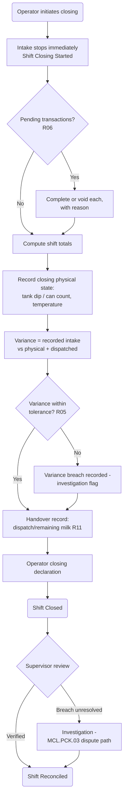

# PSP-0006 — Shift Closing

## 1. Purpose

Closing converts a shift's transaction stream into an accountable record: computed totals checked against physical reality, variance measured and judged, custody of remaining milk handed over. Closing is where the product earns producer and buyer trust — or documents exactly where it was lost.

## 2. Closing Workflow

## 3. Steps

| # | Step | Detail | Rule |
| --- | --- | --- | --- |
| 1 | Stop intake | Closing is irreversible into Open-for-new-transactions; late arrivals go to the next shift | R02 |
| 2 | Resolve pending | Every in-flight transaction completed or voided with reason — no limbo records | R06 |
| 3 | Compute totals | Transactions count; accepted volume (gross, by grade); refused count + reasons; exceptions count | — |
| 4 | Closing physical state | Storage measurement and temperature, same method as opening | R05 |
| 5 | Variance | (opening state + recorded intake) − (dispatched + closing state); judged against the market-parameterized tolerance | R05 |
| 6 | Handover | Dispatched milk countersigned by Transporter; remaining milk carried over to next shift's opening state | R11 |
| 7 | Declarations | Operator declares the closing record; Supervisor reconciles (or opens investigation on breach) | R08 |

## 4. Events Emitted

Shift Closing Started · Pending Transaction Voided · Shift Totals Computed · Closing State Recorded · Variance Breach Recorded · Dispatch Handover Countersigned · Shift Closed · Shift Reconciled — see [PSP-0010](PSP-0010-business-events.md).

## 5. Failure Behavior

- **Operator unavailable at closing** (illness, emergency): Supervisor performs a supervised close, recorded as such (attribution never blurs, R08).
- **Physical measurement impossible** (equipment failure): close with estimated state + mandatory investigation flag — never block closing indefinitely, never silently skip the measurement.
- **Offline:** closing works offline; reconciliation by Supervisor requires the synced record (R09).

## Change Log

| Version | Date | Author | Change |
| --- | --- | --- | --- |
| 0.1 | 2026-08-02 | Lacteva Collect Product Team | Initial draft from approved chapter 3. |
