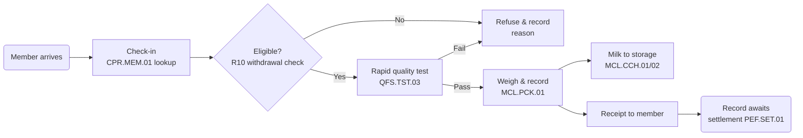

# Lacteva Collect — Implementation Package

**Lacteva Collect** digitizes daily operations at milk collection centers: member check-in, quality testing, weighing, receipts, and shift-controlled center operations. It is the product face of the collection-and-quality trust loop (capabilities MCL.PCK, MCL.CCH, QFS.TST.03) whose records feed settlement (PEF.SET).

This package implements the **first three approved chapters**: Actors & Operational Roles, Collection Center Architecture, and the Shift Management Engine. Everything here is `Draft 0.1` pending the governed approval cycle; derived judgments are logged in [REVIEW-NOTES.md](REVIEW-NOTES.md) for confirmation by the architecture owners.

## Package Contents

| Chapter | Document | Covers |
| --- | --- | --- |
| 1 — Actors & Operational Roles | [PSP-0001](PSP-0001-actors-and-roles.md) | Who works in and around a center; role boundaries |
| 2 — Collection Center Architecture | [PSP-0002](PSP-0002-collection-center.md) | What a center is: identity, stations, operating model |
| 2 — Hardware Profile | [PSP-0007](PSP-0007-hardware-profile.md) | Equipment classes a center runs on; fallback modes |
| 3 — Shift | [PSP-0003](PSP-0003-shift.md) | The shift as the unit of accountable operation |
| 3 — Shift Lifecycle | [PSP-0004](PSP-0004-shift-lifecycle.md) | States and transitions from Scheduled to Reconciled |
| 3 — Shift Opening | [PSP-0005](PSP-0005-shift-opening.md) | Opening workflow: checks, opening state, exceptions |
| 3 — Shift Closing | [PSP-0006](PSP-0006-shift-closing.md) | Closing workflow: totals, reconciliation, variance |
| 3 — Operational Metrics | [PSP-0008](PSP-0008-operational-metrics.md) | Shift/center measures and their definitions |
| Cross-chapter — Business Rules | [PSP-0009](PSP-0009-business-rules.md) | Numbered rules (R01…) with parameters and enforcement |
| Cross-chapter — Business Events | [PSP-0010](PSP-0010-business-events.md) | Events the product records; future EVT mapping |
| Traceability | [TRACEABILITY.md](TRACEABILITY.md) | Capability → product → rule → event → future API/DB/UI |
| Review notes | [REVIEW-NOTES.md](REVIEW-NOTES.md) | Assumptions, ambiguities, questions — the confirmation register |

Product architecture object: [PDT-0001 — Lacteva Collect](../../03-architecture/03-application-layer/PDT-0001-lacteva-collect.md).

## High-Level Transaction Flow

One collection transaction during an open shift — the loop the whole product exists to make trustworthy:

## Reading Order

1. [PSP-0001 Actors](PSP-0001-actors-and-roles.md) → 2. [PSP-0002 Collection Center](PSP-0002-collection-center.md) (+ [PSP-0007 Hardware](PSP-0007-hardware-profile.md)) → 3. [PSP-0003 Shift](PSP-0003-shift.md) → [PSP-0004 Lifecycle](PSP-0004-shift-lifecycle.md) → [PSP-0005 Opening](PSP-0005-shift-opening.md) / [PSP-0006 Closing](PSP-0006-shift-closing.md) → 4. [PSP-0009 Rules](PSP-0009-business-rules.md) + [PSP-0010 Events](PSP-0010-business-events.md) → 5. [TRACEABILITY.md](TRACEABILITY.md).

## Downstream Use

This package is the input for the product's future SRS, API, database, UI (Flutter), AI, and test specifications — each will cite PSP sections and the traceability rows here. When formal EA artifacts (AGG/BPR/POL) are authored in Phase 1, they become authoritative and the PSPs will reference them (rule in [`13-products/README.md`](../README.md)).
