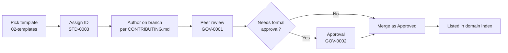

# Lacteva Documentation Workspace

This directory is the documentation half of the single source of truth. It is organized into **numbered domains**: low numbers govern *how* we document (standards, governance, templates); higher numbers hold the documentation itself.

**Governed by [Architecture Baseline V1](../ARCHITECTURE_BASELINE_V1.md)** — the official source of truth and conflict arbiter for everything below.

**Looking for a specific document?** The complete per-document inventory is the [Master Documentation Index](INDEX.md).

## Domain Index

| Domain | Contents | Document Prefix |
| --- | --- | --- |
| [`00-standards/`](00-standards/README.md) | Authoring standards everyone must follow | `STD` |
| [`01-governance/`](01-governance/README.md) | Review and approval workflows | `GOV` |
| [`02-templates/`](02-templates/README.md) | Reusable templates for every document type | `TPL` |
| [`03-architecture/`](03-architecture/README.md) | Enterprise Architecture workspace: five layers, ADRs, domain models, diagrams, architecture indexes | `ADR`, `DOM`, `CON`, `BPR`, `AGG`, `ENT`, `VAL`, `REP`, `POL`, `SPC`, `PSV`, `PDT`, `AGT` |
| [`04-requirements/`](04-requirements/README.md) | Business, product, and software requirements | `BRD`, `PRD`, `SRS` |
| [`05-capabilities/`](05-capabilities/README.md) | Business capability map | `CAP` |
| [`06-api/`](06-api/README.md) | API specifications | `API` |
| [`07-data/`](07-data/README.md) | Database designs and data documentation | `DBD` |
| [`08-ai/`](08-ai/README.md) | AI/ML model cards and AI documentation | `AIM` |
| [`09-events/`](09-events/README.md) | Event catalog | `EVT` |
| [`10-operations/`](10-operations/README.md) | Runbooks and operational docs | `OPS` |
| [`11-glossary/`](11-glossary/README.md) | Company-wide glossary and business-term taxonomy | — |
| [`12-quality/`](12-quality/README.md) | Repository quality reports, traceability matrix, documentation roadmap | `QR` |
| [`13-products/`](13-products/README.md) | Product implementation packages (chapter specifications per product) | `PSP` |

## How a Document Comes to Exist

## Rules That Apply Everywhere

- Every document carries YAML front matter (see [STD-0001](00-standards/STD-0001-markdown-writing-standards.md)).
- Every document has a unique ID (see [STD-0003](00-standards/STD-0003-document-numbering.md)) and a version (see [STD-0004](00-standards/STD-0004-versioning-strategy.md)).
- Every domain `README.md` maintains an index table of the documents it contains. Adding a document without updating the index is an incomplete contribution.
- Only documents with status `Approved` are authoritative. `Draft` and `In Review` documents may change at any time.
